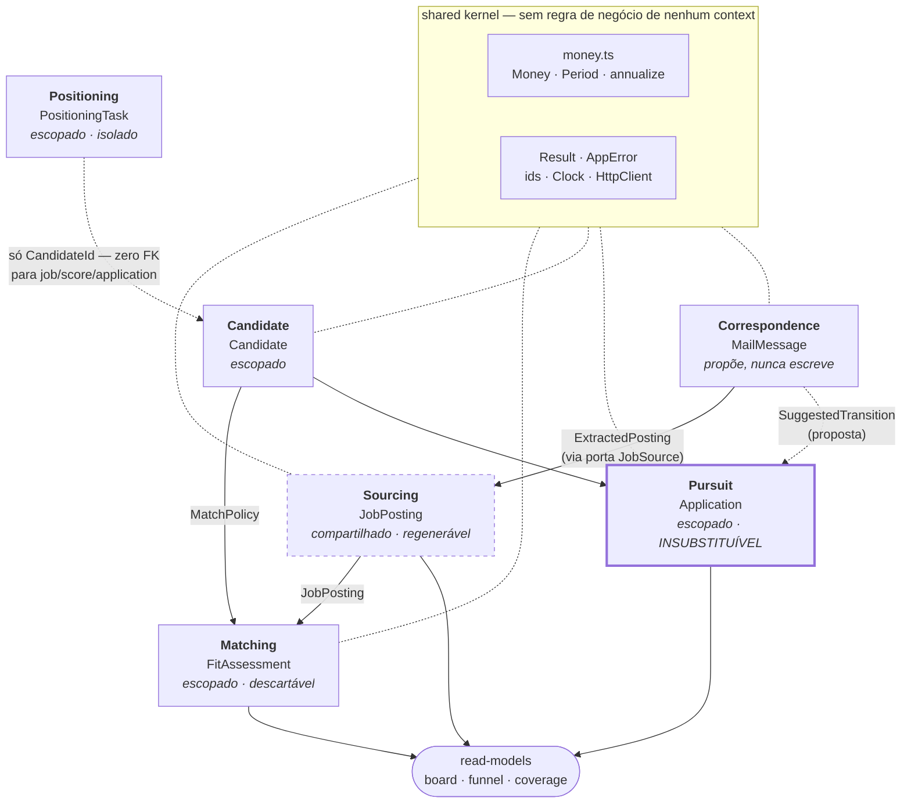

# ADR 0007 — Arquitetura hexagonal com DDD seletivo, em monólito modular

**Status:** Proposta · 2026-08-18

## Contexto

O sistema funciona. São 4.603 linhas em `src/`, 64 testes verdes, 5.021 vagas
reais no banco, 12 fontes configuradas e um funil com 2 candidaturas. A
estrutura atual é organizada por **camada técnica** (`db/`, `sources/`,
`ingest/`, `scoring/`, `profile/`, `report/`), e isso foi a decisão certa
enquanto o sistema tinha um único fluxo: buscar vaga, pontuar, listar.

A revisão acontece agora porque quatro capacidades novas foram pedidas, e
cada uma delas quebra uma premissa diferente da estrutura atual:

1. **Área do candidato dinâmica**, editável por interface, porque "isso pode
   virar um produto no futuro" — ou seja, multi-candidato.
2. **Data science**: medição estatística da qualidade do match e calibração
   do scorer.
3. **E-mail como fonte de dados**, em três usos distintos: alertas de vaga do
   LinkedIn como fonte legítima (é a correspondência do próprio usuário, não
   toca a plataforma — ADR 0001 permanece intacta), e-mails de ATS para mover
   o funil por evidência, e inbound de recrutador.
4. **Interface para registrar vaga por URL** de modo que agentes possam
   preencher e submeter candidaturas.

### O que a estrutura atual sustenta mal

Isto não é teoria. Cada item abaixo foi verificado no código e no banco.

**A multi-candidatura é estruturalmente impossível hoje.**
`src/core/db/schema.ts` declara `jobId` como chave primária de `job_score`:

```ts
jobId: integer("job_id").primaryKey().references(() => job.id, ...)
```

Uma vaga só pode ter uma nota. Um segundo candidato sobrescreveria o veredito
do primeiro via o `onConflictDoUpdate({ target: jobScore.jobId })` de
`apply.ts`, sem erro e sem sintoma visível. `application` tem o mesmo formato
com `uniqueIndex("application_job_idx").on(t.jobId)`.

**O scorer reporta constantes como se fossem medições.** Consultando o banco:

| Situação | Linhas | Total |
|---|---:|---:|
| `description_text` vazio ou nulo | 4.538 | 5.021 |
| `seniority_score = 7.2` (o default `12 × 0.6` de "não sei") | 4.909 | 5.021 |
| `geo_score ≈ 8.25` (o default `15 × 0.55` de "região não declarada") | 4.391 | 5.021 |
| `comp_score = 4.0` (o default `8 × 0.5`) | 4.994 | 5.021 |
| Linhas com algum blocker | 37 | 5.021 |

Ou seja: ~90% do corpus é pontuado sobre três componentes que são literalmente
"não sei", e nada no modelo distingue isso de "medi e deu mediano". A causa
raiz é uma linha em `src/core/sources/ats.ts:96`:

```ts
descriptionText: j.descriptionPlain ?? htmlToText(j.description),
```

`??` só cai para o lado direito em `null`/`undefined`, **não em string vazia**.
O board `lever:jobgether` devolve `descriptionPlain: ""` com `description`
contendo ~1.000 caracteres de HTML. Verificado linha a linha no banco: o campo
vazio vence e a descrição real é descartada.

**A deduplicação por fingerprint não funciona para 92% do corpus.**
`fingerprint()` é `sha256(slugifyCompany(companyName) | title | location)`, e
o adapter Lever faz `companyName: config.label`. Resultado: as 4.639 vagas de
`lever:jobgether` — 92% do banco — têm `company_name = "Jobgether"`, o
agregador, e não o empregador real. Uma mesma vaga vista no Greenhouse da
empresa e no Jobgether gera fingerprints diferentes e **nunca colapsa**, ao
contrário do que promete o comentário de cabeçalho de `normalize.ts`.

**Regras de negócio moram só na CLI.** `src/cli.ts` tem 599 linhas e é a
única casa de pelo menos quatro regras: o carimbo de `doneAt` de tarefa de
posicionamento, a validação de status de candidatura (duplicada literalmente
nas linhas 414 e 498), o filtro de cluster, e o hack `limit * 3` da linha 336
— que existe para compensar o fato de `repo.ts` aplicar `.limit()` no SQL
**antes** de filtrar status em JavaScript. `setApplicationStatus()` aceita o
status na confiança, e `schema.ts` declara `status` como `text` sem CHECK.
Qualquer rota web ou agente futuro escreve lixo sem nada barrar.

**Restrições legais são modeladas como preferência.** `profile.yaml` diz
textualmente "Hard constraints. A violated constraint is a blocker, not a low
score". O código faz `penalty = blockers.length * 12 + 5`: uma vaga que exige
autorização de trabalho nos EUA perde 12 pontos de 100 e continua no board.
Pior: `constraints.work_authorization` e `needs_visa_sponsorship_for` existem
no perfil e **não são lidos por lugar nenhum** do scorer — só `remote_only` é.

**Nada é substituível, então 86% do código não tem teste.** `getDb()` é um
singleton de módulo (`let cached`), `getJson` é import direto em todos os
adapters, `new Date()` aparece em 14 lugares e `process.env` em 10. Consequência
medida: os 543 linhas de adapters não têm um único teste, e as peculiaridades
de cada fornecedor (Greenhouse escapa HTML, Lever devolve epoch ms, Himalayas
devolve segundos, RemoteOK tem aviso legal no primeiro elemento) estão
documentadas em comentário e afirmadas em lugar nenhum.

**Existe um subdomínio inteiro que nenhuma análise anterior enxergou.**
`src/core/money.ts` (207 linhas, puro, 19 testes) e `src/core/fx.ts` (146
linhas) mais a tabela `fx_rate` e os comandos `jho fx refresh|show` formam um
subdomínio de compensação com regras próprias — `Period` inclui `"project"`,
onde o valor é o negócio inteiro e não uma taxa, e `annualize()` se recusa a
adivinhar sem duração. `scoreJob(input, profile, fx)` recebe uma `FxTable`
como terceiro argumento. **Qualquer plano de reorganização que não dê casa a
esses 353 linhas quebra na primeira movimentação de arquivo.**

---

## Decisão

Adotar **arquitetura hexagonal com DDD seletivo, em monólito modular**:
seis bounded contexts, um shared kernel, portas apenas onde existe variação
real, e regras estruturais impostas por um teste executável — não por
convenção escrita.

O princípio que orienta cada corte: **comprar tudo que hexagonal entrega de
fato** (infraestrutura substituível, domínio testável sem banco, direção de
dependência que não pode ser cruzada) e **recusar o catálogo tático de DDD
onde ele custaria indireção sem absorver variação nenhuma**.

A linha mestra do modelo, que decide de que lado cada tabela cai:

> **Invariante 1:** o **corpus é compartilhado**, o **veredito é privado**.
> Uma vaga no Greenhouse da Stripe existe independentemente de quem procura,
> e seu fingerprint não contém nenhuma entrada do candidato — por construção.
> Um fit de 78 com `blockers: ["requires US work authorization"]` não é um
> fato sobre o mundo: é a conclusão de **um** candidato. `job`, `company`,
> `source` e `fx_rate` são únicos para sempre; tudo a jusante de um perfil é
> escopado por `candidate_id` e nunca vaza do escopo.

### Bounded contexts

#### Sourcing — o que o mundo publicou

**Responsabilidade:** observar o mercado e manter o corpus compartilhado de
vagas, empresas e feeds. Identidade de vaga, dedupe entre fontes, reabertura
ao reaparecer, fechamento ao sumir, detecção de ATS por URL.

**Aggregate root:** `JobPosting`, identificado por `Fingerprint` (value
object, nunca uma string sha256 solta). `Feed` é um agregado menor com a saúde
da fonte.

**Fronteira, por quê:** é o único context cujo store inteiro é descartável —
apague `job`, `company` e `source`, rode um sync, e tudo volta. Essa
regenerabilidade é exatamente o critério que a ADR 0005 já usou para separar
as camadas, e é o que justifica que este context **nunca** possa importar
Pursuit. Muda no ritmo dos fornecedores, não do dono.

**Linguagem ubíqua:** Posting · Feed · Fingerprint · ContentHash · Sighting ·
Observation · Discovered · Refreshed · Closed · Reopened · Unfetchable host ·
Sweep · Prune

#### Candidate — quem é o caçador

**Responsabilidade:** identidade, clusters-alvo, restrições duras, modelo de
palavras-chave, blockers, faixa de compensação, faixa de senioridade,
evidências reivindicáveis, lacunas admitidas e variantes de CV. Publica
`MatchPolicy` como Published Language, para que Matching dependa de um
contrato de domínio e não da ergonomia do YAML (`snake_case`, `z.record`).

**Aggregate root:** `Candidate`.

**Fronteira, por quê:** o ciclo de vida é o oposto do de Sourcing — poucas
linhas, editadas deliberadamente por humano ou agente, exigindo validação e
versionamento. E sustenta invariantes que Zod estruturalmente não checa hoje.
Verificado: `profile.yaml` declara cinco caminhos em `profile/variants/` e
**esse diretório não existe**; `z.string()` valida forma, não referente.

> **Invariante 2:** uma afirmação pode ser citada a partir de `evidence` e
> nunca a partir de `growth`. É a regra 6 do CLAUDE.md, hoje imposta por
> nenhum código.

> **Invariante 3:** todo `cluster.cv_variant` resolve para uma variante
> declarada e existente em disco. `floor ≤ target`; `reject_below_years ≤
> min_years_expected`; um termo não aparece simultaneamente em grupo positivo
> e negativo de keywords.

**Linguagem ubíqua:** Candidate · MatchPolicy · TargetCluster ·
WorkAuthorization · KeywordModel · Blocker · CompensationBand · SeniorityBand ·
EvidenceLedger · ClaimableEvidence · AdmittedGap · CvVariant

#### Matching — o veredito, e a qualidade do veredito

**Responsabilidade:** avaliar de forma determinística e auditável (ADR 0004)
o quanto um `Candidate` serve a um `JobPosting`, **e medir o quanto essa
avaliação é boa**. Dono da calibração e da reprodutibilidade — inclusive das
cotações que produziram um score.

**Aggregate root:** `FitAssessment`, identidade `(CandidateId, JobPostingId,
CalibrationVersion)`.

**Fronteira, por quê:** é o único lugar onde Sourcing e Candidate se
encontram, e sua identidade é **inerentemente um par**. Nomear essa fronteira
é o que força a correção da chave primária de `job_score` — de bloqueio
estrutural para mera funcionalidade não construída. Versiona
independentemente dos dois lados.

Aqui mora a correção do defeito medido:

```ts
export type ScoreComponent =
  | { kind: "measured"; value: number; basis: string }
  | { kind: "unknown"; reason: string };
```

> **Invariante 4:** um componente só pode ser `measured` se a evidência da
> vaga sustentar a medição. Uma vaga sem `descriptionText` produz
> `{ kind: "unknown", reason: "posting has no description" }` — nunca
> `12 × 0.6`. `Fit` carrega `score`, `confidence` e `basis`, não um número nu.

> **Invariante 5:** elegibilidade não é peso. `WorkEligibility` é
> `eligible | ineligible | unverifiable`, decidida sobre
> `constraints.work_authorization` — hoje ignorada pelo scorer. Vaga
> `ineligible` não entra no board por padrão, independentemente do fit; vaga
> `unverifiable` (90% do corpus, porque não há descrição para ler) é marcada
> como tal em vez de passar por aprovada.

**Linguagem ubíqua:** FitAssessment · Fit · Confidence · ScoreComponent ·
Measured · Unknown · Calibration · CalibrationVersion · WorkEligibility ·
Blocker · Cluster · Reason · CoverageGap · Stale · Rescore

#### Pursuit — o que eu decidi e o que aconteceu depois

**Responsabilidade:** o funil. Decisão de se candidatar, máquina de estados,
histórico append-only, e a governança da submissão por agente.

**Aggregate root:** `Application`, com seu stream de `ApplicationEvent` como
parte do agregado.

**Fronteira, por quê:** é o único dado que **não pode ser regenerado**
(ADR 0005). São 2 linhas hoje e valem mais que as outras 5.270 somadas.
Durabilidade e autoridade de escrita opostas às de Sourcing.

> **Invariante 6:** só transições legais são aceitas, e a validação mora no
> domínio — não na CLI, onde hoje está duplicada em duas linhas. `appliedAt`
> é carimbado exatamente uma vez, na primeira entrada em `applied`. Estados
> terminais recusam avanço. Toda transição grava exatamente um evento com
> sua `StatusEvidence` — quem ou o quê afirmou aquilo.

> **Invariante 7:** a transição e seu evento são escritos na **mesma
> transação**. Hoje `repo.ts` faz dois `await` sequenciais sem transação
> nenhuma, e o codebase inteiro não tem uma única chamada a `transaction()`.

**Linguagem ubíqua:** Application · PipelineStage · Transition ·
StatusEvidence · Channel · Submission · HumanHandoff · AppliedAt ·
NextAction · Funnel · Conversion

#### Correspondence — e-mail como fato observado

**Responsabilidade:** a caixa de entrada do próprio usuário, nos três usos
pedidos. Classifica e extrai; **propõe, nunca escreve**.

**Aggregate root:** `MailMessage`, identificado por `MessageId` (RFC 5322 —
idempotência natural na reingestão).

**Fronteira, por quê:** é o caso difícil e a razão mais forte para um context
próprio. Uma mesma caixa alimenta **dois consumidores distintos com
significados distintos**: um alerta de vaga do LinkedIn vira `ExtractedPosting`
para Sourcing, um e-mail de ATS vira `SuggestedTransition` para Pursuit, e um
recrutador vira lead. Dobrar isso dentro de Sourcing arrastaria lógica de
funil para a camada de rede; dobrar dentro de Pursuit arrastaria parsing de
vaga para o livro-caixa. Além disso tem modelo de identidade próprio
(Message-ID, não fingerprint de conteúdo), modelo de confiança próprio
(este e-mail é mesmo do ATS?) e postura de privacidade própria.

> **Invariante 8:** Correspondence emite proposta, nunca escreve em
> `application`. Um e-mail com "unfortunately" gera
> `RejectionSignalDetected`; só o usuário — ou um agente explicitamente
> autorizado — confirma. É o que mantém a Invariante 1 da ADR 0005 viva
> quando surge um segundo caminho de ingestão.

**Linguagem ubíqua:** Mailbox · MailMessage · MessageId · Thread ·
Correspondent · MessageIntent · JobAlert · AtsAcknowledgement ·
ScreeningInvite · RejectionNotice · RecruiterInbound · ExtractedPosting ·
SuggestedTransition · Proposal · Confidence · Unclaimed

#### Positioning — ser encontrável e crível

**Responsabilidade:** o plano de 31 tarefas, pilares de conteúdo, fila de
engajamento assistido, contas-alvo e snapshots de SSI.

**Aggregate root:** `PositioningTask` (PT-0001..PT-0031); `Post`,
`Engagement` e `TargetAccount` são raízes menores.

**Fronteira, por quê:** por evidência empírica, não por intuição — verifiquei
o schema inteiro e **não existe uma única foreign key** entre
`positioning_task`/`post`/`engagement`/`target_account`/`metric_snapshot` e
`job`/`job_score`/`application`. Dados diferentes, cadência diferente,
vocabulário sem interseção, e a regra mais dura do repositório (ADR 0001:
rascunha, não executa). São 443 linhas que funcionam e das quais nada depende:
o context é nomeado para garantir que o strangler nunca precise tocá-las.

**Linguagem ubíqua:** PlanTask · Horizon · Priority · Pillar ·
AssistedEngagement · TargetAccount · MetricSnapshot · SSI

### Por que **não** existe um context "Insight"

Data science foi pedido, e três das quatro propostas criaram um bounded
context para ele. Recusado: com **2 candidaturas** não há sinal para calibrar,
e um context com aggregate root, regra de acesso cross-tenant e quatro
arquivos de use case para um dataset de n=2 é cerimônia pura.

Estatística entra como **read models** (`src/read-models/`) — projeções
read-only sobre os outros contexts, sem aggregate e sem store próprio. O que
ela entrega **hoje**, com n=5.021 vagas, é honesto e imediatamente acionável:
cobertura por componente (quantos scores são `unknown` e por quê) e yield por
fonte. O que ela **não** entrega hoje é calibração de pesos, e o relatório
imprime o `n` ao lado de toda taxa justamente para que n=2 nunca se disfarce
de achado.

### Diagrama dos contexts



Sourcing (tracejado) é o único cujo store é compartilhado entre candidatos.
Pursuit (borda grossa) é o único cujo dado não pode ser recriado. Positioning
liga-se ao resto por uma única aresta pontilhada, e isso é a justificativa da
sua fronteira, não um descuido do diagrama: verifiquei o schema inteiro e não
existe uma foreign key sequer entre suas tabelas e `job`, `job_score` ou
`application`.

### Árvore de diretórios alvo

```
src/
├── ctx.ts                              # type Ctx = { db, clock, http, fx, profiles, mail }
├── composition.ts                      # ÚNICO módulo que lê process.env
│
├── shared/                             # shared kernel — importável por todos os contexts
│   ├── money.ts                        # ← src/core/money.ts, PURO, 19 testes intactos
│   ├── result.ts                       # Result<T,E>
│   ├── errors.ts                       # AppError { code, params } — sem prosa
│   ├── ids.ts                          # branded CandidateId/JobId + sourceId(kind,handle)
│   └── ports/
│       ├── clock.ts                    # Clock + systemClock · fixedClock · asOfClock
│       └── http.ts                     # HttpClient + fetchHttp · fixtureHttp
│
├── contexts/
│   ├── sourcing/
│   │   ├── domain/
│   │   │   ├── fingerprint.ts          # ← ingest/normalize.ts (13 testes movem intactos)
│   │   │   ├── url-detect.ts           # ← ingest/detect.ts (9 testes movem intactos)
│   │   │   └── posting-change.ts       # PURO: (existing, incoming) → Insert|Refresh|Touch
│   │   ├── ports/job-source.ts         # ← sources/types.ts (SourceAdapter preservado)
│   │   ├── adapters/
│   │   │   ├── ats/                    # greenhouse lever ashby smartrecruiters recruitee
│   │   │   ├── aggregators/            # himalayas remotive arbeitnow remoteok adzuna
│   │   │   ├── linkedin-alert-mail.ts  # 11º feed, alimentado por Correspondence
│   │   │   ├── manual-entry.ts
│   │   │   ├── fixture.ts              # replay de payloads gravados
│   │   │   ├── html.ts                 # htmlToText sai da camada HTTP
│   │   │   └── registry.ts             # object literal — composition root de adapters
│   │   ├── app/
│   │   │   ├── sync-feeds.ts           # ← ingest/run.ts, decide; não persiste
│   │   │   ├── register-by-url.ts      # ← ingest/manual.ts — entrada dos agentes
│   │   │   └── prune-closed.ts
│   │   └── store.ts                    # ÚNICO mapeamento RawJob→row (hoje duplicado)
│   │
│   ├── candidate/
│   │   ├── domain/
│   │   │   ├── candidate.ts            # aggregate root + as 5 invariantes
│   │   │   ├── match-policy.ts         # Published Language → matching
│   │   │   └── evidence-ledger.ts
│   │   ├── ports/profile-store.ts      # yaml | db — AMBOS vivos durante a migração
│   │   ├── adapters/
│   │   │   ├── yaml-profile-store.ts   # Zod + mapeamento snake_case→domínio AQUI
│   │   │   └── db-profile-store.ts
│   │   ├── app/                        # get-policy · update-profile · import-from-yaml
│   │   └── store.ts
│   │
│   ├── matching/
│   │   ├── domain/
│   │   │   ├── score.ts                # ← scoring/score.ts (23 testes movem intactos)
│   │   │   ├── score-component.ts      # Measured | Unknown
│   │   │   ├── fit.ts                  # score + confidence + basis
│   │   │   ├── work-eligibility.ts     # eligible | ineligible | unverifiable
│   │   │   ├── calibration.ts          # pesos + saturação + penalidades, versionados
│   │   │   └── staleness.ts            # PURO — substitui o SQL cru de apply.ts
│   │   ├── ports/fx-rate-provider.ts   # frankfurter | erapi — JÁ SÃO DOIS hoje
│   │   ├── adapters/
│   │   │   ├── frankfurter.ts          # ← src/core/fx.ts (provider primário)
│   │   │   ├── er-api.ts               # ← src/core/fx.ts (fallback)
│   │   │   └── fixture-fx.ts
│   │   ├── app/                        # assess-board · rescore · refresh-rates
│   │   └── store.ts                    # fit_assessment + fx_rate
│   │
│   ├── pursuit/
│   │   ├── domain/
│   │   │   ├── application.ts          # aggregate root + eventos
│   │   │   ├── stage.ts                # const-array + LEGAL_TRANSITIONS
│   │   │   └── evidence.ts             # PURO: sinal classificado → transição proposta
│   │   ├── ports/submitter.ts          # criada só no passo 12 (ver Rejeitados)
│   │   ├── app/                        # track · confirm-proposal · submit · funnel
│   │   └── store.ts                    # agregado + eventos na MESMA transação
│   │
│   ├── correspondence/
│   │   ├── domain/                     # message.ts · classify.ts · proposal.ts (PUROS)
│   │   ├── ports/
│   │   │   ├── mailbox.ts              # eml-fixture | imap | gmail-api
│   │   │   └── interpreter.ts          # rule | llm  (espelha a ADR 0004)
│   │   ├── adapters/
│   │   │   ├── mailbox/                # eml-fixture.ts imap.ts gmail-api.ts
│   │   │   └── interpreters/           # linkedin-alert.ts ats-status.ts recruiter.ts
│   │   ├── app/                        # ingest-mailbox · list-proposals · accept
│   │   └── store.ts
│   │
│   └── positioning/                    # movido inteiro, quase sem mudança
│       ├── domain/plan.ts              # 31 tarefas, tipadas como domínio
│       ├── domain/task-status.ts       # regra de doneAt, resgatada da CLI
│       ├── app/                        # seed · list · complete
│       └── store.ts
│
├── read-models/                        # buracos NOMEADOS na parede. READ-ONLY.
│   ├── board.ts                        # job × assessment × application
│   ├── funnel.ts
│   └── coverage.ts                     # % unknown por componente, yield por fonte
│
├── platform/db/
│   ├── schema/                         # um arquivo por context + index.ts (barrel)
│   ├── client.ts                       # createDb(cfg) — sem singleton de módulo
│   ├── scope.ts                        # candidateScope(db, candidateId)
│   ├── tx.ts                           # withTransaction(db, fn)
│   ├── migrate.ts
│   └── testing.ts                      # createTestDb() — file::memory: + migrate
│
└── interfaces/
    ├── cli/                            # main.ts · commands/ · render/ · messages.pt-BR.ts
    └── http/                           # route handlers Next.js (chegam no passo 11)

tests/
├── architecture.test.ts                # A PAREDE — fitness function, sem dependência
├── support/                            # db.ts · clock.ts · http.ts
├── fixtures/                           # feeds/*.json · mail/*.eml · profiles/*.yaml
├── unit/ · integration/ · cli/         # cli/ = golden output: stdout é contrato
```

### Portas

Cada porta abaixo absorve **variação real**, com um segundo adapter que já
existe ou que uma das quatro capacidades exige nominalmente.

| Porta | Variação real que absorve | Adapters |
|---|---|---|
| **JobSource** | Doze endpoints que discordam de tudo: Greenhouse escapa HTML em `content`, Lever devolve epoch ms, Himalayas devolve **segundos**, RemoteOK tem aviso legal no primeiro elemento, SmartRecruiters pagina por offset e não manda corpo. Já é a melhor fronteira do repositório e é **preservada byte-compatível**. O 11º adapter é a novidade: alerta de e-mail do LinkedIn, cuja *entrada* é uma pasta e não um board, mas cujo *contrato de saída* é idêntico. | greenhouse, lever, ashby, smartrecruiters, recruitee, himalayas, remotive, arbeitnow, remoteok, adzuna, **linkedin-alert-mail**, manual-entry, **fixture** |
| **HttpClient** | 543 linhas de adapters com zero teste, por causa mecânica: `getJson` é import direto e nada pode substituí-lo. O custo é medido, não teórico — um único fixture do Lever teria pego o bug do `??` que destruiu 4.538 descrições. | fetchHttp, fixtureHttp, throttledHttp |
| **Clock** | 14 chamadas a `new Date()` em 7 arquivos. Duas variações exigidas pelos pedidos: `fixedClock` é pré-condição de qualquer teste de funil, e `asOfClock` é pré-condição do backtest de calibração — não dá para responder "o que esta política teria ranqueado em 01/06" com o tempo global. | systemClock, fixedClock, asOfClock |
| **FxRateProvider** | **Já existem dois provedores em produção hoje**, com fallback explícito, dentro de `fx.ts`: Frankfurter (ECB, 30 moedas) e open.er-api (160+, para códigos que o ECB não publica). É a justificativa de porta mais forte do repositório e nenhuma das quatro propostas a enxergou. | frankfurter, er-api, fixture-fx |
| **CandidateProfileStore** | Os dois adapters precisam estar vivos **ao mesmo tempo** durante toda a migração: `profile.yaml` tem 254 linhas curadas à mão, versionadas em git, editadas por agente — não podem ser desligadas num commit. YAML sobrevive como formato de import/export. | yamlProfileStore, dbProfileStore, fixtureProfileStore |
| **Mailbox** | Gmail é OAuth + historyId; IMAP é UID + IDLE + pastas; e o classificador **não pode ser desenvolvido contra uma caixa viva e mutável** — o adapter de `.eml` em disco é a superfície primária de desenvolvimento, não um enfeite de teste. | emlFixtureMailbox, imapMailbox, gmailApiMailbox |
| **MessageInterpreter** | A divisão cai exatamente na linha que a ADR 0004 já traçou para scoring: a maioria esmagadora do e-mail de ATS é identificável por remetente, `List-Id` e template de assunto — determinística, reproduzível, auditável, porque alimenta o funil. A cauda ambígua (recrutador escrevendo em prosa) é onde um LLM é genuinamente melhor. | ruleInterpreter, llmInterpreter |
| **ApplicationSubmitter** | Três mecanismos com riscos e consentimentos diferentes. **Criada só quando o segundo adapter estiver sendo escrito** — ver Rejeitados. | humanHandoff (padrão), agentAssisted, atsApi |

> **Invariante 9:** portas com **um adapter e nenhum segundo no horizonte não
> foram criadas**. Isso é decisão, não omissão. Ficaram de fora: interfaces de
> repositório (ADR 0002 torna a troca de banco impossível — libSQL local e
> Turso são o mesmo driver, o mesmo SQL, as mesmas migrations), Logger
> (`console.*` aparece 89 vezes na CLI e 2 fora dela: a fronteira já está
> certa), EventBus, IdGenerator, UnitOfWork-como-interface (`withTransaction`
> é uma função, não uma porta), Validator (Zod direto), Cache (os dois caches
> de módulo existentes são bugs que este ADR apaga) e ReportSink — cujo
> defeito real é `markdown.ts` decidir o próprio destino lendo `process.env`,
> e cuja correção é devolver uma string e deixar o chamador dono do caminho:
> um parâmetro, não uma porta.

### DDD tático sem decorators e sem DI container

A ADR 0006 proíbe decorators e parameter properties, o que mata tsyringe,
InversifyJS e todo DDD baseado em anotação. **Isso não impede DDD tático** —
impede apenas duas sintaxes. Verifiquei empiricamente sob
`erasableSyntaxOnly: true` + `strict` + Node 24 `--experimental-strip-types`:
classes abstratas, construtor privado, factory estático, getters, `override`,
branded types via `unique symbol`, `as const satisfies` e uniões
discriminadas passam todos.

**Injeção de dependência = composição de funções puras.** Um objeto `Ctx`
simples, passado como primeiro parâmetro. O container é um arquivo:

```ts
// src/ctx.ts — nenhuma implementação, só o contrato
export type Ctx = {
  db: DB;
  clock: Clock;
  http: HttpClient;
  fx: FxRateProvider;
  profiles: CandidateProfileStore;
};

// src/composition.ts — o ÚNICO módulo autorizado a ler process.env
export function createCtx(env = process.env): Ctx {
  return {
    db: createDb(env.TURSO_DATABASE_URL ?? "file:./data/jobs.db", env.TURSO_AUTH_TOKEN),
    clock: systemClock,
    http: fetchHttp({ userAgent: env.JHO_USER_AGENT }),
    fx: frankfurterProvider(erApiProvider),
    profiles: yamlProfileStore(env.JHO_PROFILE_PATH),
  };
}

// um use case: recebe Ctx, nunca o constrói
export async function assessBoard(
  ctx: Ctx,
  input: { candidateId: CandidateId; all?: boolean },
): Promise<Result<AssessRunReport, AppError>> { /* ... */ }

// um teste: o mesmo use case, zero rede, zero relógio real, zero disco
const ctx: Ctx = {
  db: await createTestDb(),                       // file::memory: + migrate
  clock: fixedClock("2026-08-18T00:00:00.000Z"),
  http: fixtureHttp("tests/fixtures/feeds"),
  fx: fixtureFx({ BRL: 5.4 }),
  profiles: fixtureProfileStore(minimalProfile),
};
```

O ganho não é estético e é o que mais importa com agentes como usuários:
**uma função sem `ctx` é comprovadamente pura.** Não pode tocar rede, relógio,
disco nem banco. É uma propriedade verificável na assinatura, que nenhuma
quantidade de prosa em CLAUDE.md entrega.

Para agregados com invariante de verdade, classe com construtor privado e
factory estático — legal e verificado:

```ts
export class Application extends AggregateRoot<number> {
  private stageValue: PipelineStage;   // TS-private, NUNCA #private (ver Consequências)
  private appliedAtValue: string | null;

  private constructor(id: number, stage: PipelineStage, appliedAt: string | null) {
    super(id);
    this.stageValue = stage;
    this.appliedAtValue = appliedAt;
  }

  static rehydrate(row: { id: number; status: string; appliedAt: string | null }) {
    return new Application(row.id, parseStage(row.status), row.appliedAt);
  }

  get stage(): PipelineStage { return this.stageValue; }

  transitionTo(next: PipelineStage, at: string): Result<void, AppError> {
    if (!LEGAL_TRANSITIONS[this.stageValue].includes(next)) {
      return err({ code: "illegal_transition", params: { from: this.stageValue, to: next } });
    }
    if (next === "applied" && this.appliedAtValue === null) this.appliedAtValue = at;
    this.record({ kind: "status_change", from: this.stageValue, to: next, at });
    this.stageValue = next;
    return ok(undefined);
  }
}
```

Agregados assim existem em **exatamente dois lugares** — `Application` e
`Candidate` — porque são os dois únicos com invariante multi-campo real.
Todo o resto é dado simples com funções puras.

### Drizzle e entidades de domínio

Drizzle é schema-first e devolve objetos simples. Não se tenta escondê-lo
atrás de uma interface de repositório: o mapeamento acontece na **fronteira
do store**, e só para os dois agregados que têm invariante. Leituras em massa
(board, scoring de 5.021 linhas) usam projeções planas direto — carregar 5.021
agregados para pontuar seria absurdo, e essa exceção é explícita e delimitada.

```ts
// contexts/pursuit/store.ts — a ÚNICA porta de escrita do funil
import { eq } from "drizzle-orm";
import { application, applicationEvent } from "../../platform/db/schema/index.ts";

/** row Drizzle → agregado de domínio */
function toDomain(row: typeof application.$inferSelect): Application {
  return Application.rehydrate({ id: row.id, status: row.status, appliedAt: row.appliedAt });
}

/** agregado → linhas, atomicamente (Invariante 7) */
export async function save(ctx: Ctx, app: Application): Promise<void> {
  await ctx.db.transaction(async (tx) => {
    await tx.update(application)
      .set({ status: app.stage, appliedAt: app.appliedAt, updatedAt: ctx.clock.nowIso() })
      .where(eq(application.id, app.id));

    for (const e of app.pullEvents()) {
      await tx.insert(applicationEvent).values({
        applicationId: app.id, kind: e.kind,
        fromStatus: e.from, toStatus: e.to, at: e.at,
      });
    }
  });
}
```

O schema é **um só** arquivo-barrel `platform/db/schema/index.ts` reexportando
um arquivo por context. Verificado: `drizzle-kit generate` resolve tabelas e
foreign keys entre arquivos através do barrel sem problema. A separação física
por context foi rejeitada porque o read model do board junta três contexts e
drizzle-kit precisa de um objeto de schema único para relations e migrations.
A fronteira que importa — *quem pode consultar estas tabelas* — é imposta pelo
teste de arquitetura.

### A parede é executável

`tests/architecture.test.ts` percorre a árvore e falha o build. Sem plugin de
lint, sem dependência nova, dentro do `pnpm check` que já existe:

1. `contexts/*/domain/` não importa `drizzle-orm`, `node:fs` nem `process.env`
2. `process.env` só aparece em `composition.ts`
3. `getDb`/`platform/db` só em `store.ts` e em `composition.ts`
4. `console.*` só em `interfaces/`
5. import entre contexts só através do `index.ts` público do context de destino
6. Sourcing nunca importa a tabela `application` (ADR 0005, Invariante 1 —
   hoje garantida por vigilância, não por estrutura)
7. **todo import relativo termina em `.ts`**

A regra 7 não é burocracia. Verifiquei: um import sem extensão passa
`tsc --noEmit` com exit 0 e quebra em runtime com `ERR_MODULE_NOT_FOUND`.
Nem o typecheck nem o vitest enxergam — só rodar a CLI enxerga.

> **Invariante 10:** `verbatimModuleSyntax: true` entra no `tsconfig.json` no
> passo 0. Verificado: importar um tipo através de um barrel com sintaxe de
> valor passa `tsc` com exit 0 e explode em runtime com
> `SyntaxError: does not provide an export named`. Com a flag, vira erro
> TS1484 no typecheck. O código atual **já passa limpo** com ela — é uma linha
> de custo zero que fecha a única armadilha capaz de deixar `pnpm check` verde
> com `pnpm jho` quebrado.

---

## O que foi deliberadamente rejeitado

Esta seção existe para impedir que um agente futuro "complete" a arquitetura
com cerimônia que ninguém pediu.

**Interfaces de repositório por agregado** (`JobPostingRepository`,
`ApplicationRepository`). A variação que uma interface de repositório absorve
é "trocar a tecnologia de persistência", e aqui ninguém consegue nomear a
segunda implementação: a ADR 0002 já tornou a única troca possível — arquivo
local para Turso — uma mudança de string de conexão, sem código. Cada interface
teria uma implementação para sempre, custando expressividade real: o join de
três tabelas de `listBoard` com ordenação por `coalesce` viraria um método
escrito à mão. Em vez disso: um `store.ts` por context, dono das tabelas
daquele context. O seam de teste é `createTestDb()`, não um mock.

**Aggregate roots em todo lugar.** Agregados existem para definir fronteira de
consistência transacional. Aqui há um escritor, um processo, um arquivo SQLite,
um humano. Só `Application` e `Candidate` têm invariante multi-campo real e
ganham classe; todo o resto é dado simples com funções puras — o que mantém
`score.ts` testável com um object literal, que é a melhor propriedade que este
código tem hoje.

**DI container** (tsyringe, InversifyJS, awilix, typed-inject). Os dois
primeiros são **ilegais**, não desaconselhados: decorators e `reflect-metadata`
falham no type stripping. awilix e typed-inject funcionariam, mas trocam um
arquivo greppável (`composition.ts`) por um grafo resolvido em runtime — e
"onde é que o `db` vem?" deixa de ter resposta estática. Para agentes isso é
perda líquida.

**Application services como classes** com injeção por construtor. Em
TypeScript apagável, injeção por construtor obriga a declarar cada campo duas
vezes, porque `constructor(private db: DB)` é parameter property e o Node 24
recusa — erro documentado na ADR 0006, descoberto na prática. Custa mais aqui
do que em TypeScript normal e compra o mesmo que um módulo de funções que
recebem `ctx`.

**Domain events com event bus.** Eventos desacoplam agregados que não podem
ser transacionalmente consistentes. Aqui tudo commita no mesmo arquivo, no
mesmo processo. Um bus transformaria uma chamada greppável ("quem chama
`track()`?") numa assinatura que não se rastreia. **Armadilha a evitar:**
`application_event` já existe e parece uma tabela de event sourcing. Não é —
é log append-only de auditoria para reconstruir o funil, e confundir os dois
seria o erro mais tentador desta refatoração. Agregados coletam eventos numa
lista simples e o `store.ts` os drena na mesma transação.

**Event sourcing.** Só `Application` tem requisito real de histórico, e
`application_event` já o satisfaz com 2 linhas e zero framework.
Event-sourcing de `JobPosting` — milhares de linhas por sync, explicitamente
regenerável — multiplicaria armazenamento para reconstituir fatos que um
re-sync reconstitui de graça.

**CQRS completo com read store separado.** Aceito em exatamente três lugares
nomeados (`read-models/board.ts`, `funnel.ts`, `coverage.ts`), onde dois
consumidores já concordam sobre uma projeção. Generalizar seria overhead puro
a 5.021 linhas.

**Value objects para tudo** (Money, Location, JobTitle, Seniority). `Money`
**já existe e é excelente** — fica no shared kernel, intocado. Ganham VO
apenas `SourceId`, `Fingerprint`, `CandidateId` e `PipelineStage`, cada um
justificado por um defeito verificado: a convenção `kind:handle` é reconstruída
à mão em três lugares, a validação de status é duplicada literalmente em duas
linhas da CLI, e há cinco casts `as never` lavando string crua em tipo de
domínio. Implementados como branded types + factory — apagáveis, custo zero
em runtime.

**Um bounded context "Insight" para data science.** Ver acima: n=2. Vira
`read-models/`.

**Um bounded context "automation" para submissão por agente.** Tentador, e
errado: uma submissão é uma transição de `Application` executada por um ator
não-humano. Um context próprio criaria um **segundo escritor no funil**, que é
exatamente a falha que a ADR 0005 existe para impedir. Em vez disso: campo
`actor` na transição, e a porta `ApplicationSubmitter` só nasce quando o
segundo adapter estiver sendo escrito. Se em doze meses a resposta continuar
sendo "o humano clica em aplicar", essa porta corretamente nunca existe.

**Anti-corruption layer com classe de mapper por fornecedor.** Já resolvido:
`RawJob` é um ACL real, cada payload é um tipo privado do seu adapter, e o
original é preservado em `raw: unknown`. Adicionar classes renomearia código
que funciona.

**pnpm workspaces / um pacote por context.** Daria fronteira imposta
fisicamente — genuinamente mais forte que um teste. Rejeitado porque briga com
as duas restrições mais duras: sem build step, e imports relativos com
extensão `.ts` explícita. Resolução entre pacotes sem build é frágil, e a ADR
0006 existe porque este projeto já pagou essa lição uma vez.

**ESLint com plugin de boundaries.** Funcionaria, mas adiciona lint e um
plugin a um projeto cujo portão é `tsc --noEmit && vitest run`. Vinte linhas
de Node fazem o serviço dentro do portão que já existe.

**`Result<T,E>` em absolutamente todo lugar.** Adotado nos use cases e nas
transições de domínio, onde falha é um resultado esperado que a CLI, uma rota
HTTP e um agente precisam ramificar. **Não** adotado nos adapters e no
`store.ts`, onde `throw` já funciona bem e `HttpError` já é o padrão em uso.

**CHECK constraint em `application.status` via migration gerada.**
Rejeitado — e este é o item mais importante desta seção.

> **Invariante 11:** nenhuma migration gerada por `drizzle-kit` pode
> reconstruir `application` ou `application_event`. Testei: SQLite não faz
> `ALTER TABLE ADD CONSTRAINT`, então drizzle emite `CREATE __new` + `INSERT
> SELECT` + `DROP` + `RENAME`; o migrator do libSQL submete tudo num único
> batch, e `PRAGMA foreign_keys=OFF` é **no-op dentro de transação**. Rodei a
> sequência completa: `application_event` foi de **1 linha para 0**, enquanto
> a linha de `application` sobreviveu — ou seja, o log append-only
> insubstituível é apagado em silêncio e nada parece errado. O status passa a
> ser garantido pelo domínio (`parseStage` + `LEGAL_TRANSITIONS` + escritor
> único). Se algum dia um CHECK for mesmo necessário, ele é executado fora do
> batch do migrator, com contagem verificada antes e depois e backup do
> arquivo.

**Renomear a tabela `application` para `pursuit`.** Duas propostas pediram.
Rejeitado: o nome `Pursuit` é jargão inventado — nem recrutador nem candidato
diz "pursuit", e o vocabulário do dono é `candidatura`/`funil`. A colisão que
motivava o rename é entre o **nome da camada** e o nome do domínio, e se
resolve nomeando a camada `app/`. O context se chama Pursuit por brevidade; a
tabela, o agregado e a linguagem continuam `Application`, preservando
continuidade com seis ADRs e 261 KB de documentação.

**Scraping do LinkedIn / MCP de LinkedIn.** Proibido pela ADR 0001, e o
caminho de e-mail é estritamente melhor: alertas são correspondência do próprio
usuário, nenhum sistema do LinkedIn é tocado, não há sessão para vazar, e um
formato de e-mail muda muito menos que um DOM renderizado.

**Trocar o scorer determinístico por LLM.** Proibido pela ADR 0004, e hoje
indemonstrável: sem o dataset rotulado não há como mostrar que um LLM ranqueia
melhor. O escape previsto na própria ADR — re-rank do topo — continua
disponível e vira **mensurável** quando `read-models/coverage.ts` existir.

---

## Migração

Ordem construída sobre um fato: **86% de `src/` não tem teste**, então
qualquer refatoração de `run.ts`, `manual.ts`, `repo.ts` ou `cli.ts` é hoje
infalsificável — não dá para distinguir uma arquitetura limpa de uma quebrada.
Portanto o oráculo vem primeiro, o bug de dados verificado vem segundo, e a
mudança de schema irreversível vem terceiro. Só então as capacidades novas.

Cada passo é independentemente entregável, com testes verdes e a CLI intacta.

**Passo 0 — a rede de segurança. Zero mudança de produção.**
`verbatimModuleSyntax: true` no tsconfig (verificado: o código atual já passa
limpo). `tests/support/db.ts` com `createTestDb()` usando `file::memory:` +
migrator — verificado funcionando, sem dependência nova, e transações também
funcionam nele. `tests/architecture.test.ts` afirmando **só regras que já são
verdadeiras hoje**, incluindo a de extensão `.ts`. Testes de caracterização
para o que dá para alcançar sem rede: `setApplicationStatus` (único caminho de
escrita do funil, único criador de `application_event`, hoje sem teste), o
carimbo único de `appliedAt`, a guarda de `pruneClosed`, e o bug de `listBoard`
— afirmado **como está**, marcado `// BUG, corrigido no passo 4`. Golden tests
de stdout para os comandos principais: a saída da CLI vira contrato.
`git tag pre-arch` e cópia do banco. **Vale a pena mesmo que todo o resto
deste ADR seja rejeitado.**

**Passo 1 — corrigir o `??` e recuperar 90% do corpus.**
`descriptionText` deixa de usar `??` contra string vazia em `ats.ts`. Mapear
também `additionalPlain`, hoje ignorado. Rodar `jho jobs score --all`.
É a mudança de maior valor de todo o plano, é independente de qualquer conceito
de DDD, e move os componentes de keyword, senioridade e geo para fora das
constantes pela primeira vez. Junto: `companyName` de boards intermediados
passa a sair do payload e não do label da fonte, o que faz o fingerprint voltar
a significar alguma coisa para as 4.639 linhas do Jobgether.

**Passo 2 — Ctx, Clock e fábrica de conexão.**
`createDb(cfg)` substitui o singleton, com `getDb()` mantido como wrapper
depreciado para os 26 call sites continuarem funcionando. `Clock` como
parâmetro com default, substituindo as 14 chamadas a `new Date()`. Primeiro
teste que afirma um timestamp; primeiro teste de sync que afirma
reabertura-ao-reaparecer e o sweep de fechamento — duas invariantes que o
comentário de cabeçalho de `run.ts` promete e nada checa.

**Passo 3 — HttpClient, fixtures e os 543 linhas escuras.**
Porta HTTP, `fixtureHttp`, um payload real gravado por fornecedor via
`jho sources probe`. Dez testes de adapter travando as peculiaridades que hoje
são só comentário. `htmlToText` sai da camada HTTP para onde normalização
pertence. `FxRateProvider` é extraída aqui, porque `fx.ts` é o segundo cliente
HTTP do repositório e ficaria de fora de outro modo.

**Passo 4 — resgatar as regras presas na CLI.**
Máquina de estados de `Application` no domínio (apagando a validação duplicada
e os cinco `as never`); regra de `doneAt` para Positioning; predicado de
staleness sai do SQL cru; filtro de status entra no SQL, apagando o
`limit * 3`; os dois mapeamentos `RawJob→row` divergentes viram um só,
resolvendo deliberadamente o `applyUrl ?? null` vs `?? url`; prosa em
português sai do core para `messages.pt-BR.ts` e o domínio devolve códigos.
`--json` em todo comando de leitura: é a superfície para agentes.

**Passo 5 — a chave composta e `Measured | Unknown`. O passo irreversível.**
Nova tabela `fit_assessment` com chave `(candidate_id, job_id,
calibration_version)`, populada a partir das 5.021 linhas de `job_score` com o
candidato único. Como a ADR 0005 declara scores descartáveis, isto é
drop-and-rescore, não um rebuild de tabela — e o rescore é a própria prova de
que o caminho novo funciona. `ScoreComponent`, `Fit(score, confidence, basis)`
e `WorkEligibility` entram aqui. **Momento mais barato que este nunca mais
vai existir**: são 46 linhas de estado escopado no banco inteiro (2
candidaturas, 2 eventos, 31 tarefas, 11 snapshots).

**Passo 6 — a árvore. Mover arquivos, não mudar lógica.**
Relocação para `contexts/`, com `money.ts` para `shared/` e `fx.ts` dividido
entre porta e adapters. Teste de arquitetura apertado para as regras de
fronteira. CLAUDE.md, AGENTS.md e os nove `docs/*.md` atualizados **no mesmo
commit** — neste repositório esses arquivos são lidos por agentes como
instrução, e um repositório que mente para os próprios agentes é pior que um
mal organizado.

**Passo 7 — Correspondence. Primeira capacidade nova, e greenfield.**
E-mail é a **primeira das quatro capacidades a nascer na estrutura nova**,
porque não há nada a estrangular: é código novo, e é onde a arquitetura se
prova em trabalho real em vez de em refatoração. `emlFixtureMailbox` e o
interpretador de regras primeiro, desenvolvidos contra `.eml` salvos, sem
credencial e sem rede. As extrações de alerta do LinkedIn entram como o 11º
`JobSource` — e portanto herdam fingerprint, dedupe, sweep e scoring de graça,
sem tocar em `run.ts`.

**Passo 8 — e-mail de ATS como evidência de funil.**
`SuggestedTransition` proposta, nunca aplicada (Invariante 8). `jho mail
review` lista, `accept` confirma. Merece a própria ADR 0008.

**Passo 9 — CandidateProfileStore, os dois adapters vivos.**
`jho candidate import` e `jho candidate diff` provando que os dois adapters
devolvem perfil idêntico campo a campo, e que os 5.021 fits batem bit a bit.
As invariantes do agregado entram aqui e imediatamente denunciam o bug vivo
dos cinco caminhos de `cv_variant` para um diretório que não existe.

**Passo 10 — calibração unificada e `read-models/coverage.ts`.**
As constantes hardcoded juntam-se aos pesos do YAML numa `Calibration`
versionada; `scorerVersion` passa a ser `logicVersion:calibrationHash`,
aposentando o bump manual. O relatório de cobertura entrega o que n=5.021
sustenta hoje — % de `unknown` por componente e yield por fonte, com o `n`
impresso ao lado de cada taxa.

**Passo 11 — rotas HTTP e a área do candidato editável.**
`interfaces/http/` sobre os mesmos use cases da CLI. É o momento em que o seam
é provado em vez de afirmado: se uma rota precisar de algo que não está
exposto como use case, o seam estava errado e a falha é barata e visível.

**Passo 12 — submissão por agente. Último, e com portão.**
ADR 0009 primeiro. `humanHandoff` como único adapter ligado por padrão. É a
única capacidade que toma ação irreversível no mundo externo em nome do dono,
e depende de tudo que veio antes: máquina de estados (4), evidência
consultável (9), e a correspondência que observa a confirmação (8).

### Quais capacidades esperam, e por quê

| Capacidade | Quando | Justificativa |
|---|---|---|
| **Ingestão de e-mail** | **Imediato** (passos 7–8) | Greenfield: nada a estrangular. Nasce direto na estrutura nova e é o teste real dela. |
| **Área do candidato dinâmica** | **Imediato** (passo 9), habilitada no 5 | A chave composta do passo 5 é o desbloqueio estrutural; sem ela é impossível, não apenas não-construída. |
| **Estatística** | **Instrumentação já, conclusão depois** (passo 10) | Com 2 candidaturas não há sinal para calibrar. Quem publica "qualidade de match" com n=2 construiu um gerador de números aleatórios com rótulo confiante. O que entra agora é a instrumentação e o relatório de cobertura, que n=5.021 sustenta. |
| **Submissão por agente** | **Último** (passo 12) | Única ação irreversível no mundo externo, e a única que depende de todas as outras. |

---

## Consequências

**Positivas**

- Multi-candidato deixa de ser impossível e passa a ser apenas não-construído.
  A migração custa 46 linhas de estado hoje; depois custaria um projeto de
  dados com janela de perda.
- ~90% do corpus deixa de ser pontuado sobre constantes disfarçadas de
  medição, e o sistema passa a poder dizer "não sei" em vez de inventar 7.2.
- Restrição legal deixa de ser um desconto de 12 pontos e vira um portão —
  o que para um contratante brasileiro sem autorização de trabalho nos EUA é
  a checagem que mais importa.
- 543 linhas de adapters ganham teste pela primeira vez, e as peculiaridades
  de fornecedor saem do comentário para a asserção.
- Regras de negócio saem da CLI, então a mesma regra serve CLI, rota HTTP e
  agente sem divergir.
- Uma função sem `ctx` é comprovadamente pura — propriedade verificável na
  assinatura, valiosa para agentes.
- Invariante quebrada falha `pnpm test`, não a revisão de código.

**Negativas — e são reais**

- **De 24 arquivos para ~80.** Para um humano é navegação; para um agente é
  orçamento de contexto. Hoje um agente lê `src/` inteiro numa passada; depois
  não lê. Mitigação parcial: nomes verbo-substantivo, uma forma só por
  context, e o teste de arquitetura dizendo onde o arquivo deveria estar. É
  custo permanente pago pelo usuário principal do repositório.
- **`fit_assessment` cresce O(vagas × candidatos).** Hoje 5.021 linhas; com
  100 candidatos, 502.000, cada uma com quatro colunas JSON. Exige duas
  políticas que hoje não existem: pontuar só vagas de feeds assinados, e
  persistir só acima de um piso.
- **Isolamento repousa em closure e teste, não no banco.** libSQL não tem RLS.
  Um bug em `candidateScope` é vazamento entre candidatos que o compilador não
  pega. Defesa em profundidade — tabelas não reexportadas, use case recebe
  escopo, `tests/isolation.test.ts` — é mitigação, estritamente mais fraca do
  que Postgres daria de graça.
- **Passos 2–6 mantêm duas convenções vivas ao mesmo tempo.** É o que um
  strangler é, e é o maior risco do plano: um agente lendo o repositório no
  meio vê `src/core/ingest/run.ts` e `src/contexts/sourcing/app/sync-feeds.ts`
  e tem chance real de estender o errado. Mitigação: apagar-conforme-move,
  `MIGRATION.md` na raiz dizendo qual passo está em voo, e regra de fitness
  que reprova crescimento de `src/core/` depois do passo 6.
- **Mappers escritos à mão introduzem uma classe de bug que o código atual não
  tem:** um mapper que esquece um campo compila e perde dado em silêncio.
  Mitigação é teste de round-trip por mapper — mais teste para manter, para
  um funil de 2 linhas.
- **Dois caminhos de escrita para o perfil** convivem a partir do passo 9;
  YAML e banco podem divergir. Deliberado, com condição de aposentadoria
  escrita: quando a edição por interface for como o dono trabalha de fato, o
  adapter YAML vira só import/export.
- **`#private` é proibido em agregados.** Verificado: `toEqual` do vitest
  considera **iguais** dois agregados com `#private` completamente diferentes
  — estados distintos e eventos pendentes distintos passam como equivalentes.
  TS `private` (apagado, campo enumerável) mantém a asserção honesta. Regra:
  `private`, nunca `#`.
- **Fixtures HTTP envelhecem em silêncio.** Um fornecedor muda o payload e os
  testes seguem verdes contra o JSON de ontem. `jho sources probe` continua
  sendo a única checagem real e continua sendo passo manual.
- **O passo 5 muda scores.** As 23 asserções de scoring que hoje fixam valores
  exatos contra o `profile.yaml` vivo mudam todas de uma vez. São uma guarda
  de calibração genuinamente útil e são recriadas de propósito como suíte
  separada, em vez de perdidas.
- **Dívida de modelagem assumida e nomeada:** `Sighting` não é modelado agora.
  Uma vaga tem um `source_id` só, o update sobrescreve com o último feed a
  vê-la, e o sweep de fechamento filtra por esse mesmo campo — então uma vaga
  viva num board pode ser fechada por outro. Hoje o corpus é monocultura (92%
  de uma fonte) e o caso é raro. **Gatilho explícito:** ao configurar um
  segundo feed com sobreposição real, ou ao construir yield por fonte,
  `job_sighting(job_id, source_id, external_id, url, first_seen, last_seen)`
  passa a ser obrigatório, porque sem ele "qual fonte gera entrevista" é
  impossível de responder.

---

## Alternativas consideradas

Quatro propostas completas foram avaliadas por três lentes independentes
(restrições técnicas, aderência ao domínio, custo-benefício). As pontuações
ficaram praticamente empatadas — 6,67 / 6,67 / 6,67 / 6,33 — o que forçou
síntese em vez de escolha. Esta decisão toma o **formato** de uma, o
**sequenciamento** de outra, o **modelo de domínio** de uma terceira e a
**linha de multi-tenancy** da quarta.

### "Six Seams and a Wall" (pragmática/YAGNI) — 6,67

*Steelman:* a mais afiada sobre proporcionalidade. Argumenta que hexagonal
vale a pena aqui mas o catálogo tático de DDD não, e recusa cada padrão com
razão verificada neste repositório, não com gosto. `ctx` como primeiro
parâmetro é a resposta certa ao TypeScript apagável, e o teste de arquitetura
é a melhor ideia isolada de todo o conjunto para o requisito de agentes.
Identifica corretamente que `application_event` é log de auditoria e não
event sourcing — a curva mais tentadora de errar.

*Por que não venceu inteira:* o passo 7 destrói dado. O CHECK constraint que
ela apresenta como a única invariante com proteção estrutural é justamente o
que apaga o log append-only insubstituível — reproduzi: 1 linha vira 0
enquanto a `application` sobrevive. Também não viu `money.ts`/`fx.ts` e erra
todas as referências de linha por ~46, sinal de snapshot velho num documento
cuja proposta de valor é precisão cirúrgica.

**Adotado daqui:** o formato geral (ports só com variação real, sem interfaces
de repositório, sem container, sem event bus), `ctx` por composição de funções,
o teste de arquitetura, os read models nomeados como buracos deliberados na
parede, e a recusa de um context de automação.

### "Shared Corpus, Private Verdict" (product-first) — 6,67

*Steelman:* o melhor corte conceitual do conjunto. "Fato do mundo versus
veredito do candidato" é o primeiro corte certo para este domínio, e é traçado
com um teste operacional — a coisa contém entrada do candidato? — e não com
gosto. Diagnostica corretamente o defeito latente mais perigoso do schema, e
`candidateScope(db, id)` como closure é a resposta certa à ausência de RLS.

*Por que não venceu inteira:* manda trocar os path aliases do tsconfig no
passo 13, e aliases não existem em runtime sob type stripping — seria
introduzir exatamente a classe de quebra que o "sem build step" proíbe
(confirmei que nenhum import do repositório usa alias hoje). A afirmação de
que a chamada insegura "não compila" é falsa assim que um use case segura
`db` e escopo ao mesmo tempo, o que `registerJobByUrl` e `listBoard` fazem por
construção. E declara dois agregados sem mencionar transação em 19 passos,
num código que hoje tem zero.

**Adotado daqui:** a Invariante 1 (corpus compartilhado, veredito privado) como
linha mestra do modelo, a chave composta, `candidateScope` como closure, e a
observação de que o momento barato para migrar tenancy é agora, com 46 linhas.

### "Strangler-Fig Hexagon" (evolucionária) — 6,67

*Steelman:* a mais honesta sobre risco, e a única que identifica o recurso
escasso corretamente: não é qualidade de design, é **oráculo**. Com 86% sem
teste, uma refatoração é infalsificável. Constrói a rede de segurança primeiro,
parametriza os seams com argumentos default para que nenhum call site mude, e
só então move arquivo. Os passos 0–1 valem a pena mesmo isoladamente.

*Por que não venceu inteira:* o formato-alvo é grande demais — sete contexts e
um barrel `public.ts` por context, que contradiz seu próprio argumento de que
mover arquivo é "verificado pelo compilador" (confirmei: importar tipo através
de barrel passa `tsc` e explode em runtime). E adia e-mail para o passo 6 de
10 apesar de argumentar corretamente que greenfield não tem o que estrangular.
Um ponto a favor dela: a alegação de um juiz de que `file::memory:` quebra com
transação **não se reproduz** no `@libsql/client` 0.17.4 — testei, funciona.

**Adotado daqui:** o sequenciamento inteiro. Oráculo primeiro, `deps`/`ctx`
com default para não mudar call site, testes de caracterização que afirmam o
bug como está, golden tests de stdout como contrato, e a disciplina de todo
passo entregar verde.

### "Fit, Evidence and the Candidate" (DDD ortodoxo) — 6,33

*Steelman:* menor média e, ainda assim, **a ideia mais valiosa do conjunto**.
É a única que faz diagnóstico empírico em vez de estético, e verifiquei cada
número: 4.538 descrições vazias, 4.909 em `seniority = 7.2`, 4.391 em
`geo ≈ 8.25`, 37 blockers em 5.021 linhas. A conclusão é correta e nenhuma
outra proposta chega perto: o defeito é de **modelagem**, não de pastas —
`Fit` é um número nu sem noção do que foi medido. Também é a única a promover
`WorkEligibility` a primeira classe e a única a pegar os cinco caminhos de
`cv_variant` pendurados.

*Por que não venceu inteira:* o preço. ~180 arquivos e o dobro de linhas para
o mesmo comportamento; seis repositórios com mappers e dublês in-memory para
um funil de 2 linhas; `Candidate` como bounded context inteiro quando 40 linhas
de `.superRefine()` imporiam as mesmas invariantes com as dependências que já
existem; e, pior para este repositório, um **segundo caminho de scoring**
(`BoardProjection` para leitura em massa, agregado para leitura unitária), que
num codebase onde agentes escrevem código é o pior desfecho possível. Ela
própria admite que os passos 1–3 entregam quase todo o valor prático e nada
do DDD.

**Adotado daqui:** `ScoreComponent = Measured | Unknown`,
`Fit(score, confidence, basis)`, `WorkEligibility` como veredito separado do
fit, as invariantes do agregado `Candidate`, e a identidade de `FitAssessment`
como par. Rejeitados: os seis repositórios, os mappers universais, `Candidate`
como context de dez arquivos e a projeção de leitura como segundo scorer.

### A correção que nenhuma das quatro fez

As quatro propostas ignoram `src/core/money.ts` (207 linhas, puro, 19 testes),
`src/core/fx.ts` (146 linhas), a tabela `fx_rate` e os comandos `jho fx` — 353
linhas e um subdomínio inteiro sem casa em nenhuma das quatro árvores. Como
`score.ts` importa seis símbolos de `money.ts` e `scoreJob` recebe uma
`FxTable`, qualquer uma delas quebraria na primeira movimentação de arquivo.

Esta decisão coloca `money.ts` no **shared kernel** (é puro e é compartilhado
por Sourcing e Matching), e divide `fx.ts` numa porta `FxRateProvider` com
seus **dois adapters que já existem hoje** — Frankfurter e open.er-api, com
fallback explícito no código atual. É, medida objetivamente, a justificativa
de porta mais forte do repositório, e passou despercebida por todas as quatro.

`fx_rate` fica em Matching, e não em `platform/`: o comentário do próprio
schema explica por quê — "um score tem de continuar reprodutível; saber apenas
que uma vaga estava acima do piso é inútil sem a cotação que a colocou lá".
Reprodutibilidade de veredito é responsabilidade de Matching.

> **Invariante 12:** um `FitAssessment` registra a data de cotação que o
> produziu. Hoje `apply.ts` calcula `fxDate` e não o persiste, então o
> componente de compensação de todas as 5.021 linhas é irreproduzível — não há
> como recuperar qual cotação o graduou.
