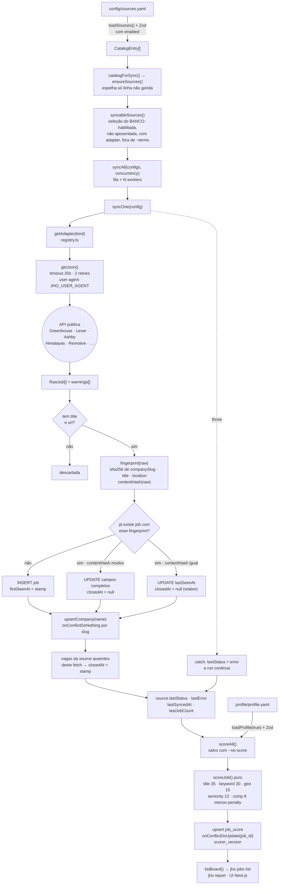

# Arquitetura

> **Baseline de 20/08/2026:** a auditoria foi remediada. O inventário executável
> de ownership, tabelas, APIs e dependências está no
> [mapa de contextos](engineering/context-map.md); o histórico e as provas ficam
> no [backlog de remediação](engineering/architecture-remediation.md).

> **Runtime atual (corte Turso → Supabase):** a aplicação conecta somente em
> PostgreSQL por `DATABASE_URL`; migrations usam `DATABASE_MIGRATION_URL`.
> Referências a libSQL/Turso mais abaixo são o desenho histórico anterior ao
> corte e não descrevem um fallback disponível. O snapshot SQLite legado só é
> lido pelos scripts de seleção/importação em `scripts/migration/`.

## Por que isto existe

`master-jobs` resolve um problema concreto: encontrar vagas compatíveis com o
perfil do Andreus Timm (Senior AI Software Architect, 20+ anos, Brasil, remoto
B2B, **sem autorização de trabalho nos EUA**), ranqueá-las de forma
**determinística e auditável**, e acompanhar o funil de candidaturas — tudo a
partir de APIs públicas e não autenticadas de ATS e agregadores.

O sistema é otimizado para duas coisas:

1. **Re-execução segura.** Todo comando pode rodar de novo. Um sync que roda
   duas vezes no mesmo dia não duplica vaga, não perde histórico e não apaga
   decisão nenhuma.
2. **Leitura por agente.** O ranking precisa ser explicável linha a linha
   (`job_score.reasons`, `job_score.blockers`) porque a decisão final é humana,
   e porque um LLM que reescreve o scorer sem entender os pesos degrada o
   produto silenciosamente.

Este documento é o mapa do sistema inteiro. Para o schema em detalhe veja
`docs/data-model.md`; para as decisões e seus trade-offs, `docs/adr/`.

---

## As camadas

O fluxo principal é `Sourcing → Matching → Pursuit → report/UI`. Candidate,
Skills e FX alimentam Matching; Correspondence observa fatos e solicita uma
transição explícita de Pursuit.

| Camada | Diretório | Responsabilidade | O que NÃO faz |
|---|---|---|---|
| **sources** | `src/core/sources/` | Um adapter por endpoint público. Fetch, mapear para `RawJob`, retornar `SourceSnapshot { jobs, warnings, completeness }` — `completeness` diz se a listagem é a fonte inteira ou uma janela. | Não normaliza, não deduplica, não pontua, não toca no banco. |
| **ingest** | `src/core/ingest/` | Normalização (`slugifyCompany`, `normalizeTitle`, `normalizeLocation`), `fingerprint`/`contentHash`, upsert idempotente em `job`, fechamento do que sumiu, saúde da `source`. | Nunca escreve em `application`. |
| **scoring** | `src/core/scoring/` | `score.ts` é um scorer **puro** (sem banco) que recebe `ScoreInput` + `Profile` e devolve `ScoreResult`. `apply.ts` persiste em `job_score`. | Não faz I/O de rede, não chama LLM. |
| **matching** | `src/contexts/matching/` | Score candidato–vaga, elegibilidade, board/cockpit e comparação manual. | Não altera candidatura. |
| **pursuit** | `src/contexts/pursuit/` | Estado do usuário e máquina de transições. Toda mudança grava `application_event` atomicamente. | Não é alcançável pela ingestão. |
| **report / UI** | `src/core/report/`, `app/` | Renderers recebem DTOs e retornam texto; a CLI faz filesystem. A UI Next.js 16 consome APIs públicas dos contextos. | Não duplica SQL nem recalcula score. |

Camadas transversais: `src/core/profile/` (carga e validação Zod do
`profile.yaml`, insumo do scoring) e `src/core/db/` (cliente PostgreSQL,
schema Drizzle, migrations).

> **Invariante:** Adapters são burros — fetch, mapear, retornar. Normalização,
> deduplicação e scoring acontecem downstream. É isso que faz "adicionar uma
> fonte" custar um arquivo em `src/core/sources/` + uma entrada em
> `registry.ts` + uma entrada em `config/sources.yaml` com `rationale`, sem
> tocar no pipeline.

---

## Por que domínio e casos de uso são separados da CLI/UI

`src/cli.ts` é composition root Commander e adaptador de terminal. Formata,
lê/grava arquivos e chama APIs públicas; decisões ficam nos contextos ou em
módulos coesos de `src/core`.

Concretamente, a API pública de Matching expõe `listBoard()`, a única definição
do que é "vaga aberta e relevante"
(`closed_at IS NULL AND coalesce(fit,0) >= minFit`, ordenado por fit desc e
`first_seen_at` desc). `jho jobs list`, `jho report` e os React Server
Components consomem essa mesma função.
Se a definição estivesse duplicada, UI e CLI divergiriam na primeira mudança de
critério — e o usuário passaria a decidir com duas verdades.

A mesma lógica vale para o bootstrap: `runMigrations()` existe como código
(`src/core/db/migrate.ts`) e não apenas como `drizzle-kit migrate`, justamente
para que CLI, testes e o workflow de migration inicializem o banco pelo mesmo
caminho.

Consequência prática para agentes: **não implemente lógica em `src/cli.ts`**.
Uma query nova nasce atrás da API pública do contexto proprietário.

> **Invariante:** Uma definição de verdade por conceito. Se CLI e UI precisam da
> mesma resposta, a função vive atrás da API pública do contexto e ambas a
> importam.

---

## Fluxo de dados de um sync

`pnpm jho jobs sync` é o caminho crítico. Da requisição HTTP até uma linha
pontuada:



Pontos do fluxo que costumam ser mal entendidos:

- **`fingerprint` é a identidade da vaga, não a chave da fonte.** Ele exclui
  deliberadamente a fonte e a URL — é exatamente isso que colapsa a mesma vaga
  vista pelo board Ashby da empresa *e* por um agregador. A localização **é**
  incluída porque empresas grandes abrem o mesmo título em várias regiões e só
  algumas são alcançáveis do Brasil.
- **`contentHash` decide se vale reescrever a linha.** Igual → só `lastSeenAt` e
  reabertura. Diferente → update completo e `result.updated++`.
- **Reabrir é o default.** Todo caminho de update seta `closedAt: null`. Vaga que
  voltou ao board volta ao ranking.
- **O fechamento é por fonte.** `syncOne()` só fecha vagas cujo `source_id` é o
  da fonte corrente e que não apareceram neste fetch — e só quando o fetch
  trouxe pelo menos um resultado. Uma fonte que falhou não fecha nada, porque o
  `catch` acontece antes.
- **O scoring roda uma vez no fim**, não por vaga. `scoreAll()` sem `--all`
  processa apenas jobs abertos sem score ou com `scorer_version` diferente de
  `SCORER_VERSION`.

> **Invariante:** Ingestão nunca escreve em `application`. Sync pode inserir,
> atualizar e fechar `job`, mas jamais toca decisões do usuário. (Item 1 do
> cabeçalho de `src/core/ingest/run.ts`.)

> **Invariante:** Vaga que some é fechada, não deletada — marque `closedAt`. A
> única exclusão permitida é `pruneClosed()`, e ela protege explicitamente o que
> tem candidatura: `job.id not in (select job_id from application)`.

> **Invariante:** Mudou a receita do `fingerprint`? Você invalidou a
> deduplicação de todo o banco existente. Trate como migração de dados, não como
> refactor.

---

## Concorrência em `syncAll`

Não há biblioteca de pool. O modelo cabe em quinze linhas em
`src/core/ingest/run.ts`:

```ts
const concurrency = opts.concurrency ?? 4;
const queue = [...configs];
const results: SyncSourceResult[] = [];

async function worker(): Promise<void> {
  for (;;) {
    const next = queue.shift();
    if (!next) return;
    const r = await syncOne(next);
    results.push(r);
    opts.onProgress?.(r);
  }
}

await Promise.all(Array.from({ length: Math.min(concurrency, configs.length) }, worker));
```

Propriedades que importam:

| Propriedade | Como é garantida |
|---|---|
| Concorrência limitada | `Math.min(concurrency, configs.length)` workers, default 4 (`--concurrency <n>` no CLI). Nunca mais workers do que fontes. |
| Distribuição por demanda | Fila compartilhada com `queue.shift()`. Um board lento não bloqueia os rápidos; quem termina primeiro pega o próximo. |
| Sem race no `shift()` | O event loop do Node é single-threaded e `shift()` é síncrono, então dois workers nunca pegam o mesmo item. |
| Uma fonte quebrada não derruba a run | O `try/catch` está **dentro** de `syncOne()`, não em volta do `Promise.all`. O erro vira `source.lastStatus = 'error'` + `lastError` e o worker segue para a próxima fonte. |
| Progresso em tempo real | `opts.onProgress?.(r)` é chamado assim que cada fonte termina — é o que imprime as linhas `✓ greenhouse:stackblitz … 1234ms` no CLI. |
| Ordem não determinística | `results` fica em ordem de conclusão, não de configuração. Não escreva código que dependa do índice. |

Dentro de `syncOne()` o processamento é **serial por vaga** — um `SELECT` por
fingerprint, depois insert/update. É lento por design: paralelizar escritas numa
mesma conexão PostgreSQL troca previsibilidade por pouco ganho, e o gargalo real
é a rede das APIs públicas.

A contenção de rede é tratada em `src/core/sources/http.ts`: `AbortController`
com timeout de 20 000 ms, no máximo 2 retries e **apenas** para status em
`RETRYABLE = {408, 425, 429, 500, 502, 503, 504}`, com backoff
`500 * 2 ** attempt`. Um 404 (handle de board errado) falha na hora — o
comentário no código diz: "A 404 means the board handle is wrong; retrying just
wastes time."

> **Invariante:** Uma fonte que falha é registrada e pulada; nunca aborta a run.
> Um board com handle errado não pode custar as outras 11 fontes.

---

## PostgreSQL explícito no runtime

`src/core/db/client.ts` valida que `DATABASE_URL` é uma URL PostgreSQL e falha
cedo quando ela não existe. `src/core/db/migrate.ts` abre uma conexão separada
com `DATABASE_MIGRATION_URL`, que pode ter privilégio de DDL sem concedê-lo ao
runtime. A composição continua simples e cacheada (`getDb()` / `closeDb()`),
mas não há fallback para arquivo local ou para Turso.

O ambiente local usa PostgreSQL em Docker, com o mesmo schema e migrations da
produção. O arquivo SQLite de `data/` e as tabelas de HTML bruto pertencem ao
snapshot pré-corte e só podem ser processados pela allowlist em
`scripts/migration/`; eles não são carregados pelo CLI normal.

> **Invariante:** uma URL de banco ausente ou com protocolo errado interrompe a
> execução antes da primeira query. Conectar acidentalmente em outro banco é
> pior que falhar alto.

---

## Node 24 e type stripping nativo

Não existe build step para o CLI. O script `jho` é literalmente:

```bash
node --experimental-strip-types --no-warnings --env-file-if-exists=.env src/cli.ts
```

O Node 24 **apaga** as anotações de tipo e executa o resto. Ele não compila: não
há downlevel, não há emissão de código. Portanto só é legal a sintaxe TypeScript
que desaparece sem deixar runtime atrás de si. O guardrail está ligado no
`tsconfig.json`:

```json
"erasableSyntaxOnly": true
```

Proibido no repositório inteiro:

| Construção | Por quê | O que usar |
|---|---|---|
| `enum Status { ... }` | Compila para um objeto em runtime | `const X = [...] as const` + union type — é o que `APPLICATION_STATUSES` faz em `src/core/db/schema.ts` (com `ApplicationStatus = (typeof APPLICATION_STATUSES)[number]`). `SourceKind` inverte a direção: é um union escrito à mão em `src/core/sources/types.ts`, e o array `KINDS` de `src/core/sources/config.ts` é derivado dele via `as const satisfies readonly SourceKind[]` |
| `constructor(private x: T)` (parameter properties) | Gera atribuição em runtime | Campo declarado + atribuição explícita — ver a classe `HttpError` em `src/core/sources/http.ts` |
| `namespace Foo { ... }` | Gera IIFE | Módulos ES |
| Decorators (`@algo`) | Semântica de runtime | Funções normais |
| `import Foo = require(...)` | Sintaxe legada com runtime | `import` ES |

Detalhes que decorrem disso e que um agente precisa respeitar:

- **Imports usam a extensão `.ts` explícita** (`from "./schema.ts"`), porque não
  há resolver de build no meio.
- `isolatedModules: true` está ligado: tipos re-exportados precisam de
  `export type` / `import type`.
- Sintoma de violação em runtime: `ERR_UNSUPPORTED_TYPESCRIPT_SYNTAX`. O
  `pnpm typecheck` (`tsc --noEmit`) pega antes.

> **Invariante:** Só sintaxe TypeScript apagável. Sem `enum`, sem parameter
> properties, sem `namespace`, sem decorators. Ver
> `docs/adr/0006-typescript-apagavel-sem-build-step.md`.

---

## O scorer como fronteira

`src/core/scoring/score.ts` é puro de propósito: sem banco, sem rede, sem
relógio. Recebe `ScoreInput` e `Profile`, devolve `ScoreResult`. `apply.ts` faz
o I/O. Isso mantém o scorer trivialmente testável e reprodutível.

Os pesos somam 100 antes das penalidades:

```ts
/** Component weights. They sum to 100 before penalties are subtracted. */
const WEIGHTS = {
  title: 35,
  keyword: 30,
  seniority: 12,
  geo: 15,
  comp: 8,
} as const;
```

A penalidade é `blockers.length * 12 + (keywords.negatives.length > 0 ? 5 : 0)`,
e o fit final é `Math.max(0, Math.min(100, rawTotal - penalty))`. Blockers
**capam** a nota em vez de zerá-la — o comentário no código explica: "a great
role that says 'US preferred' is still worth seeing, just not at the top of the
list". Detalhes componente a componente em `docs/scoring.md`.

`SCORER_VERSION` (valor atual em `src/core/scoring/score.ts`) e o
`profile_hash` são persistidos em cada linha de `job_score`. Sem `--all`, `scoreAll()` processa jobs sem score, com geração ou
perfil divergentes, e os que expiraram pela política de freshness.

> **Invariante:** Mexeu em `profile.yaml` ou no scorer? Bump `SCORER_VERSION` em
> `src/core/scoring/score.ts` e rode `pnpm jho jobs score --all`. Sem o bump,
> scores antigos e novos coexistem no mesmo ranking sem ninguém perceber.

---

## Configuração validada, nunca assumida

Os dois arquivos editados à mão passam por Zod v4 no load e falham com a lista
completa de problemas no formato `path: message`:

| Arquivo | Loader | Schema | Override de caminho |
|---|---|---|---|
| `profile/profile.yaml` | `loadProfile(force = false)` (cache em módulo) | `ProfileSchema` | `JHO_PROFILE_PATH` |
| `config/sources.yaml` | `loadSources()` (devolve toda entrada, com `enabled`; o sync seleciona do banco) | `SourcesFile` | `JHO_SOURCES_PATH` |

`scoreAll()` chama `loadProfile(true)` — força releitura, para que editar o
YAML e rodar o score na sequência não use um perfil em cache.

> **Invariante:** Zod valida tudo que é editado à mão. Um typo num `weight` deve
> quebrar no load, não produzir um scorer que ranqueia tudo em zero.

---

## Fronteira LinkedIn

Nenhuma camada deste sistema lê LinkedIn. O sourcing é 100% ATS e agregadores
públicos. A publicação usa a API oficial self-serve (`w_member_social`);
comentários, conexões e busca são **assistidos** — o agente redige, o humano
executa. O schema carrega essa regra na tabela `engagement`: "Rows here are
NEVER executed automatically… This is the deliberate boundary that keeps the
account inside the LinkedIn User Agreement."

> **Invariante:** Nunca faça scraping do LinkedIn. Nada no repositório pode ler
> `li_at`, dirigir uma sessão autenticada ou usar um "LinkedIn MCP" não oficial.
> Ver `docs/linkedin-policy.md` e
> `docs/adr/0001-nao-fazer-scraping-do-linkedin.md`.

---

## Mapa rápido dos diretórios

Contagens (tabelas, adapters) ficam no código e em
[`data-model.md`](data-model.md), não aqui.

```
src/contexts/      bounded contexts — lista viva em engineering/context-map.md
src/core/          lógica pura, compartilhada entre CLI e UI
  i18n/            pt-BR e en, chaves tipadas contra o dicionário português
  db/              composition root Drizzle, client e migrations
  sources/         um adapter por board público + registry + careers (página própria)
  ingest/          normalização, fingerprint, upsert, import manual, verificação
  scoring/         fit score determinístico + persistência
                   score.ts · freshness.ts · benefits.ts · apply.ts
  profile/         carga e validação de profile.yaml (Zod)
  mail/            parser MIME, classificador, extrator de job alert, Gmail OAuth
  positioning/     plano da auditoria como dados
  report/          export markdown
  analytics/       estatística: Wilson, Spearman, diagnóstico de componente
  scrape/          fila, robots.txt, captura e extração (duas etapas)
  security.ts      autoverificações (bind, PII, segredos, permissões)
  apply/           dossiê de candidatura (prepara; nunca envia — ADR 0010)
  llm/             porta BYOK, adapters e cadastro de provedores/modelos
                   port.ts · providers.ts · registry.ts · analyze.ts
  clock.ts         relógio injetável — só onde o tempo é decisão, não carimbo
  money.ts         value object (amount + currency + period)
  pdf.ts           extração de PDF (unpdf, JS puro) + limpeza de texto
  contacts.ts      rede profissional e referrals
src/cli.ts         Commander
app/               dashboard Next.js — adapter sobre APIs públicas
config/sources.yaml   quais boards buscar
profile/profile.yaml  perfil do candidato — fonte da verdade do scoring
data/jobs.db       snapshot SQLite legado (gitignored; não é runtime)
```

Fluxo: `sources → ingest → scoring → application → report/UI`. A migração para
hexagonal/DDD está decidida na ADR 0007 e concluída — ver `MIGRATION.md` e
[`engineering/context-map.md`](engineering/context-map.md).

## Mapa arquivo a arquivo

### Superfície de uso

| Arquivo | O que é |
|---|---|
| `src/cli.ts` | Toda a superfície de uso hoje: Commander com os grupos `db` (`migrate`, `check`, `prune`, `seed`), `sources`, `jobs` e `tasks` (`list`/`ls` com `--horizon <name>` e `--all`, `show <id>`, `done <id>` com `--status <name>` default `done`), mais os comandos soltos `track` / `pipeline` / `report` / `profile`. Helpers locais de cor ANSI (`c`), `fitColor()`, `truncate()` e `withDb()` (garante `closeDb()` no `finally`). Sem regra de negócio. |

### Banco de dados

| Arquivo | O que é |
|---|---|
| `src/core/db/schema.ts` | Composition root Drizzle/PostgreSQL das 28 tabelas no schema `production`. Ownership lógico e APIs estão no mapa de contextos; a declaração física central preserva o grafo de FKs e migrations. |
| `src/core/db/client.ts` | Cliente PostgreSQL único e cacheado em módulo (`getDb` / `closeDb`); exige `DATABASE_URL` e rejeita protocolos que não sejam PostgreSQL. Reexporta `schema`. |
| `src/core/db/migrate.ts` | `runMigrations(folder = "./drizzle/postgres")` via `drizzle-orm/postgres-js/migrator`, usando `DATABASE_MIGRATION_URL` separado do runtime. |
| `src/core/db/repo.ts` | Implementação SQL legada atrás das APIs públicas. Board filtra antes da paginação e agrega count/facets em SQL, sem teto artificial. UI/CLI não importam este arquivo. |

### Sourcing

| Arquivo | O que é |
|---|---|
| `src/core/sources/types.ts` | Contratos: `RawJob`, `SourceKind` (12 valores), `SourceConfig`, `FetchResult`, `Completeness`, `SourceSnapshot`, `SourceAdapter`. |
| `src/core/sources/registry.ts` | `ADAPTERS: Partial<Record<SourceKind, SourceAdapter>>` com 10 adapters, `getAdapter()` (lança para kind não registrado) e `sourceId(kind, handle)`, que devolve `kind:handle`. |
| `src/core/sources/config.ts` | `sourcesPath()` e `loadSources()`: valida com Zod e devolve toda entrada com `enabled` — quem quer só as habilitadas filtra. |
| `src/core/sources/http.ts` | `getJson()` com `AbortController` (timeout 20 000 ms), até 2 retries só para `RETRYABLE`, backoff `500 * 2 ** attempt`, user-agent de `JHO_USER_AGENT`; classe `HttpError`; `htmlToText()` (strip barato de HTML, suficiente para scoring, não para renderizar). |
| `src/core/sources/ats.ts` | Adapters `greenhouse`, `lever`, `ashby`, `smartrecruiters`, `recruitee`, com os tipos de resposta verificados contra respostas reais. |
| `src/core/sources/aggregators.ts` | Adapters `himalayas`, `remotive`, `arbeitnow`, `remoteok`, `adzuna`; helpers `toList()` (campo que às vezes é string, às vezes lista) e `toIso()` (número = segundos). |

### Ingestão e scoring

| Arquivo | O que é |
|---|---|
| `src/core/ingest/normalize.ts` | `slugifyCompany()`, `normalizeTitle()`, `normalizeLocation()` (tokeniza, ordena alfabeticamente e rejunta), `fingerprint()` e `contentHash()` (sha256 truncado em 32 chars), `toIsoDate()`. Contém as regexes `COMPANY_NOISE` e `TITLE_NOISE`. |
| `src/core/ingest/run.ts` | O pipeline de sync: `ensureSources()` (dois regimes por `managed_at`), `catalogForSync()`, `upsertCompany()`, `syncOne()`, `syncAll()` (workers com concorrência limitada consumindo uma fila) e `pruneClosed()`. O cabeçalho lista os 3 invariantes de ingestão. |
| `src/core/scoring/score.ts` | Scorer determinístico puro: `SCORER_VERSION`, `WEIGHTS`, `containsTerm()` (regex com borda de palavra, para "go" não bater em "google"), `scoreTitle` / `scoreKeywords` / `scoreSeniority` / `scoreGeo` / `scoreComp` / `findBlockers` e `scoreJob()`. |
| `src/core/scoring/apply.ts` | `scoreAll({ all })`: seleciona os jobs elegíveis, chama `scoreJob()` e faz upsert em `job_score` via `onConflictDoUpdate`. Retorna `{ scored, skipped, topFit }` — `skipped` é sempre 0 hoje. |

### Perfil e saída

| Arquivo | O que é |
|---|---|
| `src/core/profile/schema.ts` | `ProfileSchema` (Zod v4) validando identity / targets / constraints / keywords / blockers / compensation / seniority / evidence / growth / cv. `WeightedTerm` faz `.transform(s => s.toLowerCase())` em `term`; `Cluster` exige `weight` entre 0 e 1. |
| `src/core/profile/load.ts` | `profilePath()` (`JHO_PROFILE_PATH` ou `<cwd>/profile/profile.yaml`) e `loadProfile(force = false)` com cache em módulo; erro agregado listando cada issue como `path: message`. |
| `src/core/report/markdown.ts` | `renderBoardMarkdown()` é puro; `buildReport()`/`exportDossiers()` retornam DTO/texto. A CLI é responsável por diretórios e escrita. |

### Posicionamento

| Arquivo | O que é |
|---|---|
| `src/core/positioning/plan.ts` | `POSITIONING_PLAN: NewPositioningTask[]` — o plano de ação da seção 14 da auditoria de posicionamento (`Relatorio-Posicionamento-Andreus-Timm-2026-07-27.md`) como linhas executáveis, IDs `PT-0001`…, cada uma com `horizon` / `priority` / `effort` / `why` / `how` / `expected` / `sourceRef`. |
| `src/core/positioning/seed.ts` | `seedPositioning()` e a const `BASELINE` (métricas de 2026-07-27: SSI, search appearances, profile views, followers). Idempotente por construção: re-seed atualiza o texto da tarefa, **nunca** o `status`; o baseline entra com `onConflictDoNothing()`. |

> **Invariante:** `seedPositioning()` nunca reseta o `status` de uma tarefa. O
> progresso pertence ao usuário — re-seed refresca redação, não estado.

### Dados e configuração

| Arquivo | O que é |
|---|---|
| `profile/profile.yaml` | Perfil do candidato: fonte da verdade do scoring, das variantes de CV e das evidências citáveis. |
| `config/sources.yaml` | 12 fontes ativas + 1 entrada `adzuna` comentada. O cabeçalho do arquivo documenta o significado de `handle` por kind. |
| `drizzle/0000_remarkable_solo.sql` | Única migração; cria as 11 tabelas e todos os índices. |
| `drizzle/meta/_journal.json`, `drizzle/meta/0000_snapshot.json` | Metadados do drizzle-kit. |
| `data/jobs.db` | Snapshot SQLite legado, gitignored; não é runtime. |
| `.env.example` | Template comentado das variáveis (PostgreSQL, `CRON_SECRET`, LinkedIn oficial, Adzuna, user agent, export Obsidian). |
| `.gitignore` | Ignora `data/`, `*.db*`, `.env` / `.env.local`, `*.token.json`, `.linkedin-session.json`, `out/`, `node_modules/`, `.next/`, `.vercel/`. |

### Build e ferramental

| Arquivo | O que é |
|---|---|
| `package.json` | `master-jobs` 0.1.0, `type: module`, `engines.node >= 24.0.0`. Script `jho` = `node --experimental-strip-types --no-warnings --env-file-if-exists=.env src/cli.ts`. O script `db:seed` chama `pnpm jho db seed`, que carrega o plano de posicionamento e o baseline de métricas. |
| `tsconfig.json` | `target ES2023`, `module esnext`, `moduleResolution bundler`, `strict`, `noUncheckedIndexedAccess`, `isolatedModules`, **`erasableSyntaxOnly: true`**, `noEmit`, `jsx preserve`, plugin `next`, paths `@/*` e `@core/*`. |
| `drizzle.config.ts` | Configuração PostgreSQL, schema `./src/core/db/schema.ts`, migrations em `./drizzle/postgres`, e conexão por `DATABASE_MIGRATION_URL`. |
| `next.config.ts` | `experimental.cacheComponents: true` (Next 16 Cache Components) e `typedRoutes: true`. O dashboard existe e roda localmente em loopback. |
| `vitest.config.ts` | `include: ["tests/**/*.test.ts"]`, `environment: "node"`, `globals: false`. |
| `AGENTS.md` / `CLAUDE.md` | Entrada comum das instruções para agentes. `AGENTS.md` é a única fonte; `CLAUDE.md` é um symlink para ela. O detalhe normativo fica em `docs/engineering/rules/`. |
| `.claude/agents/fit-analyst.md`, `.claude/commands/{aplicar,fonte-nova,funil,vagas}.md` | Agente e slash-commands do Claude Code para triagem e funil. |
| `.claude/skills/{application-kit,candidate-profile,job-triage,linkedin-positioning}/SKILL.md` | As quatro skills que empacotam o procedimento de cada frente. |
| `.codex/config.toml`, `compozy/loops/job-sweep.yaml`, `compozy/README.md` | Configuração do Codex e o loop de varredura periódica de vagas. |
| `docs/adr/0001..0006` | Decisões históricas e ainda válidas: não fazer scraping do LinkedIn, sourcing via ATS públicos, scoring determinístico, separação entre fato observado e decisão do usuário e TypeScript apagável. A ADR 0002 registra o período libSQL anterior ao corte. |

### Scaffolding vazio

Diretórios que existem mas não contêm nenhum arquivo hoje: `app/api/`,
`components/`, `lib/`, `migrations/`, `src/db/`, `src/ingest/`, `src/lib/`,
`src/linkedin/`, `src/positioning/`, `src/report/`, `src/scoring/`,
`src/sources/` e `src/core/linkedin/`.

Toda a lógica real vive em `src/core/**` e `src/cli.ts`. Os diretórios
duplicados na raiz de `src/` (`src/scoring/` vs `src/core/scoring/`) são resíduo
de scaffolding — não coloque código neles.

Cobertura de teste hoje: o Vitest mede `src/**` inteiro — `cli.ts` incluído —
com piso global em `vitest.config.ts`, e o `pnpm check` reprova quando a
cobertura cai abaixo dele. Dentro disso, `tests/scoring.test.ts` (contra
`scoreJob()`) e `tests/normalize.test.ts` (contra `normalize.ts`) são as suítes
que seguram o núcleo determinístico.

> **Invariante:** Mexeu nos pesos ou nas regexes de normalização? Atualize
> `tests/scoring.test.ts` e `tests/normalize.test.ts` na mesma mudança —
> `pnpm check` roda o typecheck e o Vitest (além dos gates de changelog e de
> QA), e essas duas suítes são o que segura o scorer.

---

## Variáveis de ambiente

| Variável | Lida em | Efeito |
|---|---|---|
| `DATABASE_URL` | `db/client.ts` | URL PostgreSQL do runtime; obrigatória e sem fallback. |
| `DATABASE_MIGRATION_URL` | `db/migrate.ts`, `drizzle.config.ts` | URL PostgreSQL com privilégio de migration; obrigatória para `db migrate`. |
| `DATABASE_CA_CERT` | `db/client.ts` | CA opcional para PostgreSQL gerenciado. |
| `JHO_PROFILE_PATH` | `profile/load.ts` | Override do caminho de `profile.yaml`. |
| `JHO_SOURCES_PATH` | `sources/config.ts` | Override do caminho de `sources.yaml`. |
| `JHO_USER_AGENT` | `sources/http.ts` | Header `user-agent` em toda requisição; fallback `master-jobs/0.1 (personal job search)`. |
| `ADZUNA_APP_ID` / `ADZUNA_APP_KEY` | `sources/aggregators.ts` | Sem elas o adapter `adzuna` retorna 0 jobs + warning, em vez de falhar. |
| `JHO_VAULT_PATH` | `report/markdown.ts` | Raiz do vault Obsidian; ausente e sem `--out`, `buildReport()` retorna `path: null` e nada é escrito. |
| `JHO_REPORT_DIR` | `report/markdown.ts` | Subdiretório dentro do vault; default `05_Interviews/LinkedIn`. |
| `CRON_SECRET` | `app/api/cron/authorize.ts` | Segredo das rotas de `/api/cron/` (`recheck`, `varredura`); sem ele respondem 503. |
| `LINKEDIN_CLIENT_ID`, `LINKEDIN_CLIENT_SECRET`, `LINKEDIN_REDIRECT_URI` | — | Declaradas em `.env.example`, **nenhum código as lê hoje**. |

---

## O que ainda não existe

Fase 1 está pronta e validada: 12 fontes configuradas, 4.824 vagas ingeridas num
sync real, scoring auditável, funil funcionando, export pro Obsidian.

O dashboard Next.js existe e roda localmente; o corte de produção para Supabase
e a reativação da ingestão remota continuam pendentes. Ainda não existe geração
de CV/cover letter nem a integração de publicação no LinkedIn. As
tabelas `post`, `engagement` e `target_account` estão no schema, mas nenhum
código escreve nelas hoje. `positioning_task` e `metric_snapshot` já têm
escrita: `seedPositioning()` insere/atualiza tarefas e insere o baseline com
`onConflictDoNothing()`, e `jho tasks done` faz `update(positioningTask)`.

> **Invariante:** Não descreva como pronto o que ainda não está. Isso vale para
> este documento também — se você implementar uma camada, atualize esta seção na
> mesma mudança.


## Módulos adicionados depois da primeira versão

| Módulo | Papel | Por que existe separado |
|---|---|---|
| `src/core/money.ts` | Value object `Money` (amount + currency + period) | O scorer comparava número cru contra piso em USD, ignorando `comp_currency`. Puro e sem dependência — as taxas vêm do chamador |
| `src/contexts/fx/` | Cotações com cache em `fx_rate` | `FxRateProvider` com adapters Frankfurter e ER API; application service controla fallback |
| `src/core/country.ts` | País de uma localização escrita à mão, bandeira e nome traduzido | A mesma vaga chega uma vez por país — 2.543 linhas repetidas, 34% do acervo. Para juntá-las é preciso dizer qual país é cada uma. A tabela vem do ICU do Node, não de lista à mão, que envelheceria na primeira fonte nova |
| `src/core/contacts.ts` | Rede profissional e referrals | Referrals são ~40% das contratações e `application.channel` não era preenchido por nada |
| `src/core/mail/` | Parser MIME, classificador, extrator de alerta | Implementa a ADR 0008 |
| `src/core/ingest/detect.ts` | Reconhece o ATS por uma URL | Colar um link é o caminho mais rápido de cadastrar vaga |
| `src/core/ingest/manual.ts` | Cadastro por URL, resolvendo pelo adapter | Vaga manual é linha de primeira classe — mesmo fingerprint, mesmo dedupe |
| `src/core/ingest/import.ts` | Importa JSON de plataforma logada | Revelo e afins não têm endpoint público (ADR 0001 aplicada) |
| `src/core/ingest/verify.ts` | Checa se a vaga ainda existe | 25% dos links do Jobgether estavam mortos |
| `src/core/sources/braintrust.ts` | Adapter próprio | Único com elegibilidade por país **estruturada** |

### `src/core/mail/` em detalhe

```
eml.ts        RFC 5322/MIME mínimo, sem dependência externa
classify.ts   tipo da mensagem + confiança + sinal que decidiu
job-alert.ts  extrai vagas de um alerta
run.ts        pipeline: parse → classifica → vagas ou sugestões
```

O parser foi escrito à mão de propósito. `mailparser` é a escolha óbvia e é boa,
mas traz uma árvore grande de dependências para um projeto que manteve cinco
pacotes de runtime por decisão. O que se precisa é estreito — headers dobrados,
encoded-words, multipart aninhado, quoted-printable, base64, charset — e são
~150 linhas testáveis.

---

## A camada de interface

```
app/
  layout.tsx           navegação, TooltipProvider
  page.tsx             cockpit
  joblist.tsx          o card de vaga, compartilhado entre rotas
  filters.tsx          barra de filtros + parsing de searchParams
  grid.tsx             paginação, densidade, export, presets
  ui.tsx               Fit, ScoreBar, Legend, StatusBadge, Stat
  actions.ts           server action de mudança de status
  jobs/(lista)/page.tsx     lista com filtros e paginação
  jobs/(lista)/loading.tsx  esqueleto da lista (fronteira de Suspense)
  jobs/[id]/page.tsx   detalhe com breakdown; trilhas e histórico em Suspense
  pipeline/page.tsx    funil
  referrals/page.tsx   vagas onde há contato
  api/export/route.ts  CSV dos filtros atuais
```

Next.js 16 com shadcn/ui sobre Tailwind v4.

> **Invariante:** a UI é **adaptador**, não implementação paralela. Server
> Components e Server Actions chamam as mesmas APIs públicas que a CLI chama.
> A transição do funil passa por `setApplicationStatus` nos dois lados — uma
> mudança de status feita no navegador cai em `application_event` exatamente
> como uma feita no terminal. Outras mutações (conta, candidato, buscas, perfil
> público) ficam atrás do contexto proprietário e da sua guarda. Nunca duplique
> query entre as superfícies. Regra em
> [`engineering/rules/architecture.md`](engineering/rules/architecture.md#g65).

Três decisões que valem registro:

**Estado de filtro vive na URL**, não em React. A visão filtrada é
compartilhável, o botão voltar funciona, e as páginas continuam Server
Components. JavaScript de cliente existe em ilhas (editor, modal, formulários,
navegação, tema — ver ADR 0015), que não duplicam regra de negócio nem puxam o
grafo do servidor para o bundle.

O recorte `workMode=remote|hybrid|onsite` usa a mesma expressão SQL na lista,
contagem, facetas e exportação, antes de `LIMIT/OFFSET`. Modalidade reconhecida
em `raw.workplaceType` prevalece; localização explícita vem depois, seguida de
`remote=true` das fontes estruturadas. `raw.fields.workplace`, os campos da
página capturada e a flag remota de `careers` são heurísticas sobre palavras da
descrição e não decidem esse filtro: “hybrid cloud” e “remote sensing” não são
declarações de modalidade. `remote=false` sozinho não distingue híbrido de
presencial; sem um sinal reconhecido a vaga fica apenas em Todas. Nenhum dado
é regravado.

**`cacheComponents` do Next 16 está desligado.** Este dashboard lê um banco que
muda a cada sync, então cache só adiciona uma classe de bug de dado velho — e
proíbe os route segment configs que expressam "sempre fresco" em uma linha.

**`--primary` do shadcn resolve para o azul do `DESIGN.md`**, senão todo botão e
anel de foco carregaria o cinza padrão da biblioteca. `--accent` **não** foi
remapeado: no vocabulário do shadcn é superfície de hover, não cor de destaque.
