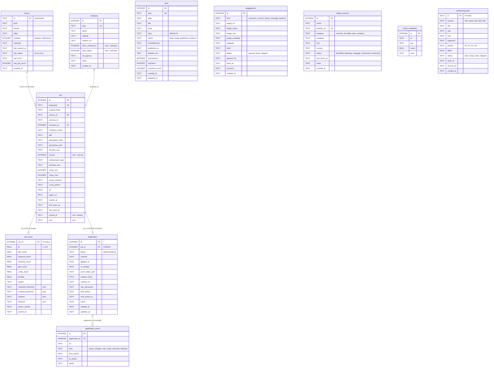

# Modelo de dados

## Por que isto existe

O banco do `job-hunt-os` guarda três coisas com naturezas muito diferentes, e a
única razão de o schema ser desse jeito é manter essas três coisas separadas:

1. **Fato observado** — o que uma fonte pública disse sobre uma vaga (`source`,
   `company`, `job`). Reingestível, reconstruível, descartável em último caso.
2. **Derivado** — o score calculado a partir do fato + `profile.yaml`
   (`job_score`). Descartável por construção: apaga e recalcula.
3. **Decisão do usuário** — em quais vagas você se candidatou, em que estágio
   está, o que combinou de taxa (`application`, `application_event`). Isto **não
   é reconstruível**. Se sumir, sumiu.

Todo o resto do documento é consequência dessa separação. Um agente que
confunde as camadas — por exemplo, escrevendo em `application` durante um sync,
ou deletando `job` em vez de fechá-la — destrói a única camada que não tem
backup natural.

O schema vive em [`src/core/db/schema.ts`](../src/core/db/schema.ts) (Drizzle,
dialeto SQLite/libSQL) e a migração gerada em
[`drizzle/0000_remarkable_solo.sql`](../drizzle/0000_remarkable_solo.sql).
São 11 tabelas.

Todo timestamp é `TEXT` em ISO-8601 UTC. O default é a constante `now` do
schema:

```ts
const now = sql`(strftime('%Y-%m-%dT%H:%M:%fZ','now'))`;
```

---

## Diagrama ER



`post`, `engagement`, `target_account`, `metric_snapshot` e `positioning_task`
não têm relacionamento por chave estrangeira com o núcleo de sourcing — são
ilhas do módulo de posicionamento LinkedIn.

---

## Núcleo de sourcing

### `source`

Uma feed configurada: um board de ATS, um agregador ou um import manual.
`config/sources.yaml` é a fonte da verdade — `ensureSources()` faz
`onConflictDoUpdate` por `id` no começo de cada `syncAll()`, atualizando
`label`, `rationale` e `enabled`. A tabela também carrega a **saúde do último
sync**, que é o que `pnpm jho sources list` imprime.

| Coluna | Notas |
|---|---|
| `id` (PK, TEXT) | `${kind}:${handle}`, montado por `sourceId()` em `registry.ts`. Ex.: `greenhouse:stackblitz` |
| `kind` | `greenhouse \| lever \| ashby \| smartrecruiters \| workable \| himalayas \| remotive \| arbeitnow \| remoteok \| adzuna \| manual` (comentário do schema; a union `SourceKind` real também inclui `recruitee`) |
| `handle` | board token / company slug / query — o significado muda por `kind`, ver `docs/sources.md` |
| `label` | nome legível; vários adapters usam como `companyName` quando a API não devolve o nome da empresa |
| `enabled` | INTEGER boolean, default `true`. `loadSources()` já filtra `enabled: true` e descarta o campo, então o banco praticamente sempre vê `true` |
| `rationale` | por que essa fonte está na lista — mantém o config auto-documentado |
| `last_synced_at`, `last_status`, `last_error`, `last_job_count` | carimbados no fim de `syncOne()`, tanto no caminho de sucesso quanto no `catch` |

Índice único: `source_kind_handle_idx (kind, handle)` — redundante com a PK por
construção, mas impede duas linhas com o mesmo par se alguém inserir à mão.

### `company`

Empresas deduplicadas entre fontes por `slug` (`slugifyCompany(name)`), mais os
fatos que decidem se vale a pena aplicar: contrata contractor? contrata LATAM?
veio por agência?

> **Invariante:** `hires_contractors`, `hires_latam`, `via_agency`, `website`,
> `careers_url` e `notes` são **preenchidos por pesquisa, nunca chutados pelo
> ingester**. `upsertCompany()` grava só `{ slug, name }` com
> `onConflictDoNothing`. `null` em `hires_*` significa *desconhecido*, não *não*.

### `job`

Uma vaga **como observada** em uma fonte. Do ponto de vista do usuário é um
fato imutável: reingestão atualiza conteúdo e `last_seen_at`, reabre
(`closed_at = null`), e nunca toca em estado de decisão.

| Coluna | Notas |
|---|---|
| `fingerprint` (UNIQUE) | identidade global da vaga — ver [Fingerprint vs contentHash](#fingerprint-vs-contenthash) |
| `content_hash` | detector de edição — mesma seção |
| `source_id` -> `source.id` | `ON DELETE cascade`. **Atenção:** é reescrito quando a vaga é atualizada com conteúdo novo (o `set` do ramo `contentHash` diferente inclui `sourceId`), então numa vaga vista por duas fontes essa coluna aponta para a última fonte que a viu com conteúdo alterado |
| `external_id` | id estável dentro da fonte; **não** participa da deduplicação |
| `company_id` -> `company.id` | sem cascade (`ON DELETE no action`) |
| `company_name` | denormalizado de propósito: existe mesmo quando `slugifyCompany()` devolve string vazia e `company_id` fica `null` |
| `description_html` / `description_text` | o `text` é o que o scorer lê. Fontes como `smartrecruiters` não trazem corpo e deixam ambos `null` |
| `remote` | `null` = a vaga não diz. Diferente de `false` |
| `comp_min`, `comp_max`, `comp_currency`, `comp_period` | `comp_period` em `year \| month \| hour`. A moeda **não** é convertida pelo scorer |
| `url`, `apply_url` | `apply_url` pode ser `null`; a CLI mostra `applyUrl ?? url` |
| `posted_at` | normalizado por `toIsoDate()`; `null` quando a fonte não dá data parseável |
| `first_seen_at` / `last_seen_at` | `first_seen_at` só é escrito no insert. `last_seen_at` é carimbado em todo sync que reencontra a vaga |
| `closed_at` | `null` = aberta. Ver o invariante 2 |
| `raw` (json) | payload original do adapter, guardado inteiro — é o que permite reprocessar um mapeamento errado sem refazer o fetch |

Índices: `job_fingerprint_idx` (único), `job_source_idx`, `job_company_idx`
(por `company_name`), `job_last_seen_idx`, `job_closed_idx`. O último importa
porque toda query de board filtra `closed_at IS NULL`.

### `job_score`

Score derivado, 1:1 com `job` (`job_id` é a própria PK, `ON DELETE cascade`).
O comentário de seção no schema é literal: *"Scoring (derived — safe to wipe and
recompute)"*.

| Coluna | Notas |
|---|---|
| `fit` | 0..100, já com penalidade subtraída e clampada |
| `title_score`, `keyword_score`, `seniority_score`, `geo_score`, `comp_score` | os cinco componentes, cujos pesos somam 100 antes das penalidades |
| `penalty` | pontos negativos de blockers e keywords negativas |
| `cluster` | chave de `targets.clusters` do `profile.yaml` — hoje `architect`, `staff`, `ai_lead`, `eng_lead`, `senior_ic` — ou `"other"`. É o que decide qual variante de CV usar. O comentário no schema (`architect \| staff \| ai-lead \| backend \| other`) está desatualizado em relação ao `profile.yaml` atual |
| `matched_keywords`, `missing_keywords`, `reasons`, `blockers` | JSON. `missing_keywords` só lista termos com `weight >= 7` |
| `scorer_version` | ver o invariante 3 |
| `scored_at` | carimbado explicitamente por `scoreAll()`, não pelo default da coluna |

Índice `job_score_fit_idx (fit)` — o board ordena por
`coalesce(job_score.fit, 0) DESC`.

---

## Pipeline de candidaturas

### `application`

Estado do usuário. Uma linha por vaga (`application_job_idx` é UNIQUE em
`job_id`). Criada sob demanda por `setApplicationStatus()` — vaga que você
nunca tocou simplesmente não tem linha aqui, e o board a mostra com status
`null` (o pseudo-status `unfiled` do `jho jobs list --status unfiled`).

| Coluna | Notas |
|---|---|
| `status` | default `'backlog'`; valores em `APPLICATION_STATUSES` |
| `channel` | `direct \| ats \| referral \| recruiter \| agency` — não escrito por nenhum comando hoje |
| `applied_at` | carimbado **na primeira vez** que o status vira `applied`; transições posteriores preservam o valor original (`status === "applied" && !previous.appliedAt ? stamp : previous.appliedAt`) |
| `cv_variant` | amarra de volta em `cv.variants` do `profile.yaml` |
| `next_action` / `next_action_at` | lidos pelo `jho pipeline` (linha `next:`) e indexados por `application_next_action_idx` |
| `updated_at` | escrito à mão em cada transição; é a ordenação do `jho pipeline` |

### `application_event`

Histórico **append-only** para reconstruir métricas de funil (tempo em cada
estágio, taxa de conversão). `setApplicationStatus()` grava um evento
`kind="status_change"` em toda transição, com `from_status` (ausente na
criação), `to_status` e `detail` (o `-n/--note` do `jho track`).

> **Invariante:** `application_event` nunca é atualizada nem deletada. É log.
> Qualquer correção é um evento novo, não um `UPDATE`.

### `APPLICATION_STATUSES` — a lista, verbatim

```ts
export const APPLICATION_STATUSES = [
  "backlog",
  "shortlisted",
  "preparing",
  "applied",
  "screening",
  "interviewing",
  "offer",
  "rejected",
  "withdrawn",
  "archived",
] as const;
```

A ordem do array **é** a ordem do funil impresso por `jho pipeline` (o loop
itera `APPLICATION_STATUSES` e pula os status com contagem zero). O `jho track`
valida a string contra essa lista **antes de tocar o banco**, e aborta com
`process.exitCode = 1` se não bater.

| Status | Significado operacional |
|---|---|
| `backlog` | Entrou no radar, decisão pendente. É o default de `application.status` e é tratado como **ainda em aberto**: `buildReport()` classifica `!r.status \|\| r.status === "backlog"` como "Novas oportunidades" e tudo que não é `backlog` como "Em andamento" |
| `shortlisted` | Você leu a vaga e decidiu que vale aplicar. Fila de trabalho real |
| `preparing` | CV / cover letter sendo adaptados para esta vaga específica |
| `applied` | Candidatura enviada. Único status que carimba `applied_at`, e só na primeira vez |
| `screening` | Triagem de recrutador / HR screen |
| `interviewing` | Entrevistas técnicas ou com o time em andamento |
| `offer` | Proposta na mesa |
| `rejected` | Eles disseram não (ou pararam de responder) |
| `withdrawn` | **Você** disse não — desistiu do processo |
| `archived` | Encerrado sem desfecho relevante; tira da vista sem apagar histórico |

Não existe máquina de estados: `setApplicationStatus()` aceita qualquer
transição entre valores válidos. A auditoria de trajetória fica em
`application_event`, não em restrições de transição.

> **Invariante:** para adicionar ou renomear um status, edite
> `APPLICATION_STATUSES` em `src/core/db/schema.ts` — é `as const`, não `enum`,
> porque o runtime é o type stripping do Node 24 (`erasableSyntaxOnly: true`).
> Um `enum` quebra em runtime com `ERR_UNSUPPORTED_TYPESCRIPT_SYNTAX`. Renomear
> um valor exige migrar as linhas existentes de `application.status` e de
> `application_event.from_status` / `to_status` — nada no banco valida esses
> textos.

---

## Módulo de posicionamento LinkedIn

Estas cinco tabelas existem no schema e na migração, mas **nenhum código as
escreve hoje**. A única leitura é `repo.openTasks()`, sobre `positioning_task`.

| Tabela | Para quê | Colunas notáveis |
|---|---|---|
| `post` | Rascunhos de conteúdo. *"Published through the official `w_member_social` API only."* | `slug` (UNIQUE), `pillar`, `status` (`draft \| ready \| published \| archived`), `linkedin_urn` (ex. `urn:li:share:123`), métricas `impressions` / `reactions` / `comment_count` |
| `engagement` | Fila de engajamento **assistido** | `kind` (`comment \| connect \| follow \| message \| endorse`), `target_url`, `draft`, `status` (`queued \| done \| skipped`), índice `(status, queued_for)` |
| `target_account` | As 30 contas-alvo da §2.2 do audit de posicionamento | `linkedin_url` (UNIQUE), `category` (`recruiter \| ai-leader \| peer \| company`), `status` (`identified \| following \| engaged \| connected \| conversing`) |
| `metric_snapshot` | Métricas de funil registradas à mão — SSI, search appearances, profile views | UNIQUE `(at, key)`, `value REAL` |
| `positioning_task` | O plano de ação da §14 do audit como linhas executáveis | `id TEXT` no formato `PT-0001`, `horizon` (`24h \| week \| 30d \| 60d \| 90d`), `priority` (`P0 \| P1 \| P2 \| P3`), `source_ref` apontando de volta pro audit |

> **Invariante:** `engagement` nunca é executada automaticamente. O comentário
> no schema é a regra: *"Rows here are NEVER executed automatically. The agent
> drafts, the human opens the URL and acts. This is the deliberate boundary that
> keeps the account inside the LinkedIn User Agreement."* Nenhuma coluna aqui
> guarda cookie, `li_at` ou material de sessão — e nenhuma deve passar a
> guardar.

---

## Os três invariantes de design

### 1. Ingestão nunca escreve em `application`

Está declarado no cabeçalho de [`src/core/ingest/run.ts`](../src/core/ingest/run.ts):

```
 *  1. Sync never writes to `application` — user decisions survive every re-run.
```

E é verificável por leitura: `run.ts` importa exatamente `company`, `job` e
`source` de `schema.ts`. `application` não aparece no arquivo — exceto dentro
da subquery textual de `pruneClosed()`, onde é usada só para **proteger** linhas
(`select job_id from application`).

Consequência prática: `pnpm jho jobs sync` pode rodar todo dia, quantas vezes
quiser, e um `status = 'interviewing'` continua `interviewing`. As tabelas de
decisão só mudam por `setApplicationStatus()`, chamada exclusivamente pelo
`jho track`.

> **Invariante:** nenhum código sob `src/core/ingest/` ou `src/core/sources/`
> pode importar `application` ou `applicationEvent` para escrita. Se um sync
> precisar sinalizar algo sobre uma vaga já candidatada, o lugar é `job` ou um
> campo derivado — nunca a linha do funil.

### 2. Vaga que some é fechada, não deletada

`syncOne()` compara os fingerprints vistos nesta rodada com os que aquela fonte
carregava e faz `UPDATE ... SET closed_at = stamp`. Nunca `DELETE`.

```ts
// Anything this source used to carry but no longer lists is closed.
if (seenFingerprints.length > 0) {
```

Dois detalhes que um agente precisa preservar:

- **O guard `seenFingerprints.length > 0` é intencional.** Se uma API devolve
  zero vagas (rate limit, mudança de endpoint, board vazio temporariamente),
  nenhuma vaga é fechada. Sem esse guard, um blip de API fecharia o board
  inteiro de uma empresa.
- **A varredura é por `source_id`.** Ela seleciona `job` com aquele `source_id`
  e `closed_at IS NULL`, e fecha o que não apareceu nesta rodada. Como
  `source_id` é reescrito quando uma vaga duplicada é atualizada com conteúdo
  novo por outra fonte, a "posse" de uma vaga vista por duas fontes pode migrar
  entre elas. Vale saber disso antes de debugar um `closed` inesperado.

Reabertura é automática: nos dois ramos do update (`contentHash` igual ou
diferente), o `set` inclui `closedAt: null`. Uma vaga que reaparece na fonte
volta ao board sem intervenção.

A **única** exclusão permitida no sistema é `pruneClosed()`, exposta como
`jho db prune --days <n>` (default `90`), e ela é explicitamente defensiva:

```ts
and(
  lt(job.closedAt, cutoff),
  sql`${job.id} not in (select job_id from application)`,
)
```

> **Invariante:** nenhum caminho de código pode `DELETE FROM job` sem o predicado
> `job.id not in (select job_id from application)`. As FKs `ON DELETE cascade` de
> `job_score` e `application` significam que apagar uma `job` apaga junto a linha
> de funil e todo o `application_event` pendurado nela — histórico que não tem
> como ser reconstruído.

### 3. Scores são derivados e versionados por `SCORER_VERSION`

`job_score` é a única tabela do núcleo que pode ser truncada sem perda: dado o
mesmo `job` e o mesmo `profile.yaml`, `scoreJob()` é uma função pura e
determinística (sem banco, sem rede, sem LLM) e reproduz os mesmos números.

A versão é uma constante em
[`src/core/scoring/score.ts`](../src/core/scoring/score.ts):

```ts
export const SCORER_VERSION = "1.0.0";
```

Ela é persistida em `job_score.scorer_version` e é **o gatilho de
repontuação**. Sem `--all`, `scoreAll()` seleciona apenas:

```sql
job.closed_at is null
  and (job_score.job_id is null or job_score.scorer_version <> '1.0.0')
```

Ou seja: vaga aberta sem score, ou com score de uma versão antiga. Com `--all`,
o filtro vira só `job.closed_at IS NULL` e tudo é repontuado. A escrita é
sempre `onConflictDoUpdate` em `job_score.jobId`, então rodar de novo é
idempotente.

> **Invariante:** mexeu nos pesos, na lógica do scorer ou em `profile.yaml`?
> **Bump `SCORER_VERSION`** e rode `pnpm jho jobs score --all`. Sem o bump,
> `scoreAll()` considera os scores antigos válidos, eles se misturam com os
> novos, e o ranking passa a comparar maçãs com laranjas sem nenhum sinal
> visível. (O comentário no topo de `score.ts` cita uma flag `--rescore`; a flag
> que existe de fato na CLI é `--all`.)

> **Invariante:** `scoreJob()` continua puro — sem `getDb()`, sem `fetch`, sem
> relógio influenciando o resultado. A separação `score.ts` (puro) / `apply.ts`
> (persistência) existe justamente para o scorer ser testável sem banco.

---

## Fingerprint vs contentHash

Ambos vivem em [`src/core/ingest/normalize.ts`](../src/core/ingest/normalize.ts),
ambos são `sha256` truncado em **32 caracteres hex**, e ambos respondem
perguntas diferentes.

| | `fingerprint` | `content_hash` |
|---|---|---|
| Pergunta | "esta vaga é *a mesma* que já vi?" | "esta vaga *mudou* desde a última vez?" |
| Entrada | `slugifyCompany(companyName)`, `normalizeTitle(title)`, `normalizeLocation(locationRaw)` | `title`, `locationRaw ?? ""`, `employmentType ?? ""`, `String(compMin ?? "")`, `String(compMax ?? "")`, `descriptionText.slice(0, 4000)` |
| Junção | `parts.join("\|")` | `parts.join("\|")` |
| Normalização | agressiva (lowercase, NFD sem acentos, remoção de ruído, tokens de localização ordenados alfabeticamente) | **nenhuma** — usa os valores crus |
| Constraint | `UNIQUE` (`job_fingerprint_idx`) | nenhuma |
| Papel no sync | chave de lookup: `select ... where job.fingerprint = fp` | comparação: `found.contentHash === ch ?` |

### Por que `fingerprint` exclui a fonte e a URL

O comentário no topo do arquivo é a justificativa:

> *"It deliberately excludes the source and the URL, because those are exactly
> what differ between duplicates."*

A mesma vaga da mesma empresa aparece no board Ashby da empresa **e** no
Himalayas **e** no RemoteOK, cada um com `source_id` e `url` diferentes. Se
qualquer um dos dois entrasse no hash, você teria três linhas para uma vaga só,
três scores idênticos poluindo o board e três chances de aplicar duas vezes na
mesma coisa. Excluindo-os, as três observações colapsam numa linha só — a
primeira insere, as outras duas caem no ramo de update.

**A localização entra no hash de propósito:**

> *"Location is included because large companies genuinely open the same title
> in several regions and only some of them are reachable from Brazil."*

"Staff Engineer — US Only" e "Staff Engineer — LATAM" na mesma empresa são
vagas diferentes para este usuário, e colapsá-las esconderia justamente a que
importa. `normalizeLocation()` tokeniza, **ordena alfabeticamente** e rejunta,
de forma que `"Remote - LATAM"`, `"LATAM (Remote)"` e `"latam remote"` produzem
a mesma string — colapsa variação de formatação sem colapsar região.

As regexes `COMPANY_NOISE` (sufixos como `inc`, `ltda`, `gmbh`, `technologies`)
e `TITLE_NOISE` (parênteses tipo `(Remote)`, marcadores `w/m/d`, `#1234`,
`job id: X`) existem pelo mesmo motivo: cada board decora o mesmo nome e o mesmo
título de um jeito, e a decoração não é identidade.

> **Invariante:** mudar a receita do `fingerprint` — os campos, a ordem, o
> separador, o `slice(0, 32)` ou qualquer uma das duas regexes de ruído —
> **invalida a deduplicação de todo o banco existente**. Os fingerprints antigos
> deixam de bater, tudo é reinserido como vaga nova, e as linhas antigas são
> fechadas na varredura seguinte. Se for realmente necessário, trate como
> migração de dados: recalcule os fingerprints das linhas existentes na mesma
> transação em que a nova receita entra.

### Por que `content_hash` existe

Ele responde "vale a pena reescrever esta linha?". No loop de `syncOne()`:

```ts
await db
  .update(job)
  .set(found.contentHash === ch ? { lastSeenAt: stamp, closedAt: null } : { ...values, closedAt: null })
  .where(eq(job.id, found.id));
if (found.contentHash !== ch) result.updated++;
```

- **Hash igual** -> a vaga foi só *revista*. Atualiza `last_seen_at`, reabre se
  estava fechada, e não conta como `updated`. Todo o resto do conteúdo fica como
  estava.
- **Hash diferente** -> o anúncio foi *editado* (mudou título, faixa salarial,
  localização, tipo de contrato ou o corpo). Reescreve a linha inteira, inclusive
  `source_id`, `url`, `raw` e o próprio `content_hash`, e conta em `updated`.

O corte em `descriptionText.slice(0, 4000)` é um trade-off: pega qualquer edição
substantiva sem hashear descrições de 30 KB milhares de vezes por sync. Um
ajuste no rodapé jurídico da vaga não vai disparar update — o que é exatamente o
comportamento desejado, já que o contador `updated` da saída do `jobs sync` só é
útil se significar "mudou algo que eu deveria reler".

> **Invariante:** `content_hash` é diagnóstico de mudança, nunca chave de
> identidade. Nunca faça lookup por `content_hash` e nunca coloque `UNIQUE` nele:
> duas vagas legitimamente diferentes podem ter conteúdo idêntico depois da
> normalização que o `fingerprint` aplica e o `content_hash` não.

Note que `content_hash` **não** dispara repontuação. Quem decide o que repontuar
é `SCORER_VERSION` (e o `--all`). Uma vaga cujo corpo mudou mantém o score
antigo até a próxima corrida com `--all` ou até um bump de versão — algo a
considerar ao mexer no pipeline.

---

## Migrations

Existe **uma** migração hoje: `drizzle/0000_remarkable_solo.sql` (193 linhas),
que cria as 11 tabelas e todos os índices. O fluxo é:

```bash
pnpm db:generate        # drizzle-kit gera o SQL a partir de schema.ts
pnpm jho db migrate     # aplica; roda tambem no inicio de `jho jobs sync`
```

`runMigrations()` cria o diretório do arquivo (`mkdir` recursivo) quando a URL é
`file:`, senão o libSQL não consegue abrir o banco.

> **Invariante:** `schema.ts` é a fonte da verdade; o SQL em `drizzle/` é
> **gerado**. Editar o `.sql` à mão desincroniza o snapshot de `drizzle/meta/` e
> a próxima geração produz um diff errado. Mexeu no schema, rode
> `pnpm db:generate` e commite os dois.
