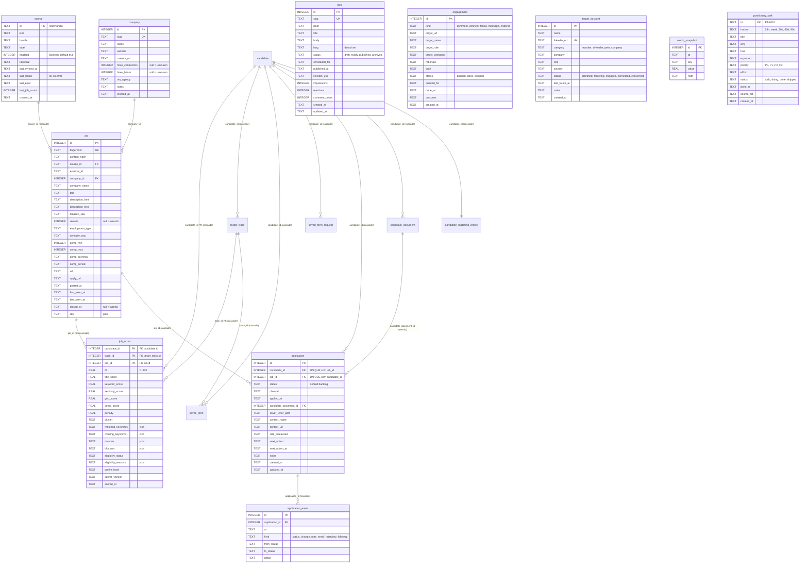

# Modelo de dados

## Por que isto existe

O banco do `master-jobs` guarda três coisas com naturezas muito diferentes, e a
única razão de o schema ser desse jeito é manter essas três coisas separadas:

1. **Fato observado** — o que uma fonte pública disse sobre uma vaga (`source`,
   `company`, `job`). Reingestível, reconstruível, descartável em último caso.
2. **Derivado** — o score calculado para o par candidato–vaga a partir do fato
   + perfil (`job_score`). Descartável por construção: apaga e recalcula.
3. **Decisão do usuário** — em quais vagas você se candidatou, em que estágio
   está, o que combinou de taxa (`application`, `application_event`). Isto **não
   é reconstruível**. Se sumir, sumiu.

Todo o resto do documento é consequência dessa separação. Um agente que
confunde as camadas — por exemplo, escrevendo em `application` durante um sync,
ou deletando `job` em vez de fechá-la — destrói a única camada que não tem
backup natural.

O schema vive em [`src/core/db/schema.ts`](../src/core/db/schema.ts) (Drizzle,
dialeto PostgreSQL, no schema `production`), com migrações incrementais em
`drizzle/postgres/`. São 28 tabelas; o diagrama abaixo destaca o núcleo de
sourcing, matching e pursuit.

Todo timestamp é `TEXT` em ISO-8601 UTC. O default é a constante `now` do
schema:

```ts
const now = sql`to_char(clock_timestamp() at time zone 'UTC', 'YYYY-MM-DD"T"HH24:MI:SS.MS"Z"')`;
```

---

## Diagrama ER



`post`, `engagement`, `target_account`, `metric_snapshot` e `positioning_task`
não têm relacionamento por chave estrangeira com o núcleo de sourcing — são
ilhas do módulo de posicionamento LinkedIn.

---

## Núcleo de sourcing

### `source`

Uma feed configurada: um board de ATS, um agregador ou um import manual.
`config/sources.yaml` é a fonte da verdade — `ensureSources()` faz
`onConflictDoUpdate` por `id` no começo de cada `syncAll()`, atualizando
`label`, `rationale` e `enabled`. A tabela também carrega a **saúde do último
sync**, que é o que `pnpm jho sources list` imprime.

| Coluna | Notas |
|---|---|
| `id` (PK, TEXT) | `${kind}:${handle}`, montado por `sourceId()` em `registry.ts`. Ex.: `greenhouse:stackblitz` |
| `kind` | `greenhouse \| lever \| ashby \| smartrecruiters \| workable \| himalayas \| remotive \| arbeitnow \| remoteok \| adzuna \| manual` (comentário do schema; a union `SourceKind` real também inclui `recruitee`) |
| `handle` | board token / company slug / query — o significado muda por `kind`, ver `docs/sources.md` |
| `label` | nome legível; vários adapters usam como `companyName` quando a API não devolve o nome da empresa |
| `enabled` | INTEGER boolean, default `true`. `loadSources()` já filtra `enabled: true` e descarta o campo, então o banco praticamente sempre vê `true` |
| `rationale` | por que essa fonte está na lista — mantém o config auto-documentado |
| `last_synced_at`, `last_status`, `last_error`, `last_job_count` | carimbados no fim de `syncOne()`, mas **não do mesmo jeito nos dois caminhos**: o ramo de sucesso grava os quatro (`lastStatus: "ok"`, `lastError: null`, `lastJobCount: result.fetched`); o `catch` grava só `lastSyncedAt`, `lastStatus: "error"` e `lastError`. `last_job_count` fica com o valor do último sync bem-sucedido, então `pnpm jho sources list` imprime esse número obsoleto ao lado do status `error` |

Índice único: `source_kind_handle_idx (kind, handle)` — redundante com a PK por
construção, mas impede duas linhas com o mesmo par se alguém inserir à mão.

### `company`

Empresas deduplicadas entre fontes por `slug` (`slugifyCompany(name)`), mais os
fatos que decidem se vale a pena aplicar: contrata contractor? contrata LATAM?
veio por agência?

> **Invariante:** `hires_contractors`, `hires_latam`, `via_agency`, `website`,
> `careers_url` e `notes` são **preenchidos por pesquisa, nunca chutados pelo
> ingester**. `upsertCompany()` grava só `{ slug, name }` com
> `onConflictDoNothing`. `null` em `hires_*` significa *desconhecido*, não *não*.

### `job`

Uma vaga **como observada** em uma fonte. Do ponto de vista do usuário é um
fato imutável: reingestão atualiza conteúdo e `last_seen_at`, reabre
(`closed_at = null`), e nunca toca em estado de decisão.

| Coluna | Notas |
|---|---|
| `fingerprint` (UNIQUE) | identidade global da vaga — ver [Fingerprint vs contentHash](#fingerprint-vs-contenthash) |
| `content_hash` | detector de edição — mesma seção |
| `source_id` -> `source.id` | `ON DELETE cascade`. **Atenção:** é reescrito quando a vaga é atualizada com conteúdo novo (o `set` do ramo `contentHash` diferente inclui `sourceId`), então numa vaga vista por duas fontes essa coluna aponta para a última fonte que a viu com conteúdo alterado |
| `external_id` | id estável dentro da fonte; **não** participa da deduplicação |
| `company_id` -> `company.id` | sem cascade: `ON DELETE no action`, **declarado** no schema. Empresa que ainda nomeia vaga não pode ser apagada; nada apaga empresa hoje |
| `company_name` | denormalizado de propósito: existe mesmo quando `slugifyCompany()` devolve string vazia e `company_id` fica `null` |
| `description_html` / `description_text` | `description_text` é o dado durável que scorer e UI leem. `description_html` permanece por compatibilidade de schema, mas ingestão nova grava `null`; `jho db cleanup` remove o legado |
| `remote` | `null` = a vaga não diz. Diferente de `false` |
| `comp_min`, `comp_max`, `comp_currency`, `comp_period` | `comp_min`/`comp_max` aceitam centavos para tarifas por hora ou projeto; `comp_period` em `year \| month \| hour`. A moeda **não** é convertida pelo scorer |
| `url`, `apply_url` | `apply_url` pode ser `null`; a CLI mostra `applyUrl ?? url` |
| `posted_at` | normalizado por `toIsoDate()`; `null` quando a fonte não dá data parseável |
| `first_seen_at` / `last_seen_at` | `first_seen_at` só é escrito no insert. `last_seen_at` é carimbado em todo sync que reencontra a vaga |
| `closed_at` | `null` = aberta. Ver o invariante 2 |
| `raw` (json) | fontes de rede preservam somente `{ workplaceType }` quando declarado e descartam o restante. Fontes `manual` e `recruiter` preservam notas e proveniência autorais; ver ADR 0019 |

`archived_at` ainda não existe no schema atual. A decisão aceita para a próxima
migration é adicionar essa coluna nullable como estado operacional separado de
`closed_at`: arquivar tira a vaga do board ativo, mas não apaga a vaga nem suas
candidaturas. O contrato está em [ADR 0020](adr/0020-ciclo-de-vida-e-historico-de-candidaturas.md).

Índices: `job_fingerprint_idx` (único), `job_source_idx`, `job_company_idx`
(por `company_name`), `job_last_seen_idx`, `job_closed_idx`. O último importa
porque toda query de board filtra `closed_at IS NULL`.

**Busca por termo (#214).** `job_description_trgm_idx` é GIN `gin_trgm_ops`
sobre `replace(replace(description_text, ' ', ''), '-', '')`, parcial em
`closed_at IS NULL`; `job_page_text_trgm_idx` é o mesmo sobre `job_page.text`.
Eles não respondem ao `~*` de palavra inteira — o separador opcional `[ -]?`
de `termPattern` não deixa o `pg_trgm` extrair trigrama garantido, e o índice
direto sobre a coluna devolvia 98% das linhas —, e sim a um **pré-filtro**
`ilike '%chave%'` sobre o texto sem espaço e hífen, que é condição necessária
do padrão. O `~*` exato continua na consulta e decide; só termos com chave
ASCII e três letras ou dígitos seguidos usam o pré-filtro
(`termPrefilterLike` em `src/core/term.ts`). A expressão da consulta
(`termTextCandidates` em `repo.ts`) precisa ser **idêntica** à do índice, ou o
planner o ignora sem erro — `tests/jobs-board.test.ts` (IT-214b) confere o
plano. Exigem a extensão `pg_trgm`, criada por `0012_enable_pg_trgm.sql` com
`CREATE EXTENSION IF NOT EXISTS`. Migrations `0012` e `0013` são só aditivas;
reverter é `DROP INDEX` dos dois (a extensão pode ficar). O migrator roda numa
transação, então `0013` usa `CREATE INDEX` comum, sem `CONCURRENTLY`: durante a
construção, escritas em `job` e `job_page` esperam. No acervo local (9.060
vagas) o índice de descrição tem 19 MB e ficou pronto em poucos segundos
(observado, não cronometrado); rode
`migrate.yml` fora da janela do sync.

A migration que adicionar `archived_at` também deve manter um índice que suporte
as varreduras por corte de `closed_at`/`archived_at`, conforme o TechSpec de
retenção; a coluna sem esse índice não atende ao contrato de lote.

### `job_score`

Score derivado, um por (candidato, trilha de alvo, vaga). A chave primária
composta é `(candidate_id, track_id, job_id)`; as três FKs usam
`ON DELETE cascade`. O comentário de seção no schema é literal: *"Scoring
(derived — safe to wipe and recompute)"*.

A trilha entrou na chave na versão 1.4.0 do scorer (ADR-008 da feature `term-search-target-tracks`). A trilha
principal tem linha para toda vaga aberta; uma trilha aceita só para as vagas
relevantes a ela. Todo leitor escolhe a trilha por `scoreTrackFilter` (board)
ou `primaryScoreFilter` (quem mostra uma nota só: dossiê, relatório,
exportação, cockpit, e o `max(fit)` que ordena verificação e captura) — um
teste de arquitetura reprova arquivo que lê `jobScore` sem um dos dois.

| Coluna | Notas |
|---|---|
| `candidate_id`, `track_id`, `job_id` | identidade composta do score; permite avaliações independentes da mesma vaga por pessoa e por trilha |
| `fit` | 0..100, já com penalidade subtraída e clampada |
| `title_score`, `keyword_score`, `seniority_score`, `geo_score`, `comp_score` | os cinco componentes, cujos pesos somam 100 antes das penalidades |
| `penalty` | pontos negativos de blockers e keywords negativas |
| `cluster` | chave de `targets.clusters` do `profile.yaml` — hoje `architect`, `staff`, `ai_lead`, `eng_lead`, `senior_ic` — ou `"other"`. É o que decide qual variante de CV usar. O comentário no schema (`architect \| staff \| ai-lead \| backend \| other`) está desatualizado em relação ao `profile.yaml` atual |
| `matched_keywords`, `missing_keywords` | JSON. `missing_keywords` só lista termos com `weight >= 7` |
| `reasons`, `blockers` | JSON de mensagens estruturadas `{ code, params }`; apresentação traduz os códigos |
| `eligibility_status`, `eligibility_reasons` | resultado `eligible \| ineligible \| unverifiable` e códigos auditáveis |
| `profile_hash` | hash do perfil efetivo (pessoa + alvo da trilha); mudança invalida a avaliação daquela trilha mesmo na mesma versão |
| `scorer_version` | ver o invariante 3 |
| `scored_at` | carimbado explicitamente por `scoreAll()`, não pelo default da coluna |

Índices `job_score_fit_idx (fit)` e
`job_score_candidate_track_fit_idx (candidate_id, track_id, fit)` — o board
ordena por `coalesce(job_score.fit, 0) DESC` dentro de uma trilha.

### `candidate_matching_profile`

Política persistida de matching por candidato. Guarda o JSON validado do
perfil, seu `profile_hash` e timestamps. O `profile.yaml` permanece como
fallback de bootstrap para o candidato padrão, não como estado global
compartilhado. A combinação `(candidate_id, profile_hash, scorer_version)`
torna avaliações independentes e auditáveis para dois candidatos na mesma
vaga.

Guarda a metade **pessoa** do perfil. A metade **alvo** — `targets`,
`keywords`, os dois limiares de senioridade e as faixas de remuneração — é da
trilha principal em `target_track`, e `effectiveProfile` junta as duas antes de
pontuar (ADR-009 da feature `term-search-target-tracks`). Salvar o perfil sincroniza o alvo da principal.

### `target_track`

Trilha de alvo: um tipo de vaga que a pessoa aceita, com a própria régua. Uma
principal por candidato e até seis ativas.

| Coluna | Notas |
|---|---|
| `candidate_id` | dono; `ON DELETE cascade` |
| `name`, `name_key` | nome exibido e a chave sem caixa; único por candidato (`target_track_name_idx`) |
| `is_primary` | no máximo uma por candidato — índice parcial `target_track_one_primary_idx` |
| `status` | `active` ou `archived`. Arquivar pausa os termos da trilha; restaurar retoma só os que o arquivamento pausou |
| `position` | ordem de exibição e desempate em "todas as trilhas" |
| `target_json` | o alvo (`TrackTarget`). **Nulo é principal pendente**: candidato sem perfil próprio, que não é pontuado (M-06) |
| `unreviewed_json` | campos herdados do perfil padrão que a pessoa ainda não revisou |

Mutação de trilha serializa por candidato com
`pg_advisory_xact_lock(hashtext('target_track'), candidate_id)`: limite de seis
ativas e nome único não resistiriam a duas requisições simultâneas só com
leitura antes da escrita.

### `saved_term`

Termo salvo ("php", "Tech Lead") ligado a uma trilha. Criado nesta versão; a
busca que o usa vem com a captura por termo.

| Coluna | Notas |
|---|---|
| `candidate_id`, `track_id` | dono e trilha; ambos `ON DELETE cascade` |
| `term`, `term_key` | o texto e a chave sem caixa, espaço e hífen (`termKey`); único por candidato |
| `status`, `paused_reason` | `active` ou `paused`; `track_archived` marca a pausa que a restauração desfaz |
| `last_run_requested_at`, `last_visit_at` | quando a busca foi pedida e quando a pessoa olhou o resultado |

### `saved_term_request`

Quantas buscas o candidato pediu pela tela em cada dia UTC (migração `0008`).
Salvar um termo e "rodar de novo" somam um; passado o teto de 40, o termo é
salvo e espera a varredura, e o "rodar de novo" é recusado. A conta mora fora de
`saved_term` de propósito: apagar o termo não pode zerá-la, senão um ciclo de
salvar-apagar ocuparia as janelas por minuto das plataformas de todo mundo.

| Coluna | Notas |
|---|---|
| `candidate_id`, `window_day` | chave primária; `candidate_id` com `ON DELETE cascade` |
| `requested` | pedidos no dia, somados por upsert atômico |

---

## Pipeline de candidaturas

### `application`

Estado do usuário. Uma linha por par candidato–vaga
(`application_candidate_job_idx` é UNIQUE em `candidate_id, job_id`). Criada
sob demanda por `setApplicationStatus(candidateId, jobId, ...)` — vaga que o
candidato nunca tocou simplesmente não tem linha aqui, e o board a mostra com
status `null` (o pseudo-status `unfiled` do `jho jobs list --status unfiled`).

| Coluna | Notas |
|---|---|
| `candidate_id` | dono obrigatório da candidatura; FK `candidate.id` com cascade |
| `status` | default `'backlog'`; valores em `APPLICATION_STATUSES` |
| `channel` | `direct \| ats \| referral \| recruiter \| agency` — não escrito por nenhum comando hoje |
| `applied_at` | carimbado **na primeira vez** que o status vira `applied`; transições posteriores preservam o valor original (`status === "applied" && !previous.appliedAt ? stamp : previous.appliedAt`) |
| `candidate_document_id` | documento exato enviado; FK composta com `candidate_id` impede referência cross-candidate e `ON DELETE restrict` preserva histórico mesmo após renomear label |
| `next_action` / `next_action_at` | lidos pelo `jho pipeline` (linha `next:`) e indexados por `application_next_action_idx` |
| `updated_at` | escrito à mão em cada transição; é a ordenação do `jho pipeline` |

### `application_event`

Histórico **append-only** para reconstruir métricas de funil (tempo em cada
estágio, taxa de conversão). `setApplicationStatus()` grava um evento
`kind="status_change"` em toda transição, com `from_status` (ausente na
criação), `to_status` e `detail` (o `-n/--note` do `jho track`).

> **Invariante:** `application_event` nunca é atualizada nem deletada pelo
> ciclo de vida do funil. É log. Qualquer correção é um evento novo, não um
> `UPDATE`. "Append-only" não é retenção absoluta: a FK é `cascade`, e apagar a
> candidatura, o candidato ou a vaga leva o histórico junto — por isso o único
> descarte de vaga deixa de fora toda vaga com candidatura.

**Regra de retenção:** `application` é a unidade de contagem de candidaturas;
`application_event` é a unidade de etapas/auditoria. Fechar ou arquivar o `job`
não altera nenhuma das duas tabelas. Read models de candidato e recrutador
devem aplicar o escopo de autorização antes de agregar.

`transitionApplication()` é a máquina de estados pura. Repetir o status atual
é idempotente (não cria outro evento), estados terminais não reabrem por uma
transição comum — a exceção é `archived` sem `applied_at`, que volta a
`backlog` para desfazer um "não me interessa" — e `applied_at` é gravado
somente na primeira entrada em `applied`. O repositório persiste a nova `application` e seu evento na mesma
transação e usa o status anterior como token de concorrência otimista.

### Endereço público (`candidate.public_slug`)

`/p/<slug>` lê `candidate.public_slug`, não `candidate.slug` (ADR 0024). `slug`
é o identificador interno — a CLI e o seed acham o dono por `slug = 'default'`
— e nunca muda pela tela; `public_slug` é o endereço que o próprio candidato
escolhe em `/candidate` (`setPublicSlug`), com índice único
`candidate_public_slug_idx`. Migrações `0010_candidate_public_slug` (coluna
anulável + índice) e `0011_backfill_candidate_public_slug` (copia `slug` para
quem não tem endereço, idempotente). Trocar o endereço faz o antigo responder
404 na hora, sem redirecionamento, e o libera para outra pessoa. Linha sem
`public_slug` não responde em `/p/`; é o caso do candidato cujo `slug` é
`user-<e-mail>` (criado pelo admin — o endereço publicaria o e-mail), que o
backfill e `ensureCandidate` deixam sem endereço até a pessoa escolher um.

### Candidato criado pela própria conta

Só o candidato do dono nasce do `profile/profile.yaml` (`syncCandidateFromProfile`,
slug `default`, `is_default = true`). Toda conta de papel candidato sem
candidato cria o PRÓPRIO em `/candidate` (#234), por `createOwnCandidate`:

- a linha é sempre **nova** — `insertOwnCandidate` usa `on conflict do
  nothing` (sem alvo: cobre o índice do `slug` e o do `public_slug`) e tenta `nome`, `nome-2` … `nome-50` e depois cinco sufixos
  aleatórios; nunca atualiza nem reaproveita candidato existente, ao contrário
  de `ensureCandidate`;
- slug reservado (`default`, nomes de rota) ou com prefixo `user-`/`e2e-` — os
  que `createUserAction` e o e2e montam e `ensureCandidate` reaproveita — ganha
  o prefixo `perfil-`;
- o currículo colado entra no mesmo commit do candidato;
- nasce com `visibility = 'private'`, `public_cv = false`, `is_default = false`
  e `public_slug = slug` — ou com o endereço que a pessoa escolheu no
  formulário, que não ganha sufixo: já publicado por outra pessoa, a criação
  volta pedindo outro; se só colide com o `slug` interno de alguém (endereço
  liberado por troca), o endereço é aceito e o `slug` interno é derivado do
  nome;
- o slug vem do nome digitado, sem acento — ver `src/core/candidate-identity.ts`;
- candidato e vínculo (`auth_user.candidate_id`) entram no mesmo commit, com
  `select … for update` na linha da conta: duplo envio concorrente espera o
  primeiro e devolve o candidato já criado, sem gerar um segundo.

### Migração do ownership por candidato

A mudança é expand/backfill/contract para não reconstruir tabelas antes de os
dados antigos terem dono:

1. `0011_boring_vertigo.sql` adiciona `candidate_id` anulável e índices;
2. `0012_backfill_candidate_scope.sql` escolhe, em ordem, o candidato marcado
   como default, o slug `default` ou o mais antigo; só cria um placeholder se
   houver linhas legadas e nenhum candidato;
3. `0013_robust_jasper_sitwell.sql` torna a coluna obrigatória e aplica a chave
   primária/índice único compostos.

O backfill é restrito a `candidate_id IS NULL`, portanto é reiniciável. Antes
do contract, instalações devem confirmar zero nulos em `application` e
`job_score`.

As migrations `0015`–`0018` fazem expand/backfill/contract da referência de
documento: adicionam `candidate_document_id`, escolhem deterministicamente a
versão legada pelo candidato/label, removem `cv_variant` e aplicam a FK composta
de ownership. `candidate_document` possui índice parcial único que permite no
máximo um documento atual por candidato/tipo; `saveDocument()` troca o atual na
mesma transação.

### `APPLICATION_STATUSES` — a lista, verbatim

```ts
export const APPLICATION_STATUSES = [
  "backlog",
  "shortlisted",
  "preparing",
  "applied",
  "screening",
  "interviewing",
  "offer",
  "rejected",
  "withdrawn",
  "archived",
] as const;
```

A ordem do array **é** a ordem do funil impresso por `jho pipeline` (o loop
itera `APPLICATION_STATUSES` e pula os status com contagem zero). O `jho track`
valida a string contra essa lista **antes de tocar o banco**, e aborta com
`process.exitCode = 1` se não bater.

| Status | Significado operacional |
|---|---|
| `backlog` | Entrou no radar, decisão pendente. É o default de `application.status` e é tratado como **ainda em aberto**: `buildReport()` classifica `!r.status \|\| r.status === "backlog"` como "Novas oportunidades" e tudo que não é `backlog` como "Em andamento" |
| `shortlisted` | Você leu a vaga e decidiu que vale aplicar. Fila de trabalho real |
| `preparing` | CV / cover letter sendo adaptados para esta vaga específica |
| `applied` | Candidatura enviada. Único status que carimba `applied_at`, e só na primeira vez |
| `screening` | Triagem de recrutador / HR screen |
| `interviewing` | Entrevistas técnicas ou com o time em andamento |
| `offer` | Proposta na mesa |
| `rejected` | Eles disseram não (ou pararam de responder) |
| `withdrawn` | **Você** disse não — desistiu do processo |
| `archived` | Encerrado sem desfecho relevante ou marcado "não me interessa"; some das listas de vagas por padrão sem apagar histórico. Sem `applied_at`, pode voltar a `backlog` |

As transições permitidas ficam em
`src/contexts/pursuit/domain/application.ts`. A função pura aceita a criação em
qualquer etapa já observada, mas depois exige avanço legal; estados terminais
recusam avanço, salvo a restauração de `archived` sem `applied_at` para
`backlog`. A auditoria da trajetória continua em `application_event`.

> **Invariante:** para adicionar ou renomear um status, edite
> `APPLICATION_STATUSES` no domínio de Pursuit — é `as const`, não `enum`,
> porque o runtime é o type stripping do Node 24 (`erasableSyntaxOnly: true`).
> Um `enum` quebra em runtime com `ERR_UNSUPPORTED_TYPESCRIPT_SYNTAX`. Renomear
> um valor exige migrar as linhas existentes de `application.status` e de
> `application_event.from_status` / `to_status` — nada no banco valida esses
> textos.

---

## Módulo de posicionamento LinkedIn

Estas cinco tabelas existem no schema e na migração, mas **nenhum código as
escreve hoje**. A única leitura é `repo.openTasks()`, sobre `positioning_task`.

| Tabela | Para quê | Colunas notáveis |
|---|---|---|
| `post` | Rascunhos de conteúdo. *"Published through the official `w_member_social` API only."* | `slug` (UNIQUE), `pillar`, `status` (`draft \| ready \| published \| archived`), `linkedin_urn` (ex. `urn:li:share:123`), métricas `impressions` / `reactions` / `comment_count` |
| `engagement` | Fila de engajamento **assistido** | `kind` (`comment \| connect \| follow \| message \| endorse`), `target_url`, `draft`, `status` (`queued \| done \| skipped`), índice `(status, queued_for)` |
| `target_account` | As 30 contas-alvo da §2.2 do audit de posicionamento | `linkedin_url` (UNIQUE), `category` (`recruiter \| ai-leader \| peer \| company`), `status` (`identified \| following \| engaged \| connected \| conversing`) |
| `metric_snapshot` | Métricas de funil registradas à mão — SSI, search appearances, profile views | UNIQUE `(at, key)`, `value REAL` |
| `positioning_task` | O plano de ação da §14 do audit como linhas executáveis | `id TEXT` no formato `PT-0001`, `horizon` (`24h \| week \| 30d \| 60d \| 90d`), `priority` (`P0 \| P1 \| P2 \| P3`), `source_ref` apontando de volta pro audit |

> **Invariante:** `engagement` nunca é executada automaticamente. O comentário
> no schema é a regra: *"Rows here are NEVER executed automatically. The agent
> drafts, the human opens the URL and acts. This is the deliberate boundary that
> keeps the account inside the LinkedIn User Agreement."* Nenhuma coluna aqui
> guarda cookie, `li_at` ou material de sessão — e nenhuma deve passar a
> guardar.

---

## Os três invariantes de design

### 1. Ingestão nunca escreve em `application`

Está declarado no cabeçalho de [`src/core/ingest/run.ts`](../src/core/ingest/run.ts):

```
 *  1. Sync never writes to `application` — user decisions survive every re-run.
```

E é verificável por leitura: `run.ts` importa exatamente `job` e `source` de
`schema.ts`, e `application` só aparece ali em comentário. `pruneClosed()` delega o
descarte a `deleteClosedJobsWithoutApplication()`, em `src/core/db/retention.ts`,
onde `application` é lida só para **proteger** linhas. A importação repetida —
igual e com conteúdo alterado — contra uma candidatura com histórico é provada
em `tests/db-decision-integrity.test.ts`.

Consequência prática: `pnpm jho jobs sync` pode rodar todo dia, quantas vezes
quiser, e um `status = 'interviewing'` continua `interviewing`. As tabelas de
decisão só mudam por `setApplicationStatus()`, chamada exclusivamente pelo
`jho track`.

> **Invariante:** nenhum código sob `src/core/ingest/` ou `src/core/sources/`
> pode importar `application` ou `applicationEvent` para escrita. Se um sync
> precisar sinalizar algo sobre uma vaga já candidatada, o lugar é `job` ou um
> campo derivado — nunca a linha do funil.

### 2. Vaga que some é fechada, não deletada

`syncOne()` compara os fingerprints vistos nesta rodada com os que aquela fonte
carregava e faz `UPDATE ... SET closed_at = stamp`. Nunca `DELETE`.

```ts
// Anything this source used to carry but no longer lists is closed.
if (seenFingerprints.length > 0) {
```

Dois detalhes que um agente precisa preservar:

- **O guard `seenFingerprints.length > 0` é intencional.** Se uma API devolve
  zero vagas (rate limit, mudança de endpoint, board vazio temporariamente),
  nenhuma vaga é fechada. Sem esse guard, um blip de API fecharia o board
  inteiro de uma empresa.
- **A varredura é por `source_id`.** Ela seleciona `job` com aquele `source_id`
  e `closed_at IS NULL`, e fecha o que não apareceu nesta rodada. Como
  `source_id` é reescrito quando uma vaga duplicada é atualizada com conteúdo
  novo por outra fonte, a "posse" de uma vaga vista por duas fontes pode migrar
  entre elas. Vale saber disso antes de debugar um `closed` inesperado.

Reabertura é automática: nos dois ramos do update (`contentHash` igual ou
diferente), o `set` inclui `closedAt: null`. Uma vaga que reaparece na fonte
volta ao board sem intervenção.

**Ausência na fonte e descarte são coisas diferentes.** A ausência — board que
parou de listar, 404/410 na verificação — só fecha (`closed_at`) e é
reversível. O descarte é administrativo, pedido por pessoa, e só alcança vaga
fechada há mais de N dias **e sem nenhuma candidatura**. Ele tem uma única
implementação, `deleteClosedJobsWithoutApplication()` em
[`src/core/db/retention.ts`](../src/core/db/retention.ts), e duas entradas:
`jho db prune --days <n>` (default `90`) e `jho db cleanup --apply`.

A implementação trava antes de conferir, em dois comandos na mesma transação:

1. `SELECT id FROM job WHERE <fechada antes do corte> AND NOT EXISTS
   (application) FOR UPDATE` — espera toda candidatura em curso que já
   referencia essas vagas e impede que uma nova se prenda a elas até o commit;
2. `DELETE FROM job WHERE id = ANY(<travadas>) AND <o mesmo predicado>` — um
   comando novo, que em READ COMMITTED enxerga as candidaturas confirmadas
   enquanto o passo 1 esperava.

Um `DELETE ... WHERE NOT EXISTS (application)` sozinho **não basta**: ele
avalia o predicado com a fotografia do início do comando, espera o lock que a
FK da candidatura concorrente pôs na vaga e, quando ela confirma, apaga assim
mesmo — a vaga estava travada, não alterada, então nada é reavaliado — e o
cascade leva a candidatura recém-confirmada. Os dois caminhos faziam isso até a
correção; `tests/db-decision-integrity.test.ts` reproduz a corrida com duas
conexões reais. Na ordem inversa (descarte trava primeiro), a candidatura
tardia falha na FK: o usuário vê o erro, e nada some em silêncio.

> **Invariante:** nenhum caminho de código faz `DELETE FROM job` fora de
> `deleteClosedJobsWithoutApplication()` — `tests/architecture.test.ts` procura
> `.delete(job)` e `delete from job` em `src/`. As FKs `ON DELETE cascade` de
> `job_score` e `application` significam que apagar uma `job` apaga junto a linha
> de funil e todo o `application_event` pendurado nela — histórico que não tem
> como ser reconstruído. Pelo mesmo motivo, `job.source_id` em cascade faz de
> "apagar uma fonte" um descarte de candidaturas: nenhum código apaga `source`,
> e fonte aposentada é desligada (`enabled = false`), não removida.

### 3. Scores são derivados e versionados por `SCORER_VERSION`

`job_score` é a única tabela do núcleo que pode ser truncada sem perda: dado o
mesmo `job` e o mesmo `profile.yaml`, `scoreJob()` é uma função pura e
determinística (sem banco, sem rede, sem LLM) e reproduz os mesmos números.

A versão é uma constante em
[`src/core/scoring/score.ts`](../src/core/scoring/score.ts):

```ts
export const SCORER_VERSION = "1.4.1";
```

Ela é persistida em `job_score.scorer_version` e é **o gatilho de
repontuação**. Sem `--all`, `scoreAll()` seleciona, para cada trilha ativa:

```sql
job.closed_at is null
  and job_score.candidate_id = :candidateId
  and job_score.track_id = :trackId
  and (
    job_score.job_id is null
    or job_score.scorer_version <> :scorerVersion
    or job_score.profile_hash <> :profileHash
    or job_score.scored_at < :freshnessCutoff
  )
```

Ou seja: vaga aberta sem score, com versão/perfil antigo ou cuja parcela
temporal expirou. Com `--all`,
o filtro vira `job.closed_at IS NULL` para aquele candidato e tudo é
repontuado. A escrita usa `onConflictDoUpdate` na chave
`(candidate_id, track_id, job_id)`, então rodar de novo é idempotente e não
sobrescreve o score de outro candidato nem de outra trilha. Numa trilha aceita,
vaga que deixou de ser relevante perde a linha.

> **Invariante:** mexeu nos pesos, na lógica do scorer ou em `profile.yaml`?
> **Bump `SCORER_VERSION`** e rode `pnpm jho jobs score --all`. Sem o bump,
> `scoreAll()` considera os scores antigos válidos, eles se misturam com os
> novos, e o ranking passa a comparar maçãs com laranjas sem nenhum sinal
> visível. (O comentário no topo de `score.ts` cita uma flag `--rescore`; a flag
> que existe de fato na CLI é `--all`.)

> **Invariante:** `scoreJob()` continua puro — sem `getDb()`, sem `fetch`, sem
> relógio influenciando o resultado. A separação `score.ts` (puro) / `apply.ts`
> (persistência) existe justamente para o scorer ser testável sem banco.

---

## Fingerprint vs contentHash

Ambos vivem em [`src/core/ingest/normalize.ts`](../src/core/ingest/normalize.ts),
ambos são `sha256` truncado em **32 caracteres hex**, e ambos respondem
perguntas diferentes.

| | `fingerprint` | `content_hash` |
|---|---|---|
| Pergunta | "esta vaga é *a mesma* que já vi?" | "esta vaga *mudou* desde a última vez?" |
| Entrada | `slugifyCompany(companyName)`, `normalizeTitle(title)`, `normalizeLocation(locationRaw)` | `title`, `locationRaw ?? ""`, `employmentType ?? ""`, `String(compMin ?? "")`, `String(compMax ?? "")`, `descriptionText.slice(0, 4000)` |
| Junção | `parts.join("\|")` | `parts.join("\|")` |
| Normalização | agressiva (lowercase, NFD sem acentos, remoção de ruído, tokens de localização ordenados alfabeticamente) | **nenhuma** — usa os valores crus |
| Constraint | `UNIQUE` (`job_fingerprint_idx`) | nenhuma |
| Papel no sync | chave de lookup: `select ... where job.fingerprint = fp` | comparação: `found.contentHash === ch ?` |

### Por que `fingerprint` exclui a fonte e a URL

O comentário no topo do arquivo é a justificativa:

> *"It deliberately excludes the source and the URL, because those are exactly
> what differ between duplicates."*

A mesma vaga da mesma empresa aparece no board Ashby da empresa **e** no
Himalayas **e** no RemoteOK, cada um com `source_id` e `url` diferentes. Se
qualquer um dos dois entrasse no hash, você teria três linhas para uma vaga só,
três scores idênticos poluindo o board e três chances de aplicar duas vezes na
mesma coisa. Excluindo-os, as três observações colapsam numa linha só — a
primeira insere, as outras duas caem no ramo de update.

**A localização entra no hash de propósito:**

> *"Location is included because large companies genuinely open the same title
> in several regions and only some of them are reachable from Brazil."*

"Staff Engineer — US Only" e "Staff Engineer — LATAM" na mesma empresa são
vagas diferentes para este usuário, e colapsá-las esconderia justamente a que
importa. `normalizeLocation()` tokeniza, **ordena alfabeticamente** e rejunta,
de forma que `"Remote - LATAM"`, `"LATAM (Remote)"` e `"latam remote"` produzem
a mesma string — colapsa variação de formatação sem colapsar região.

As regexes `COMPANY_NOISE` (sufixos como `inc`, `ltda`, `gmbh`, `technologies`)
e `TITLE_NOISE` (parênteses tipo `(Remote)`, marcadores `w/m/d`, `#1234`,
`job id: X`) existem pelo mesmo motivo: cada board decora o mesmo nome e o mesmo
título de um jeito, e a decoração não é identidade.

> **Invariante:** mudar a receita do `fingerprint` — os campos, a ordem, o
> separador, o `slice(0, 32)` ou qualquer uma das duas regexes de ruído —
> **invalida a deduplicação de todo o banco existente**. Os fingerprints antigos
> deixam de bater, tudo é reinserido como vaga nova, e as linhas antigas são
> fechadas na varredura seguinte. Se for realmente necessário, trate como
> migração de dados: recalcule os fingerprints das linhas existentes na mesma
> transação em que a nova receita entra.

### Por que `content_hash` existe

Ele responde "vale a pena reescrever esta linha?". No loop de `syncOne()`:

```ts
await db
  .update(job)
  .set(found.contentHash === ch ? { lastSeenAt: stamp, closedAt: null } : { ...values, closedAt: null })
  .where(eq(job.id, found.id));
if (found.contentHash !== ch) result.updated++;
```

- **Hash igual** -> a vaga foi só *revista*. Atualiza `last_seen_at`, reabre se
  estava fechada, e não conta como `updated`. Todo o resto do conteúdo fica como
  estava.
- **Hash diferente** -> o anúncio foi *editado* (mudou título, faixa salarial,
  localização, tipo de contrato ou o corpo). Reescreve a linha inteira, inclusive
  `source_id`, `url`, `raw` e o próprio `content_hash`, e conta em `updated`.

O corte em `descriptionText.slice(0, 4000)` é um trade-off: pega qualquer edição
substantiva sem hashear descrições de 30 KB milhares de vezes por sync. Um
ajuste no rodapé jurídico da vaga não vai disparar update — o que é exatamente o
comportamento desejado, já que o contador `updated` da saída do `jobs sync` só é
útil se significar "mudou algo que eu deveria reler".

> **Invariante:** `content_hash` é diagnóstico de mudança, nunca chave de
> identidade. Nunca faça lookup por `content_hash` e nunca coloque `UNIQUE` nele:
> duas vagas legitimamente diferentes podem ter conteúdo idêntico depois da
> normalização que o `fingerprint` aplica e o `content_hash` não.

Note que `content_hash` **não** dispara repontuação. Quem decide o que repontuar
é `SCORER_VERSION` (e o `--all`). Uma vaga cujo corpo mudou mantém o score
antigo até a próxima corrida com `--all` ou até um bump de versão — algo a
considerar ao mexer no pipeline.

---

## Migrations

As migrações PostgreSQL ficam em `drizzle/postgres/` e criam o schema
`production` e seus índices. O fluxo é:

```bash
pnpm db:generate        # drizzle-kit gera o SQL a partir de schema.ts
pnpm jho db migrate     # aplica; roda tambem no inicio de `jho jobs sync`
```

`runMigrations()` usa `DATABASE_MIGRATION_URL`, uma conexão PostgreSQL separada
da URL de runtime. O snapshot SQLite legado não participa do bootstrap normal.

> **Invariante:** `schema.ts` é a fonte da verdade; o SQL em `drizzle/postgres/`
> é **gerado**. Editar o `.sql` à mão desincroniza o snapshot de
> `drizzle/postgres/meta/` e
> a próxima geração produz um diff errado. Mexeu no schema, rode
> `pnpm db:generate` e commite os dois.

Migração de dados é a exceção declarada: nasce vazia com
`drizzle-kit generate --custom` e recebe o SQL escrito à mão, com snapshot e
journal gerados pelo kit. A troca de chave de `job_score` é o exemplo —
expandir (`0004`, trilha anulável), preencher (`0005`, trilha principal por
candidato e `track_id` nas notas existentes) e contrair (`0006`, `NOT NULL` e a
chave nova). O migrator aplica as pendentes numa transação só: falha no meio
não deixa metade aplicada, e rodar de novo depois de corrigir a causa retoma.
Ele também só aplica entrada do journal cuja `when` é mais nova que a última
migração registrada no banco — entrada com `when` antiga (típico depois de
rebase sobre a migração de outra pessoa) é **pulada sem aviso**.

O procedimento completo, com locks e checklist, está na skill
[`drizzle-safe-migrations`](../.claude/skills/drizzle-safe-migrations/SKILL.md).
As provas que o sustentam:

| Pergunta | Prova |
|---|---|
| Toda FK escreve `onDelete`, inclusive `no action`? | `tests/fk-delete-intent.test.ts` |
| O DDL aplicado tem as mesmas FKs e ações que o schema? | `tests/cov-db-schema.test.ts` (`pg_constraint`) |
| Banco populado na versão anterior sobe sem perder o funil? | `tests/postgres-upgrade.test.ts` (0003 → atual, com falha e retomada) |
| Runtime não tem DDL nem escala privilégio? | `tests/postgres-permissions.test.ts` |
| Schema e SQL gerado estão em sincronia? | job `schema-e-migracao` do CI |

A distinção entre as duas primeiras é o ponto: o Drizzle completa com
`no action` o `onDelete` que ninguém escreveu, e o PostgreSQL grava o mesmo.
Paridade sozinha não distingue "escolhi" de "esqueci".


`0009` cria `auth_user_candidate_idx`, índice único parcial em
`auth_user(candidate_id) where candidate_id is not null`: um candidato tem no
máximo uma conta. Conta sem candidato (admin, recrutador) continua livre. O
índice só aplica sobre dados limpos — a verificação e a ordem estão em
[`docs/security.md`](security.md#achado-5--conta-convidada-com-o-candidato-do-dono--corrigido-hotfix).

`0009` cria `auth_user_candidate_idx`, índice único parcial em
`auth_user(candidate_id) where candidate_id is not null`: um candidato tem no
máximo uma conta. Conta sem candidato (admin, recrutador) continua livre. O
índice só aplica sobre dados limpos — a verificação e a ordem estão em
[`docs/security.md`](security.md#achado-5--conta-convidada-com-o-candidato-do-dono--corrigido-hotfix).

## Tabelas adicionadas depois da primeira versão

### Captura por termo — `term_capture`, `term_attribution`, `platform_quota`

Do contexto `sourcing` (`src/contexts/sourcing/`). Nenhuma das três nomeia
candidato: a captura é por termo, e quem salvou o termo fica em `saved_term`.
Regras de negócio em [`docs/sources.md`](sources.md#busca-por-termo).

| Tabela | Chave | O que guarda |
|---|---|---|
| `term_capture` | `id`; único `(platform, term_key, window_day)` | fila e registro de uma busca por termo numa plataforma num dia UTC: estado, lease, contagens (`fetched`, `created`, `known`, `attributed`), `total_hint` |
| `term_attribution` | `(term_key, job_id)`; `job_id` com `ON DELETE cascade` | a vaga que a captura trouxe e que cita o termo — base do filtro "trazida por" |
| `platform_quota` | `(platform, window_kind, window_start)` | unidades gastas por plataforma em cada janela `day`/`minute`, sincronização incluída |

Vaga nova de captura entra numa fonte `<kind>:~terms` criada com
`enabled = false`: a sincronização nunca a fecha.

### `fx_rate` — cotações em cache

| Coluna | Papel |
|---|---|
| `date` | Data da cotação **publicada pelo provedor**, não do fetch |
| `base`, `currency`, `rate` | 1 unidade de `base` compra `rate` de `currency` |
| `provider` | `frankfurter` \| `erapi` \| `manual` |

Único por `(date, base, currency)`.

> **Invariante:** o scorer **nunca** faz requisição de câmbio. Ele lê esta
> tabela. Isso mantém a pontuação pura e offline, e — o que mais importa —
> reproduzível: a taxa que produziu um score continua em disco.

### `mail_message` — correspondência analisada

Implementa a [ADR 0008](adr/0008-ingestao-de-email-como-fonte-de-sourcing.md).

| Coluna | Papel |
|---|---|
| `message_id` | RFC 5322; chave natural de deduplicação entre reimportações |
| `kind` | `job_alert`, `ats_received`, `ats_screening`, `ats_interview`, `ats_offer`, `ats_rejection`, `recruiter_inbound`, `unknown` |
| `provider` | ATS ou board de origem, quando reconhecível |
| `company_guess` | Empresa inferida — do **nome de exibição** do remetente antes do domínio |
| `extracted_jobs` | Quantas vagas saíram, para `job_alert` |

Repare no que esta tabela **não** tem: nenhuma chave estrangeira que permita a
um e-mail mutar uma candidatura.

### `mail_suggestion` — o que o e-mail sugere

| Coluna | Papel |
|---|---|
| `mail_id`, `application_id`, `job_id` | Origem e alvo; os dois últimos são nulos quando não houve casamento |
| `suggested_status` | Para onde o e-mail indica mover |
| `rationale` | Por que achamos isso — mostrado antes de aceitar |
| `confidence` | 0..1, derivado de quão inequívoco foi o sinal |
| `status` | `pending` \| `accepted` \| `dismissed` |

> **Invariante:** parsear e-mail nunca escreve em `application`. Escreve aqui, e
> o usuário aceita ou descarta. Um parser de rejeição que erra uma vez e fecha
> silenciosamente um processo vivo violaria a ADR 0005 do modo mais caro
> possível — "sem resposta" é indistinguível de "rejeitado" para quem parou de
> fazer follow-up.

Ao aceitar, a mudança passa por `setApplicationStatus`, então cai em
`application_event` igual a uma transição manual. Não há caminho paralelo.

### `target_account` — a rede, agora com uso

A tabela existia desde o início para as 30 contas-alvo da auditoria §2.2, e
ficou vazia. Hoje `jho contacts seed` a popula com as **14 empresas onde o
candidato já trabalhou ou entregou**, categoria `former` — o vínculo mais forte
que existe, e que estava parado no currículo.

Categorias: `recruiter`, `ai-leader`, `peer`, `former`, `company`.
