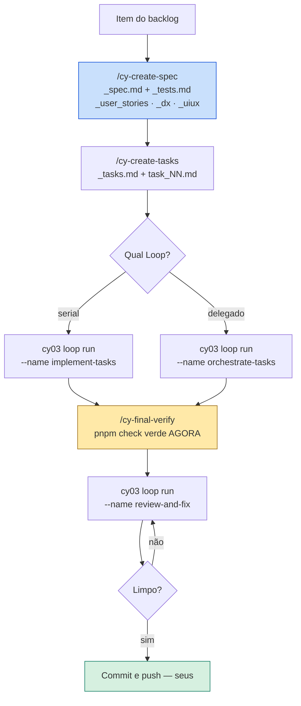

# CompozyOS 0.3 no fluxo do job-hunt-os

Como conduzir o ciclo **SDD + Loop Engineering** deste repositório com o
CompozyOS 0.3: especificar, decompor em tarefas, executar, revisar e verificar.

Escrito para humano e para agente. Todo comando é literal.

> **Estado apurado em 19/08/2026**, contra a instalação real desta máquina
> (`0.3.0-beta.17`) e contra o `MIGRATION_GUIDE.md` oficial. Onde a
> documentação pública e a máquina divergiram, **a máquina venceu** — e as
> divergências estão anotadas, porque elas voltam a morder quem ler só os docs.

---

## 1. O que já existe aqui

Nada precisa ser instalado. As duas versões convivem, isoladas:

| | Binário | Versão | Estado |
|---|---|---|---|
| Produção | `compozy` (Homebrew) | 0.2.15 | deprecada, mas intacta |
| Beta | `cy03` → `~/bin/compozy03` | **0.3.0-beta.17** | daemon no ar |

```bash
compozy --version      # 0.2.15
cy03 version           # compozy 0.3.0-beta.17
cy03 status
```

### O wrapper `cy03`, e por que ele existe

`~/bin/cy03` não é conveniência: é o que torna a coexistência possível. Ele fixa
três variáveis, e **cada uma resolve uma falha concreta**:

| Variável | Valor | O que quebra sem ela |
|---|---|---|
| `COMPOZY_HOME` | `~/.compozy-os` | O estado da 0.3 (`compozy.db`, socket, config) cairia em `~/.compozy` e se misturaria com o da 0.2. |
| `HOME` | `~/.compozy-os-home` | **O daemon 0.3 registra `$HOME` como workspace padrão, independente do `cwd`.** Com o `$HOME` real ele acha o `~/.compozy/config.toml` da 0.2, faz strict-decode, engasga nas chaves `defaults.stall.*` que não existem mais na 0.3, e **recusa iniciar**. |
| `CY03_WORKSPACE` | `~/www/lab/compozy-os-lab` | O diretório onde o comando roda — o workspace sobre o qual a 0.3 opera. |

O script ainda recusa rodar se `CY03_OS_HOME` estiver dentro do workspace,
porque o app desktop materializa um `$HOME` inteiro ali (`.zsh_history`,
`.cursor/`, `.config/`, `.local/`) e poluiria o repositório.

> **Se você só ler uma linha deste documento, leia esta:** o `HOME` falso não é
> paranoia, é requisito. A 0.3 não sobe com a config da 0.2 no caminho.

---

## 2. Apontar a 0.3 para este repositório

O workspace padrão do wrapper é o laboratório. Para trabalhar aqui:

```bash
cd "/Users/andreus/Documents/Obsidian Vault/05_Interviews/mvp"

# por comando
CY03_WORKSPACE="$PWD" cy03 status

# pela sessão inteira do shell
export CY03_WORKSPACE="/Users/andreus/Documents/Obsidian Vault/05_Interviews/mvp"
cy03 workspace add .
cy03 workspace list
```

Sugestão de atalho, para não repetir o caminho:

```bash
# em ~/.zshrc
jho-cy() {
  CY03_WORKSPACE="$HOME/Documents/Obsidian Vault/05_Interviews/mvp" cy03 "$@"
}
```

---

## 3. Inventário: o que está disponível agora

### Loops

```bash
cy03 loop list
```

| Loop | Papel |
|---|---|
| `implement-tasks` | Executa as tarefas de um spec, em ordem de dependência |
| `orchestrate-tasks` | Delega: uma sessão de worker dedicada **por tarefa** |
| `review-and-fix` | Um agente revisor escreve a rodada, os corretores rodam em cima |

### Skills (10, todas ativas)

```bash
cy03 skill list
```

| Skill | O que faz |
|---|---|
| `cy-create-spec` | Spec unificado + catálogos (ver §4) |
| `cy-create-tasks` | Decompõe o spec em tarefas independentes |
| `cy-execute-task` | Executa **uma** tarefa fim a fim, sem pausar |
| `cy-orchestrate-tasks` | Conduz as tarefas por delegação a workers |
| `cy-review-round` | Revisão completa → `reviews-NNN/` |
| `cy-fix-reviews` | Remedia as issues da rodada |
| `cy-final-verify` | Exige evidência **fresca** antes de qualquer alegação |
| `cy-workflow-memory` | Memória entre execuções de tarefa |
| `git-rebase` | Rebase e conflitos preservando o trabalho |
| `compozy` | Manual do próprio runtime |

### Extensions

```bash
cy03 extension list
```

| Extension | Versão | Estado | Observação |
|---|---|---|---|
| `spec-cycle` | 0.4.1 | **active** | É quem entrega o ciclo hoje |
| `dev-cycle` | 0.3.1 | **error** | Superada pela `spec-cycle`; ver §8 |
| `forge-github` | 0.1.0 | active | Pede `GITHUB_TOKEN` |
| `tailscale` | 0.1.0 | active | Conectividade remota |

---

## 4. Correções à documentação pública

Três coisas que o `MIGRATION_GUIDE.md` afirma e que **não se confirmam** nesta
instalação. Registradas porque cada uma levaria a uma decisão errada.

**1. `cy-create-spec` não perdeu a separação Product/Technical.**

O guia diz que `cy-create-prd` e `cy-create-techspec` "não têm sucessor". Na
prática a `cy-create-spec` produz **um `_spec.md` com as duas partes** — Product
e Technical — mais quatro catálogos companheiros:

| Arquivo | Conteúdo |
|---|---|
| `_spec.md` | Spec unificado, com parte de produto **e** parte técnica |
| `_user_stories.md` | Catálogo de histórias |
| `_tests.md` | Contrato de testes |
| `_dx.md` | Contrato de experiência de desenvolvimento |
| `_uiux.md` | Mapa de mudança de UI, para feature com interface |

Ou seja: você **não perde** PRD e TechSpec. Ganha os dois no mesmo arquivo, mais
`_dx.md` e `_uiux.md`, que a 0.2 não tinha. O processo é um "two-stage frontier
grill" com pesquisa paralela de codebase e de mercado.

**2. A skill `compozy` não foi aposentada.** O guia diz que sim. Ela está
`bundled`, `enabled` e `active`.

**3. Quem entrega o ciclo é a `spec-cycle`, não a `dev-cycle`.** O guia fala em
extension `dev-cycle`. Aqui a `dev-cycle` 0.3.1 está em **error/unhealthy**, a
`spec-cycle` 0.4.1 está ativa, e as dez skills estão funcionando. A `spec-cycle`
é mais nova e a substituiu.

---

## 5. O ciclo, ponta a ponta



### 5.1 Especificar

Numa sessão de agente (Claude Code, Codex, o que você usa):

```
/cy-create-spec
```

Interativo — entrevista antes de escrever. Saída em
`.compozy/tasks/<slug>/`.

### 5.2 Decompor

```
/cy-create-tasks
```

Produz `_tasks.md` (o grafo) e `task_01.md … task_NN.md`. **Cada caso de
`_tests.md` cai em exatamente uma tarefa** — é o que impede caso órfão e caso
contado duas vezes.

### 5.3 Executar

No terminal:

```bash
cd "/Users/andreus/Documents/Obsidian Vault/05_Interviews/mvp"
export CY03_WORKSPACE="$PWD"

# SEMPRE veja o plano antes
cy03 loop run --name implement-tasks --input slug=<slug> --dry-run -o json

# execução real
cy03 loop run --name implement-tasks --input slug=<slug>
```

O `--dry-run` reporta os valores efetivos e **a origem de cada um**, sem criar
run. Use sempre: é a diferença entre saber e supor qual modelo e qual
`auto_commit` vão valer.

**Serial ou delegado?**

| | `implement-tasks` | `orchestrate-tasks` |
|---|---|---|
| Modelo | Uma sessão executa em ordem | Uma sessão worker **por tarefa** |
| Prova de conclusão | Estado do run | **Só o arquivo da tarefa em disco** |
| Quando usar | Padrão | Tarefas realmente independentes |

Comece serial. `orchestrate-tasks` só compensa quando o grafo tem largura real —
tarefas que se tocam viram conflito de merge, não paralelismo.

Runtime por tipo de tarefa:

```bash
cy03 loop run --name implement-tasks --input slug=<slug> \
  --runtime type=backend:claude/opus@high \
  --runtime type=docs:codex/gpt-5-mini@low
```

`--runtime` é repetível e aceita `worker=`, `judge=`, `id=`, `complexity=`.

### 5.4 Verificar

```
/cy-final-verify
```

Exige evidência **fresca**. Não aceita "passou antes".

Aqui isso significa `pnpm check` verde **nesta execução** — 419 testes e
typecheck. É a mesma disciplina que o `CLAUDE.md` já impõe; a skill só a torna
inescapável.

### 5.5 Revisar

```bash
cy03 loop run --name review-and-fix --input task_name=<slug>
```

Um agente revisor do CompozyOS **escreve uma rodada nova**, e só então os
corretores rodam. Sem CodeRabbit, sem polling de PR, sem resolução de thread,
sem push. Rodadas em `.compozy/tasks/<slug>/reviews-NNN/`.

**O push é sempre seu.** Nenhum Loop empurra.

---

## 6. Configuração

Não existe migrador de config. A tradução é manual. Precedência: valor da
execução → `[loops.inputs.<loop>]` do workspace → default global → default da
definição do Loop.

```bash
export CY03_WORKSPACE="/Users/andreus/Documents/Obsidian Vault/05_Interviews/mvp"

cy03 config set loops.inputs.implement-tasks.auto_commit false --scope workspace
cy03 config get loops.inputs.implement-tasks.auto_commit
cy03 config show -o json
```

> **Recomendação para este repositório: `auto_commit=false`.** As mensagens de
> commit aqui carregam o *porquê* de cada decisão — é o que torna o histórico
> utilizável meses depois. Commit automático produz mensagem genérica e perde
> exatamente isso.

Equivalências vindas da 0.2:

| 0.2 `config.toml` | 0.3 |
|---|---|
| `defaults.ide` | `loops.defaults.{delivery,watch}.runtime_defaults.{worker,judge}.provider` |
| `defaults.model` | `…runtime_defaults.{worker,judge}.model` |
| `defaults.reasoning_effort` | `…runtime_defaults.{worker,judge}.reasoning` |
| `defaults.auto_commit` | `loops.inputs.{implement-tasks,review-and-fix}.auto_commit` |
| `defaults.timeout` | `session.limits.timeout` |
| `tasks.types`, `fetch_reviews.*`, `watch_reviews.*`, `recovery.*` | **removidos** |

Provedores mapeiam exato: `codex→codex`, `claude→claude`,
`cursor-agent→cursor`, `opencode→opencode`, `pi→pi`, `gemini→gemini`,
`copilot→copilot`, `kiro→kiro`. **`droid` e `devin` não têm equivalente** — não
aliase para outro provedor.

---

## 7. Git

Este repositório versiona `.compozy/tasks/`. **Não ignore `.compozy/` inteiro.**
Ignore só runtime:

```gitignore
# CompozyOS — estado de runtime
.compozy/compozy.db
.compozy/workspace.toml
.compozy/daemon.sock
.compozy/daemon.lock
.compozy/logs/
.compozy/cache/
```

Fica versionado: `.compozy/tasks/`, definições de Loop, skills, agentes e a
config de workspace que o time compartilha.

---

## 8. Diagnóstico

```bash
cy03 status              # daemon
cy03 doctor              # 37 verificações
cy03 extension list      # o que está ativo
cy03 skill list
cy03 loop list
cy03 loop status --run-id <id> -o json
cy03 session list
cy03 logs
```

### Achados atuais desta instalação

`cy03 status` reporta **`Health: degraded`**. Diagnosticado: não é o runtime,
são provedores e uma extension.

| Item | Causa | Impacto | Correção |
|---|---|---|---|
| `extension_runtime_unavailable` | `forge-github` sem `GITHUB_TOKEN` | Só integração com GitHub | `cy03 extension secrets set forge-github --env GITHUB_TOKEN` |
| `provider_cli_missing` (×7) | CLIs de agente ausentes no `$HOME` isolado | O provedor não pode ser usado | Instalar a CLI, ou ignorar os que você não usa |
| `dev-cycle` em `error` | Superada pela `spec-cycle` 0.4.1 | **Nenhum** — as 10 skills estão ativas | `cy03 extension disable dev-cycle` para limpar o ruído |

O comando de secret lê o valor por **entrada escondida**, nunca por argumento —
segredo em `argv` aparece no histórico do shell e na lista de processos. Para
automação existe `--value-stdin`.

> O `degraded` aqui é ruído de provedor, não defeito de runtime. Vale desabilitar
> a `dev-cycle` para que um `degraded` futuro signifique alguma coisa — alarme
> que sempre toca é alarme que ninguém escuta.

### Sintomas comuns

| Sintoma | Causa |
|---|---|
| Daemon 0.3 recusa iniciar | `HOME` real no caminho: ele lê a config da 0.2 e engasga. Use o wrapper. |
| Comando opera no repositório errado | `CY03_WORKSPACE` não foi exportado; o padrão é o laboratório. |
| `compozy --version` mostra 0.2.15 | Correto e esperado — a 0.3 é `cy03`. |
| Estado estranho após mexer na 0.2 | Nunca copie `compozy.db`, sockets, locks ou `runs/` entre as versões. |

---

## 9. Como isto convive com as regras deste projeto

O CompozyOS orquestra; não substitui os invariantes do `CLAUDE.md`.

| Regra daqui | Efeito no ciclo |
|---|---|
| **4 — módulo novo entra por porta** | O spec declara a porta antes da decomposição, ou as tarefas nascem acopladas. |
| **6 — bump `SCORER_VERSION`** | Tarefa que toca scoring inclui o bump e `jho jobs score --all`. |
| **9 — frontend segue o `DESIGN.md`** | Tarefa de UI cita o token, nunca o valor. `_uiux.md` é onde isso é acordado. |
| **10 — toda tela funciona no celular** | Critério de aceite de qualquer tarefa de UI. |
| **13 — autorização por `can()`** | Tarefa que cria Server Action nasce com guard. |
| **`pnpm check` verde** | É a evidência que `/cy-final-verify` exige. Não invente outra. |

**Regra de convivência:** o CompozyOS decide *o que* e em que ordem; o
`CLAUDE.md` decide *como*. Onde discordarem, **o `CLAUDE.md` vence** — ele
carrega restrições que já custaram bug aqui.

---

## 10. Primeira jornada

Escolha algo pequeno, real e isolado. Sugestão: **upload de PDF em lote** — tem
valor, é conhecido, e não toca scoring nem autorização.

```bash
# 1. contexto
cd "/Users/andreus/Documents/Obsidian Vault/05_Interviews/mvp"
export CY03_WORKSPACE="$PWD"
cy03 workspace add .
cy03 status

# 2. higiene: silencia a extension superada
cy03 extension disable dev-cycle

# 3. na sessão do agente
#    /cy-create-spec      → _spec.md + _tests.md + _user_stories/_dx/_uiux
#    /cy-create-tasks     → _tasks.md + task_NN.md

# 4. planejar
cy03 loop run --name implement-tasks --input slug=<slug> --dry-run -o json

# 5. executar
cy03 loop run --name implement-tasks --input slug=<slug>

# 6. verificar → /cy-final-verify  (pnpm check verde, agora)

# 7. revisar
cy03 loop run --name review-and-fix --input task_name=<slug>

# 8. commit e push — seus
```

Rode uma vez inteira antes de adotar. O objetivo da primeira jornada não é
entregar a feature: é descobrir onde o ciclo atrita com este repositório.

---

## 11. Superfícies novas da 0.3 que ainda não usamos

`cy03 --help` lista muito além do ciclo de desenvolvimento. Vale saber que
existem, sem tratar como pendência:

| Comando | O que abre |
|---|---|
| `automation` | Jobs, gatilhos e sugestões — agendar sync e scrape aqui |
| `memory` | Memory v2, contexto durável consultável |
| `network` | Delegação entre sessões, `compozy-network/v0` |
| `spawn` | Sessão filha limitada |
| `marketplace` | Capacidades instaláveis |
| `mcp` | Integrações MCP pelo daemon |
| `observe` / `logs` | Observabilidade de runtime |
| `app` / `desktop` / `open` | App desktop e UI web |
| `gateway` / `pair` / `device` | Acesso remoto |

O candidato mais óbvio para este projeto é **`automation`**: `jho jobs sync` e
`jho scrape run` são exatamente o tipo de trabalho recorrente que hoje é manual.

---

## Referências

- [`MIGRATION_GUIDE.md`](https://github.com/compozy/compozy/blob/main/MIGRATION_GUIDE.md) — autoritativo, com as três ressalvas da §4
- [Repositório](https://github.com/compozy/compozy) · [Releases](https://github.com/compozy/compozy/releases) · [Changelog](https://www.compozy.com/changelog/)
- `~/bin/cy03` — o wrapper, e o comentário dentro dele
- `~/.claude/skills/compozy/SKILL.md` — **documenta a 0.2**; histórico apenas
