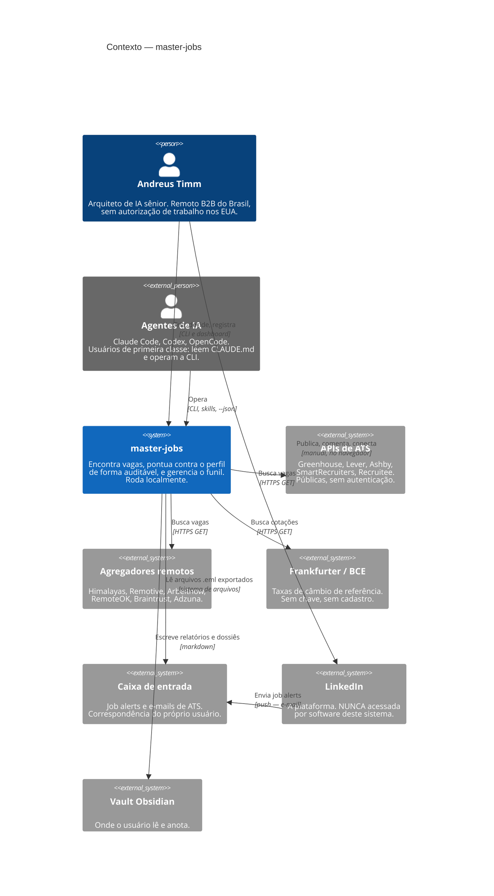

# C4 nível 1 — Contexto do sistema

Quem usa o master-jobs e com que sistemas externos ele fala.

O ponto que o diagrama precisa deixar óbvio: **o LinkedIn aparece três vezes,
com três naturezas diferentes**, e é isso que a [ADR 0001](../../adr/0001-nao-fazer-scraping-do-linkedin.md)
e a [ADR 0008](../../adr/0008-ingestao-de-email-como-fonte-de-sourcing.md)
governam. Nenhuma seta sai do sistema **para** a plataforma do LinkedIn.

## O que o diagrama afirma

**Não existe seta de `master-jobs` para `LinkedIn`.** O sistema lê o que o
LinkedIn **envia** — o job alert que chega na caixa de entrada — e nunca
consulta a plataforma. Publicar, comentar e conectar são ações do humano, no
navegador dele.

**Agentes de IA são usuários, não infraestrutura.** Eles aparecem como `Person`
porque operam o sistema pela mesma superfície que o humano. Isso tem
consequência de projeto: comandos idempotentes, saída legível por máquina, e
invariantes escritas em prosa nos arquivos que os agentes leem.

**Todas as fontes de vaga são públicas e sem autenticação.** Marketplaces com
área logada — Revelo, BairesDev — entram por importação manual de payload, não
por adapter; ver [sources-autenticadas](../../sources-autenticadas.md).
