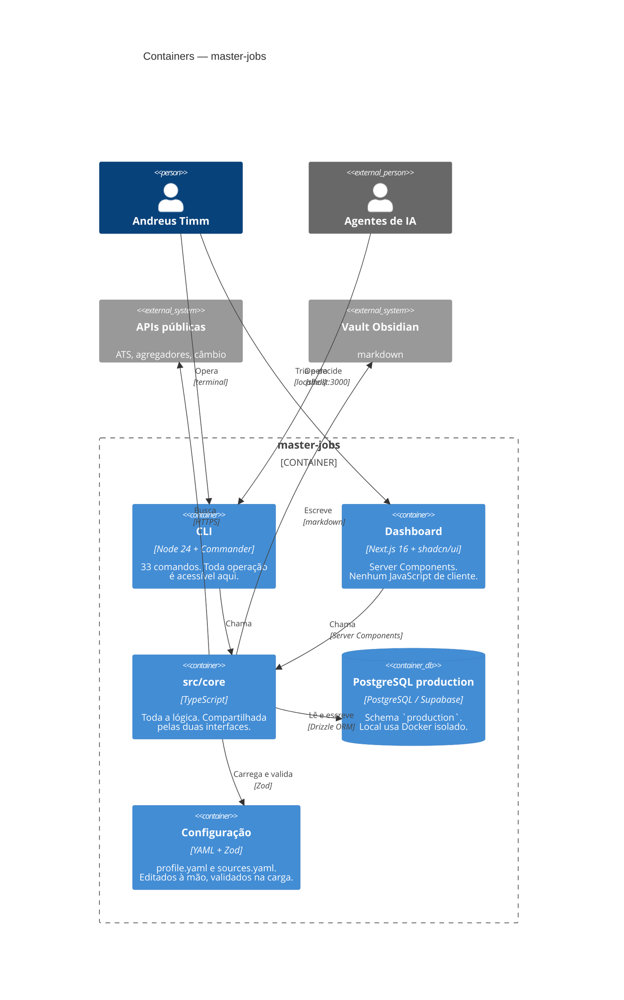

# C4 nível 2 — Containers

As unidades executáveis e onde o estado vive.

## A invariante que este nível existe para mostrar

> **A UI é adaptador, não implementação paralela.** As duas interfaces chamam
> as mesmas funções de `src/core`. A única mutação do funil passa por
> `setApplicationStatus`, então uma mudança de status feita no navegador cai em
> `application_event` exatamente como uma feita no terminal.

Quando uma query é necessária às duas, ela vai para `src/core/db/repo.ts`.
Nunca é duplicada — foi por isso que `getJobDetail`, `corpusStats`,
`clusterBreakdown` e `pipelineRows` nasceram lá quando o dashboard precisou.

## Por que PostgreSQL explícito

O runtime precisa de um banco persistente compartilhado entre CLI, dashboard e
workers. `DATABASE_URL` aponta para PostgreSQL; `DATABASE_MIGRATION_URL` mantém
DDL separado. O snapshot SQLite anterior ao corte Turso → Supabase só aparece
no fluxo de importação documentado em [`deploy.md`](../deploy.md).

## Por que sem build step

Node 24 executa TypeScript diretamente. O custo é uma restrição real: só
sintaxe apagável — sem `enum`, sem parameter properties, sem decorators.
Ver [ADR 0006](../../adr/0006-typescript-apagavel-sem-build-step.md).
