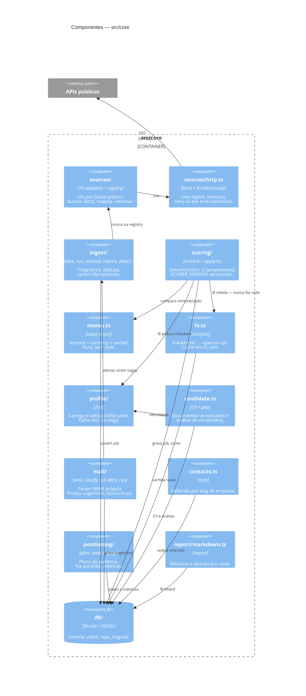

# C4 nível 3 — Componentes de `src/core`

Os módulos dentro do core e como se compõem. Os agrupamentos abaixo antecipam
os bounded contexts da [ADR 0007](../../adr/0007-arquitetura-hexagonal-monolito-modular.md) —
hoje eles são pastas, e a migração os torna fronteiras.

## As dependências que **não** existem, e por quê

Um diagrama de componentes vale tanto pelas setas ausentes quanto pelas
presentes.

**`scoring` não fala com a rede.** Ele lê `fx_rate`, uma tabela que alguém
populou antes. Isso mantém a pontuação pura, executável offline e — o que mais
importa — reproduzível: a taxa que gerou um score continua em disco.

**`sources` não conhece `scoring` nem `db`.** Um adapter recebe config e devolve
`RawJob[]`. Normalizar, deduplicar e pontuar são responsabilidade das camadas
seguintes. É o que faz adicionar um board custar um arquivo.

**`mail` não escreve em `application`.** Ele grava em `mail_suggestion` e o
humano decide. A seta de `mail` para o funil simplesmente não existe.

**Nada aponta para a UI.** As interfaces dependem do core; o core não sabe que
elas existem.

## Agrupamento futuro (ADR 0007)

| Contexto | Módulos hoje |
|---|---|
| Sourcing | `sources/`, `ingest/` |
| Matching | `scoring/` |
| Candidate | `profile/`, `candidate.ts` |
| Pursuit | a parte de `db/repo.ts` que trata `application` |
| Correspondence | `mail/` |
| Positioning | `positioning/`, `contacts.ts` |
| Shared kernel | `money.ts`, `fx.ts` (como porta), `db/` |
