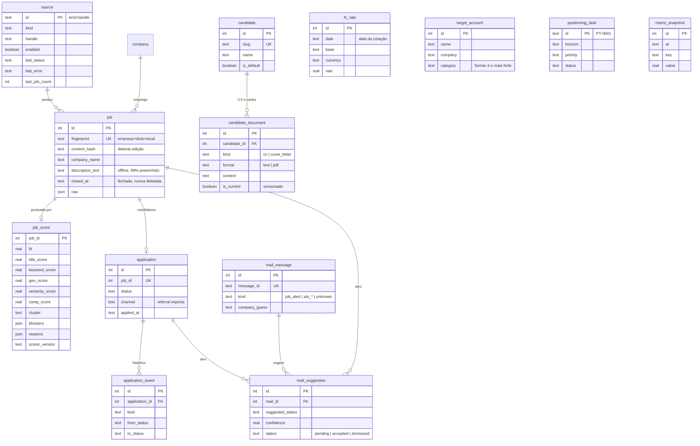
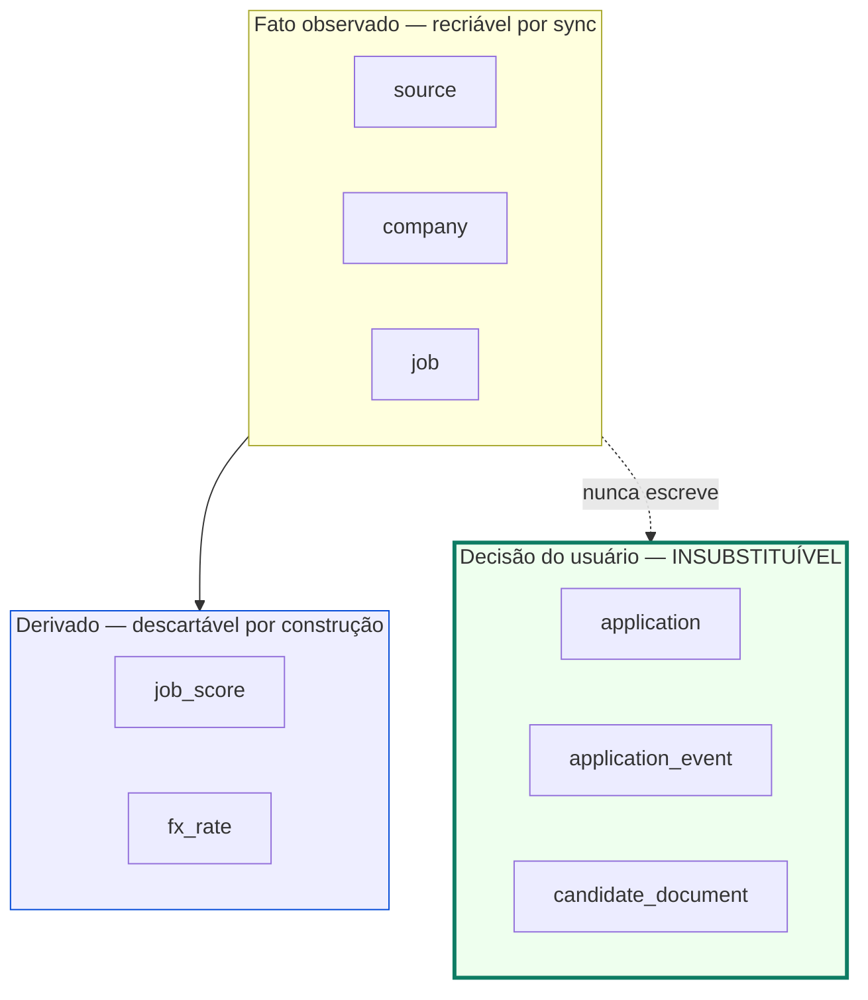

# Modelo de dados — ER

As 14 tabelas, agrupadas pela natureza do dado. Essa separação é a decisão de
projeto mais importante do schema ([ADR 0005](../../adr/0005-separacao-entre-fato-observado-e-decisao-do-usuario.md)).

## As três naturezas de dado

> **Invariante:** apagar `data/jobs.db` custa as decisões, e só elas. Todo o
> resto volta com um `jobs sync`. É por isso que backup dessa tabela é a única
> operação de banco que importa de verdade.

`job_score` é tabela separada em vez de colunas em `job` justamente para ser
descartável: pode ser apagada e recomputada a qualquer momento, e a ingestão faz
isso automaticamente quando o conteúdo de uma vaga muda.
