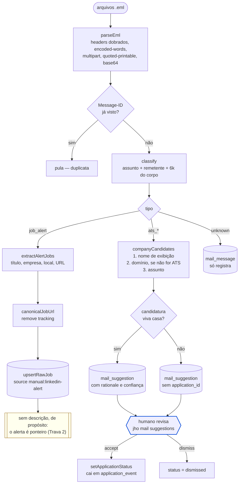

# Fluxo — ingestão de e-mail

`pnpm jho mail import` — a implementação da [ADR 0008](../../adr/0008-ingestao-de-email-como-fonte-de-sourcing.md).

## A fronteira que o diagrama existe para mostrar

> **Nenhuma seta liga o parsing diretamente a `application`.** Todo caminho de
> e-mail termina numa sugestão que um humano aceita ou descarta. Um parser de
> rejeição que erra uma vez e fecha silenciosamente um processo vivo violaria a
> ADR 0005 do modo mais caro possível — "sem resposta" é indistinguível de
> "rejeitado" para quem parou de fazer follow-up.

## Por que o alerta entra sem descrição

A Trava 2 da ADR 0008 proíbe seguir o link do alerta com automação. O e-mail
entrega o **sinal**; a resolução para o anúncio completo acontece pelas fontes
de ATS públicas. Consequência aceita: essas vagas pontuam baixo em keywords, e
a UI marca "sem descrição — a nota está subestimada, não baixa".

## Por que o classificador prefere `unknown`

Classificação perdida custa uma edição manual. Rejeição falsa custa uma
oportunidade. Por isso as regras de rejeição exigem frase explícita e carregam
uma lista `none` que impede, por exemplo, que um alerta contendo "unfortunately"
seja lido como rejeição.
