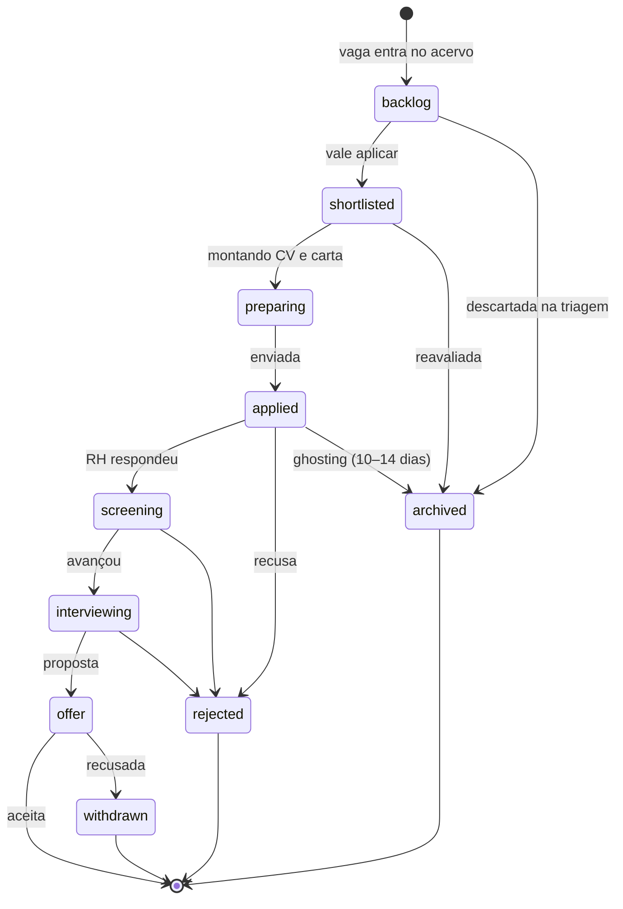
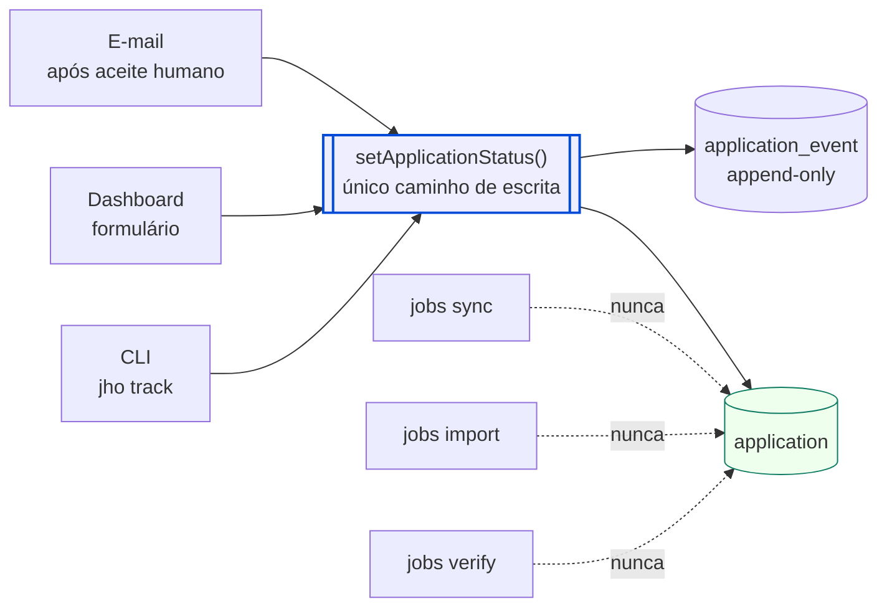

# Fluxo — o funil de candidaturas

A máquina de estados de `application`, e quem pode movê-la.

O diagrama mostra só o avanço. Desde a #316 também valem, sem desenhar cada
seta: **voltar** de qualquer estágio de progresso para qualquer anterior;
**reabrir** `rejected`, `withdrawn` e `archived` para qualquer estágio de
progresso; **arquivar** de todo estágio de progresso (inclusive `preparing`);
**rejeitar/retirar** de todo estágio a partir de `applied`. Avançar continua um
passo de cada vez. **Desfazer** grava um evento compensatório com
`reverts_event_id`; desfeito o primeiro registro, a candidatura fica
`untracked` (fora do funil, sem DELETE). A regra é
`transitionDirection()` em `src/contexts/pursuit/domain/application.ts`.

## Quem escreve aqui

> **Invariante:** existe **um** caminho de escrita. As três interfaces passam
> por `setApplicationStatus`, então uma mudança feita no navegador é
> indistinguível de uma feita no terminal em `application_event`. Ingestão de
> qualquer tipo — sync, import, verify, e-mail — nunca toca esta tabela.

`application_event` é append-only de propósito: é o que permite reconstruir a
conversão por etapa, que é a métrica que a auditoria pede na §14 e a única
forma de responder "onde meu funil vaza".

## Por que `archived` e não deletar

Uma candidatura encerrada continua sendo histórico. E vagas que somem da fonte
recebem `closedAt` em vez de `DELETE`, justamente porque a foreign key levaria
a candidatura junto.
