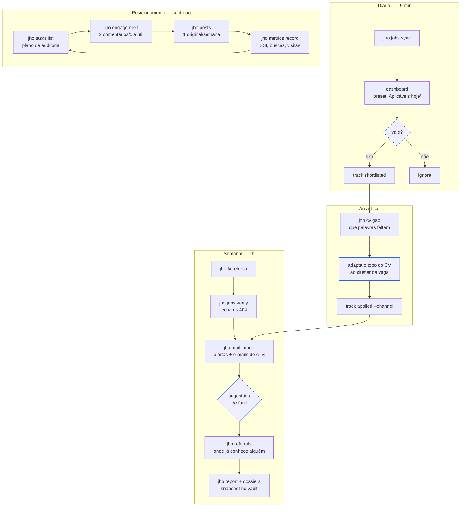

# Fluxo — a semana do candidato

Como as peças se compõem no uso real. As caixas azuis são decisões humanas; o
sistema prepara, o humano decide.

## O que a auditoria de posicionamento pede, mapeado

| Recomendação (§14) | Comando |
|---|---|
| 5–8 candidaturas/semana, segmentadas por cluster | `jobs list --cluster` + `track --channel` |
| 2 comentários substantivos por dia útil | `engage next` |
| 1 post original por semana | `posts add` |
| Medir o funil semanalmente | `metrics record` + `metrics trend` |
| Mapear 30 contas-alvo | `contacts add -k recruiter\|ai-leader\|peer` |

## O laço que fecha

`apply → mail` não é decorativo. Depois de aplicar, os e-mails de ATS voltam
como evidência: confirmação, triagem, entrevista ou rejeição. É isso que
transforma o funil de memória em dado — e o que permite responder **em qual
estágio** o processo quebra, que é uma pergunta diferente de "não fechou".
