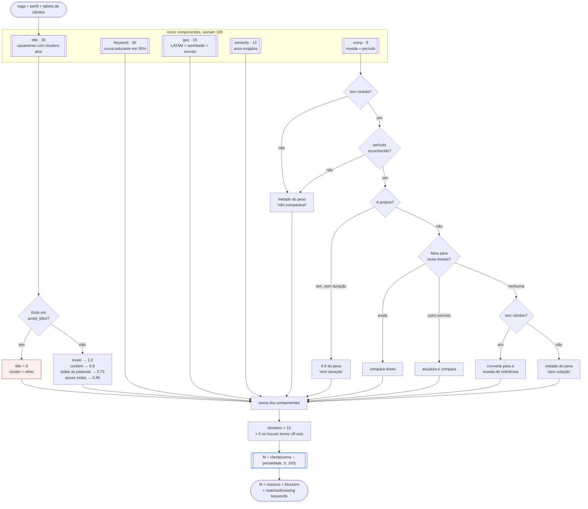

# Fluxo — pontuação de uma vaga

`scoreJob(input, profile, fx)` — puro, sem rede, sem banco.

## Por que blockers limitam em vez de zerar

Uma vaga excelente que diz "US preferred" ainda merece ser vista — só não no
topo. Cada bloqueio custa 12 pontos. Zerar esconderia oportunidades onde a
restrição é negociável, e a única pessoa capaz de julgar isso é o candidato.

## Por que a curva de keywords satura

A pontuação satura ao atingir 35% do peso alcançável. Sem isso, descrições
longas venceriam por serem verbosas, não por serem aderentes — e agregadores
publicam descrições muito mais longas que boards de empresa.

## Por que recusar comparar é uma resposta

Quando não há moeda, período reconhecível ou cotação, o componente devolve
metade do peso e uma razão legível — não zero. Zero significaria "paga mal";
metade significa "não sei", que é a verdade.
