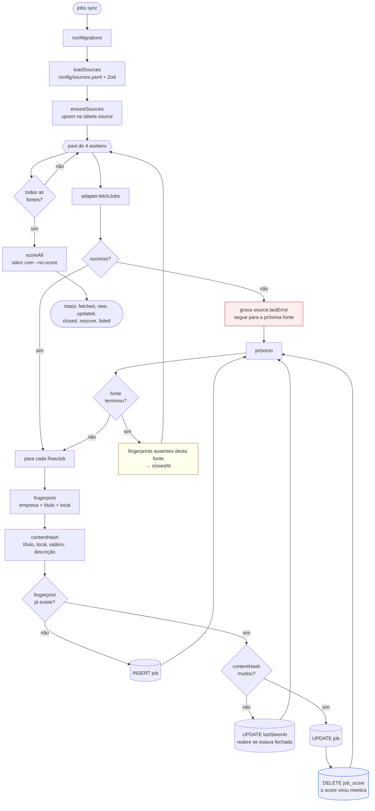

# Fluxo — sincronização de vagas

O que acontece em `pnpm jho jobs sync`.

## Três decisões visíveis no fluxo

**Erro de fonte não interrompe nada.** Ele vira `source.lastError` e o pool
segue. Um handle errado não pode custar as outras doze fontes.

**Conteúdo alterado invalida o score.** O `job_score` foi calculado sobre o
texto antigo, então ele passou a ser mentira. Sem isso, uma vaga editada
mantinha nota obsoleta indefinidamente — foi assim que 4.538 vagas do Lever
ficaram com keyword zero depois que as descrições foram finalmente parseadas.

**O que some é fechado, não deletado.** `closedAt` preserva o histórico de
candidatura, que a foreign key levaria junto.
