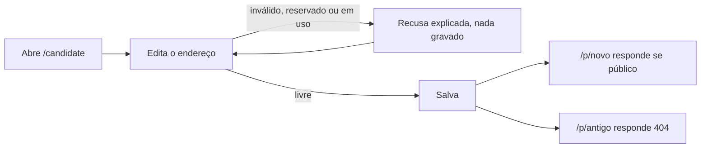

# Jornada: escolher o endereço público do perfil

```yaml
journey:
  id: J-choose-public-address
  name: Escolher e trocar o endereço /p/ do próprio perfil
  priority: P2
  value_statement: O candidato compartilha um link com o próprio nome em vez de um identificador técnico, e controla quando um link antigo para de funcionar
  personas: [Andreus no celular, Visitante do perfil público]
  entry_points:
    - url: /candidate
      origin: nav
  actions:
    - step: 1
      verb: Abrir a área do candidato e editar o endereço público
      expected_observable: O campo mostra o endereço atual, as regras de formato e o aviso de que o antigo deixa de funcionar
    - step: 2
      verb: Salvar um endereço válido e livre
      expected_observable: O endereço novo aparece no campo depois do refresh e no link da visibilidade quando o perfil é público
    - step: 3
      verb: Abrir o endereço novo e o antigo sem sessão
      expected_observable: O novo mostra o perfil público; o antigo responde 404
  goal:
    observable: Só o endereço escolhido responde, e só enquanto o perfil é público
    side_effects: [candidate.public_slug alterado]
  true_end_state: Depois do refresh, /p/<novo> responde e /p/<antigo> responde 404
  exit:
    natural: Copiar o link novo e compartilhar
  abandonment:
    - at_step: 2
      how: O endereço desejado está em uso ou é reservado
      resume: Escolher outro; nada foi gravado na recusa
  crosses: [public profile allowlist, candidate identity, i18n, responsive shell]
```



- **Entrada:** área do candidato com perfil criado.
- **Estado final verdadeiro:** só o endereço novo responde, e apenas com o perfil Público.
- **Saída:** compartilhar o link novo.
- **Abandono:** endereço recusado; a pessoa escolhe outro ou desiste sem efeito.
