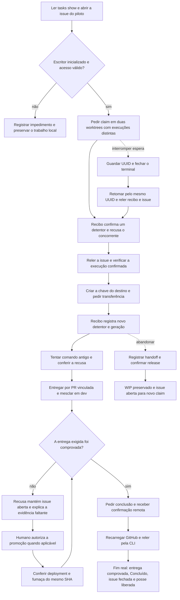

# Coordenar uma tarefa até comprovar sua entrega



```yaml
journey:
  id: J-coordinate-task-delivery
  name: Coordenar uma tarefa até comprovar sua entrega
  priority: P0
  value_statement: "Saber qual execução pode trabalhar e encerrar somente uma entrega comprovada, sem perder trabalho concorrente."
  personas: [Operador somente por teclado]
  entry_points:
    - url: rtk pnpm tasks show <issue> --json
      origin: direct
    - url: https://github.com/users/andreustimm/projects/3
      origin: direct
  actions:
    - step: 1
      verb: Ler a issue, a entrega exigida e o estado do escritor
      expected_observable: A CLI distingue estado remoto, falta de acesso e ativação pendente
    - step: 2
      verb: Pedir a mesma tarefa em duas worktrees com execuções distintas
      expected_observable: Um recibo confirma posse e o concorrente recebe recusa compreensível
    - step: 3
      verb: Retomar uma espera interrompida usando o UUID original
      expected_observable: A operação encontra seu recibo sem duplicar efeito nem trocar o detentor
    - step: 4
      verb: Transferir a tarefa e tentar continuar pela execução antiga
      expected_observable: O destino verifica sua posse e a execução anterior recebe recusa
    - step: 5
      verb: Solicitar conclusão depois do merge em dev
      expected_observable: Uma entrega de produção permanece aberta enquanto faltar sua prova real
    - step: 6
      verb: Concluir com a evidência exigida e consultar novamente por duas superfícies públicas
      expected_observable: Issue e Project recarregados concordam com a CLI sobre conclusão, data e liberação da posse
  goal:
    observable: A tarefa está concluída após a entrega exigida e nenhuma execução antiga conserva autorização
    side_effects: [recibo na caixa de entrada, coordenação na issue, campos atualizados no Project, fechamento da issue]
  true_end_state: A issue e o Project recarregados confirmam a mesma entrega, estado terminal e posse liberada que uma nova leitura da CLI
  exit:
    natural: Link da issue com as evidências da entrega e do recibo final
  abandonment:
    - at_step: 2
      how: Fechar o terminal durante a espera de confirmação
      resume: Repetir a operação com o UUID original e consultar o remoto antes de trabalhar
    - at_step: 4
      how: Encerrar a sessão antes de entregar
      resume: Registrar handoff, confirmar release e retomar após novo claim válido; preservar a worktree com WIP
  crosses: [CLI, Git e worktrees, GitHub Issues, GitHub Projects, GitHub Actions, PR e CI, deployment de produção]
```

## Escopo e pré-condições

Jornada do [épico #181](https://github.com/andreustimm/master-jobs/issues/181)
e do [piloto #191](https://github.com/andreustimm/master-jobs/issues/191).
O risco é P0 porque posse concorrente e conclusão prematura afetam integridade
do trabalho e o gate de entrega. O contrato está no
[guia operacional](../../engineering/github-project-tasks.md).

Usar issues identificadas para o piloto no Project 3, com assignee e entrega
explícitos, e duas worktrees próprias. Não tomar posse de tarefas de outros
agentes. O bootstrap exige código em `main` e credenciais validadas; executar
`initialize` manualmente com `TASKS_WRITER_ENABLED` ainda desativado. Antes
do piloto, confirmar a inicialização remota e habilitar
`TASKS_WRITER_ENABLED=true`. `TASKS_ENFORCEMENT` permanece desativado: sua
habilitação e o required check seguem o corte de #191 depois do piloto. Um
preflight anterior deve registrar essa pendência sem ocultá-la.

No primeiro bootstrap, os dois cenários abaixo são o gate do **corte
operacional #191 após a implantação**, com enforcement desativado até o piloto.
Ainda não há escritor confiável disponível para percorrê-los no RC anterior
ao primeiro merge em `main`; o relatório registra essa dependência de
ativação prevista na regra 24, preservando `untested` e a prioridade P0.
Isso não dispensa o QA Full do RC do dashboard nem o restante das jornadas
P0/P1 disponíveis. A PR de integração explicita o limite; a entrega do fluxo
só é aceita depois deste gate remoto.

Os cenários permanecem `untested` até serem percorridos. Fakes de gateway,
testes unitários e CI verde são evidência técnica separada. Abrir o relatório
antes da sessão, vincular issue, PR, runs e recibos reais, e guardar saídas
redigidas sem tokens nem chaves privadas. Promoção humana pendente não é Pass.

## Cobertura deliberada

| Dimensão | Cobertura planejada |
|---|---|
| Jornada | Claim, handoff e entrega até a releitura independente, nos dois cenários abaixo. |
| Funcional | Posse por execução, recibos, geração, prova de entrega e persistência após refresh. |
| Experiência | Uso por teclado, mensagens que distinguem pendência de rejeição, UUID recuperável e estado legível sem depender de cor. |
| Erros e abandono | Disputa entre worktrees, espera interrompida, geração antiga e conclusão sem evidência. |
| Transversal | Continuidade entre sessões e consistência CLI/GitHub; canária da entrada compartilhada do pacote/runtime. |

Responsividade, touch, layout, tema e tradução do dashboard são N/A nesta
mudança de CLI. Avaliação criptográfica, rate limits e falhas injetadas no
transporte pertencem à auditoria técnica; não viram veredito de jornada sem
interação pública observada.

## Cenários e sessão

- [Posse entre duas worktrees](../scenarios/CLI-task-worktree-ownership.md).
- [Conclusão pela entrega exigida](../scenarios/CLI-task-delivery-evidence.md).
- [Charter targeted](../charters/CH-task-worktree-handoff.md).
- [Canária existente de abertura direta](../charters/CH-direct-startup-canary.md).
