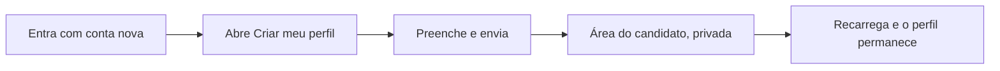

# Jornada: criar o próprio perfil de candidato

```yaml
journey:
  id: J-create-own-profile
  name: Conta nova cria o próprio candidato
  priority: P1
  value_statement: Uma conta de candidato sem perfil sai do beco sem saída do 403 e começa a usar o produto com um perfil que é só dela
  personas: [Candidato convidado sem perfil]
  entry_points:
    - url: /candidate
      origin: nav
  actions:
    - step: 1
      verb: Entrar com a conta nova e abrir o link de criar perfil pela navegação (Create my profile em inglês)
      expected_observable: /candidate mostra o formulário com nome, headline, localização e currículo opcional (colado ou em PDF), sem dado de outro candidato
    - step: 2
      verb: Preencher o nome (e opcionalmente o resto, colando o currículo ou enviando o PDF) e enviar
      expected_observable: A área do candidato abre com o nome digitado e a visibilidade privada marcada; com PDF, o aviso pede a revisão e o editor mostra o texto extraído
    - step: 3
      verb: Recarregar a página
      expected_observable: O perfil continua lá; o formulário de criação não volta
  goal:
    observable: A conta tem um candidato novo, privado e só dela
    side_effects: [candidate criado, auth_user.candidate_id preenchido, candidate_document do CV quando colado ou enviado em PDF]
  true_end_state: Depois do refresh, /candidate mostra a área do candidato com a identidade digitada e visibilidade privada
  exit:
    natural: Revisar o currículo no editor (ou colá-lo, se ainda não veio) ou abrir Vagas
  abandonment:
    - at_step: 2
      how: Desiste antes de enviar
      resume: Voltar a /candidate; o formulário continua disponível enquanto não houver perfil
  crosses: [auth policy, candidate identity, i18n, responsive shell]
```



- **Entrada:** conta de papel candidato sem candidato vinculado.
- **Estado final verdadeiro:** candidato novo, privado, ligado só a esta conta, com a identidade digitada — nunca a do `profile.yaml`.
- **Saída:** revisar o currículo no editor (ou colá-lo, se ainda não veio) ou seguir para Vagas.
- **Abandono:** desistir antes de enviar; nada é criado e o formulário continua lá.
