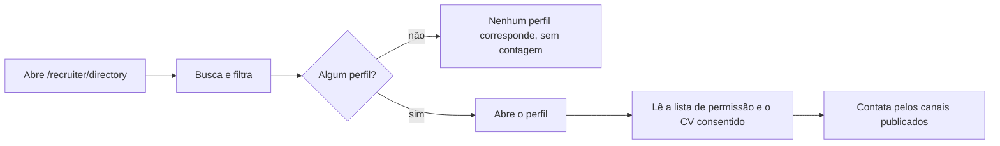

# Jornada: achar candidatos no diretório e ler só o que eles publicaram

```yaml
journey:
  id: J-discover-profiles-in-directory
  name: Buscar perfis Recrutadores e Público no diretório e abrir um deles
  priority: P1
  value_statement: O recrutador acha quem escolheu ser encontrado e decide se vale contato, sem alcançar funil, contato nem pretensão de ninguém
  personas: [Recrutador do diretório]
  entry_points:
    - url: /recruiter/directory
      origin: nav
  actions:
    - step: 1
      verb: Abrir o diretório pela navegação de recrutador
      expected_observable: A busca, os filtros (localização, modelo de trabalho, nível) e a lista paginada aparecem; nenhum perfil Privado e nenhuma contagem do que não aparece
    - step: 2
      verb: Buscar "react" e filtrar por remoto
      expected_observable: Só perfis que casam nome, headline ou skill confirmada; o filtro vira um chip removível, e remoto só acha quem marcou "mostrar" o modelo de trabalho
    - step: 3
      verb: Abrir um perfil Público e depois um de Recrutadores
      expected_observable: Os campos do perfil público, o currículo só com o segundo consentimento e sem e-mail, telefone ou pretensão; link /p/ só no Público; nenhum botão de pedir acesso
    - step: 4
      verb: Recarregar o perfil e voltar à busca
      expected_observable: Mesmo conteúdo, sem efeito colateral; muitas buscas seguidas mostram "Tente de novo em instantes"
  goal:
    observable: O recrutador lê a lista de permissão de quem escolheu Recrutadores ou Público, e nada além
    side_effects: [recruiter_directory_query recebe uma linha por busca ou perfil aberto, sem texto nem candidato]
  true_end_state: Depois do refresh, o perfil aberto mostra os mesmos campos; perfil que virou Privado responde 404
  exit:
    natural: Contatar a pessoa pelos canais que ela publicou (LinkedIn, GitHub, /p/)
  abandonment:
    - at_step: 2
      how: Nenhum perfil corresponde à busca
      resume: Limpar a busca e tentar outros termos
  crosses: [allowlist de /p/ (G21), 404 uniforme (G22), consentimento do CV (G23), candidate:discover, i18n, 375 px]
```



- **Entrada:** conta com papel de recrutador. Candidato e admin sem o papel
  recebem a recusa; sem sessão, o login devolve ao diretório.
- **Estado final verdadeiro:** o perfil aberto continua igual após refresh, e o
  que é Privado nunca aparece, nem pelo nome exato.
- **Saída:** contato pelos canais que a pessoa publicou; quem também tem
  concessão vê o link para a página da concessão.
- **Abandono:** nenhum resultado; limpar a busca e tentar de novo.
- **Variante do candidato:** em `/candidate`, trocar a visibilidade para
  Privado tira o perfil do diretório na requisição seguinte e voltar para
  Recrutadores o devolve (`J-toggle-profile-visibility`).
