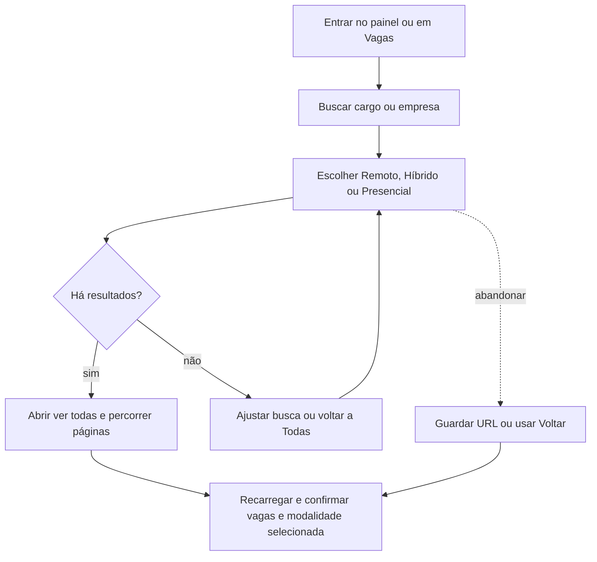

# Encontrar vagas pela modalidade de trabalho



```yaml
journey:
  id: J-find-jobs-by-work-mode
  name: Encontrar vagas pela modalidade de trabalho
  priority: P1
  value_statement: "Encontrar vagas compatíveis com a preferência de presença física."
  personas: [Andreus em triagem, Andreus no celular]
  entry_points:
    - url: /
      origin: direct
    - url: /jobs
      origin: in-app-nav
  actions:
    - step: 1
      verb: Buscar cargo ou empresa e escolher modalidade
      expected_observable: Opção ativa e vagas correspondentes aparecem juntas
    - step: 2
      verb: Abrir lista completa, avançar páginas ou trocar modalidade
      expected_observable: Busca e modalidade permanecem; trocar modalidade volta à primeira página
    - step: 3
      verb: Recarregar e voltar pelo histórico
      expected_observable: URL, seleção e vagas continuam correspondendo
  goal:
    observable: A pessoa consegue retomar o mesmo recorte e consultar uma vaga dele
    side_effects: []
  true_end_state: Lista e detalhe confirmam a vaga do recorte após uma leitura nova
  exit:
    natural: Lista filtrada ou detalhe da vaga escolhida
  abandonment:
    - at_step: 2
      how: Fechar a aba e reabrir a URL guardada
      resume: A modalidade e a busca permanecem na URL
  crosses: [cockpit, matching, listagem, paginação, i18n]
```
