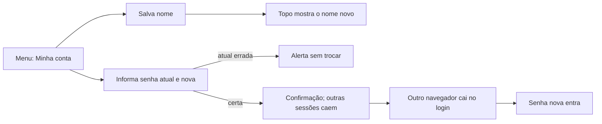

# Jornada: manter a própria conta — nome e senha

```yaml
journey:
  id: J-manage-own-account
  name: Trocar a própria senha e o nome de exibição
  priority: P1
  value_statement: Recuperar o controle da conta sem depender do admin nem de e-mail, derrubando sessões suspeitas
  personas: [Andreus em triagem noturna, Andreus no celular, Recrutadora convidada]
  entry_points:
    - url: /account
      origin: menu
  actions:
    - step: 1
      verb: Abrir Minha conta pelo menu
      expected_observable: A tela mostra o e-mail só para leitura, o nome editável e o formulário de senha
    - step: 2
      verb: Trocar o nome de exibição e salvar
      expected_observable: A tela confirma e o topo passa a mostrar o nome novo, também depois de recarregar
    - step: 3
      verb: Trocar a senha informando a atual, a nova e a confirmação
      expected_observable: A tela confirma que as outras sessões foram encerradas e continua conectada
    - step: 4
      verb: Abrir o sistema em outro navegador que estava conectado
      expected_observable: A outra sessão foi encerrada e cai no login; a senha nova entra
  goal:
    observable: Nome e senha novos valem; só o navegador que trocou continua conectado
    side_effects: [auth_event password_changed, auth_event profile_updated, sessões antigas revogadas]
  true_end_state: Depois de recarregar, a conta mostra o nome novo e só a senha nova entra
  exit:
    natural: Voltar ao trabalho na mesma sessão
  abandonment:
    - at_step: 3
      how: Não lembra a senha atual
      resume: Usar "Esqueci minha senha" no login
  crosses: [auth policy, session store, password hashing, rate limit, responsive shell, i18n]
```


