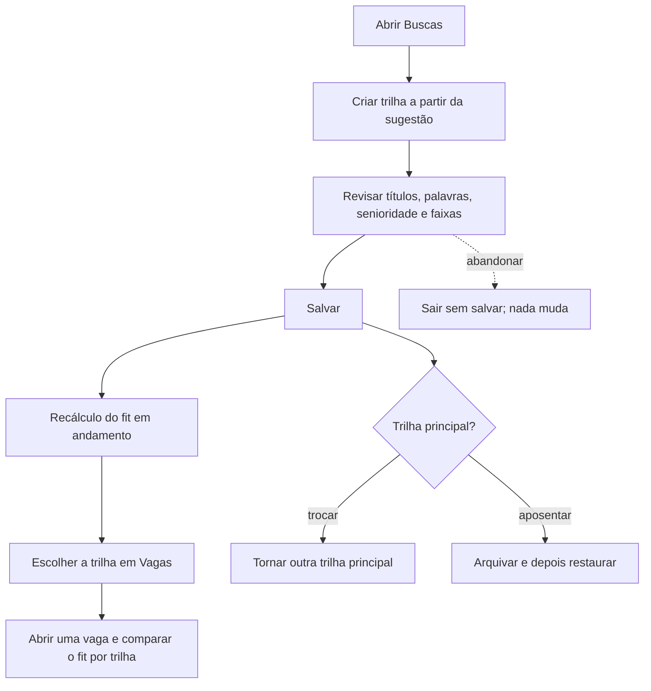

# Manter trilhas-alvo e ver o fit de cada uma



```yaml
journey:
  id: J-manage-target-tracks
  name: Manter trilhas-alvo e ver o fit de cada uma
  priority: P1
  value_statement: "Avaliar a mesma vaga contra mais de um alvo de carreira sem misturar os critérios."
  personas: [Andreus em triagem, Andreus no celular]
  entry_points:
    - url: /searches
      origin: in-app-nav
    - url: /searches/tracks/new
      origin: in-app-nav
    - url: /searches/tracks/<id>
      origin: direct
  actions:
    - step: 1
      verb: Criar uma trilha a partir da sugestão e confirmá-la
      expected_observable: A trilha aparece em Buscas e o recálculo é anunciado
    - step: 2
      verb: Editar títulos, palavras-chave, senioridade e faixas de pagamento
      expected_observable: Os valores salvos reaparecem após recarga; edição concorrente é recusada sem perder o texto
    - step: 3
      verb: Tornar a trilha principal, arquivar e restaurar
      expected_observable: Só uma trilha é principal; a arquivada some do seletor de Vagas e volta ao restaurar
    - step: 4
      verb: Escolher a trilha em Vagas e abrir uma vaga
      expected_observable: A lista usa o fit da trilha e o detalhe mostra o fit de cada trilha ativa
  goal:
    observable: Cada trilha ativa tem seu fit visível na lista e no detalhe da vaga
    side_effects: [recálculo do fit na fila]
  true_end_state: Buscas, Vagas e o detalhe, lidos de novo, concordam sobre trilhas, principal e fit
  exit:
    natural: Detalhe da vaga com o fit por trilha
  abandonment:
    - at_step: 2
      how: Sair do editor sem salvar
      resume: A trilha mantém a última versão salva
  crosses: [matching, fila de pontuação, i18n, sessão emprestada]
```
