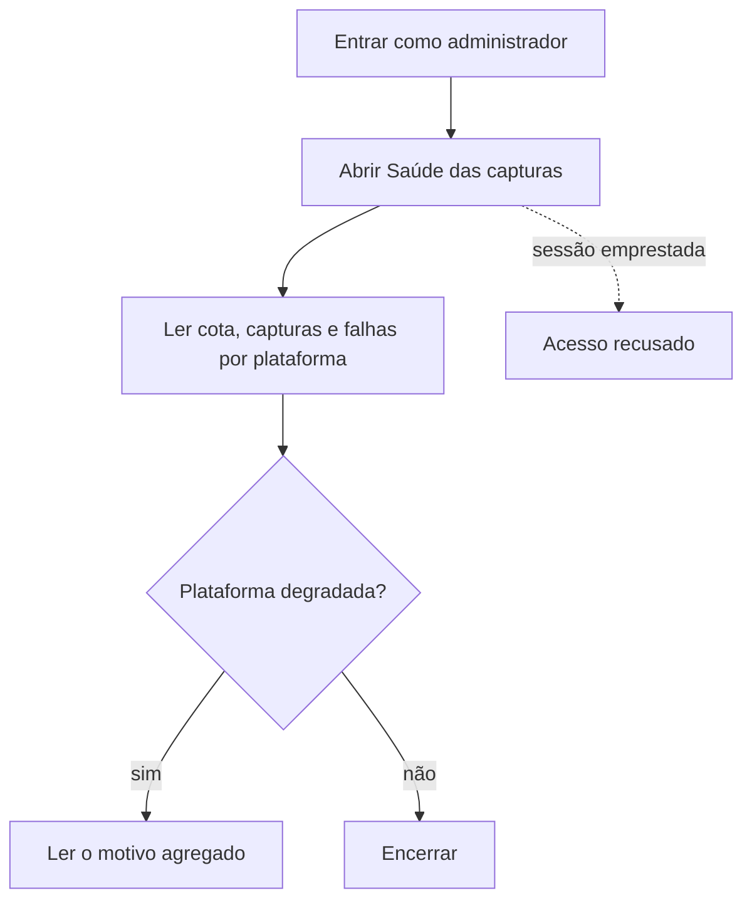

# Acompanhar a saúde das capturas por termo



```yaml
journey:
  id: J-monitor-term-capture-health
  name: Acompanhar a saúde das capturas por termo
  priority: P2
  value_statement: "Saber se as plataformas estão respondendo sem ler termos ou trilhas de nenhum candidato."
  personas: [Andreus em triagem]
  entry_points:
    - url: /admin/captures
      origin: direct
  actions:
    - step: 1
      verb: Abrir a saúde das capturas por termo
      expected_observable: Um cartão por plataforma com cota do dia, capturas e falhas
    - step: 2
      verb: Tentar a mesma tela numa sessão emprestada ou como candidato
      expected_observable: Acesso recusado
  goal:
    observable: A pessoa sabe quais plataformas estão saudáveis
    side_effects: []
  true_end_state: A tela recarregada mostra os mesmos números e nenhum termo nem nome de candidato
  exit:
    natural: Saúde das capturas
  abandonment:
    - at_step: 1
      how: Fechar a aba
      resume: Nada a retomar; a tela é só leitura
  crosses: [sourcing, autorização, i18n]
```
