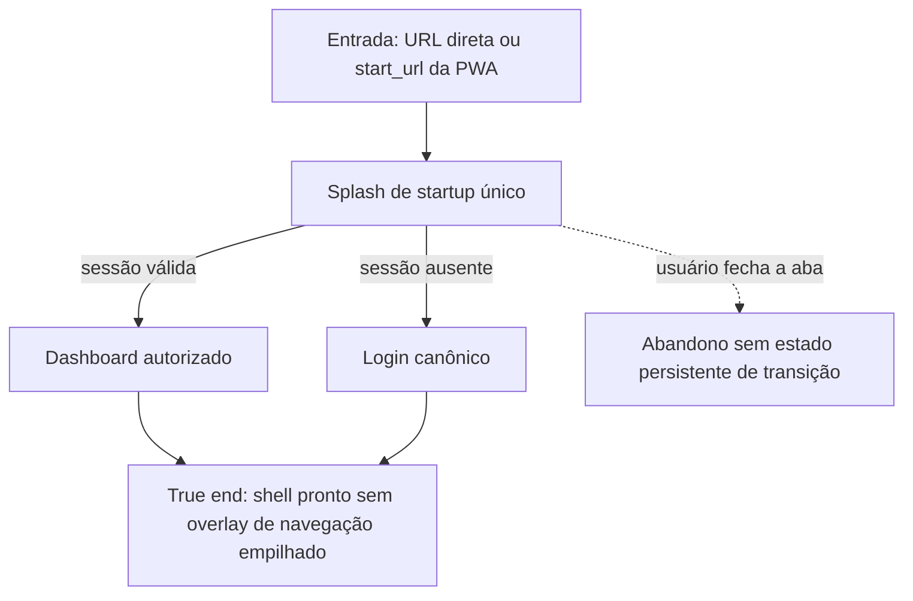

# Abrir o dashboard diretamente



```yaml
journey:
  id: J-open-dashboard-direct
  name: Abrir o dashboard diretamente
  priority: P1
  value_statement: "O usuário recebe o startup branded existente e chega a uma superfície autorizada sem camadas duplicadas."
  personas: [Andreus em triagem, Candidato em trânsito]
  entry_points:
    - url: /
      origin: direct
  actions:
    - step: 1
      verb: Abrir ou recarregar o dashboard
      expected_observable: Apenas o splash de startup aparece antes da tela
  goal:
    observable: A tela autorizada aparece sem overlay de transição durante hidratação
    side_effects: []
  true_end_state: A página permanece utilizável depois da hidratação e da recarga
  exit:
    natural: Dashboard ou login autorizado
  abandonment:
    - at_step: 1
      how: Fechar a aba antes da hidratação
      resume: Uma nova carga começa somente o lifecycle de startup
  crosses: [startup renderer, App Router hydration, auth policy]
```
