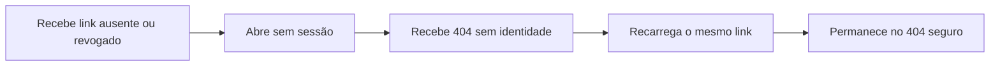

# Jornada: resolver um link de perfil público sem revelar cadastro

```yaml
journey:
  id: J-open-public-profile
  name: Resolver um link público ausente ou revogado
  priority: P2
  value_statement: Receber uma resposta segura no celular sem confirmar a existência de cadastro privado
  personas: [Visitante do perfil público]
  entry_points:
    - url: /p/[slug]
      origin: shared-link
  actions:
    - step: 1
      verb: Abrir sem sessão um link ausente ou não publicado
      expected_observable: A página responde 404 sem identidade ou confirmação de cadastro
    - step: 2
      verb: Recarregar o mesmo link
      expected_observable: O 404 permanece estável e não expõe dado privado
  goal:
    observable: Ausência ou revogação não confirma identidade nem cadastro em viewport móvel
    side_effects: []
  true_end_state: A resposta 404 permanece segura após reload
  exit:
    natural: Fechar a página ou solicitar um novo link ao candidato
  abandonment:
    - at_step: 1
      how: O visitante não dispõe de outro link para tentar
      resume: Receber um novo link publicado
  crosses: [public profile allowlist, auth policy, responsive shell]
```



- **Entrada:** link `/p/<slug>` ausente, revogado ou ainda não publicado.
- **Estado final verdadeiro:** 404 estável sem identidade, email, telefone, funil ou confirmação de cadastro.
- **Saída:** fechar a página ou solicitar um link válido ao candidato.
- **Abandono:** não há outro link disponível; a retomada exige um novo link publicado.
