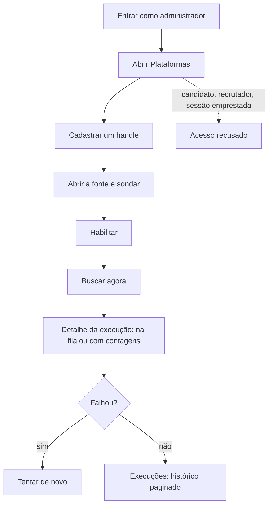

# Operar o catálogo de fontes e as execuções



```yaml
journey:
  id: J-operate-source-catalog
  name: Operar o catálogo de fontes e as execuções
  priority: P2
  value_statement: "Cadastrar, sondar e buscar uma fonte sem terminal, e saber o que cada execução capturou."
  personas: [Andreus em triagem]
  entry_points:
    - url: /admin/plataformas
      origin: direct
    - url: /admin/execucoes
      origin: direct
  actions:
    - step: 1
      verb: Cadastrar um handle de board suportado, sem habilitar
      expected_observable: A fonte aparece na lista como desabilitada; duplicado e valor de chave no campo da variável são recusados com o motivo
    - step: 2
      verb: Abrir a fonte e sondar
      expected_observable: Mensagem de alcançável, vazio, bloqueado, falha ou ambiente sem permissão; nenhuma vaga gravada
    - step: 3
      verb: Habilitar e pedir Buscar agora
      expected_observable: Detalhe da execução na fila (com o motivo, sem credencial) ou concluída com contagens
    - step: 4
      verb: Buscar em todas com uma fonte quebrada e tentar de novo só a falha
      expected_observable: Execução parcial com uma linha por fonte, desconhecido onde faltou contagem; nova tentativa ligada à original
    - step: 5
      verb: Abrir as mesmas rotas como candidato, recrutador ou sessão emprestada
      expected_observable: Acesso recusado, sem configuração visível; /jobs segue pesquisável
  goal:
    observable: A fonte sincroniza pela tela e a execução explica o que capturou
    side_effects: [source, source_run, job]
  true_end_state: Recarregar Plataformas e Execuções mostra o mesmo estado da fonte e das execuções
  exit:
    natural: Execuções
  abandonment:
    - at_step: 3
      how: Fechar a aba depois de pedir
      resume: A execução continua na fila ou rodando; o detalhe mostra o estado atual
  crosses: [sourcing, operations, autorização, i18n]
```
