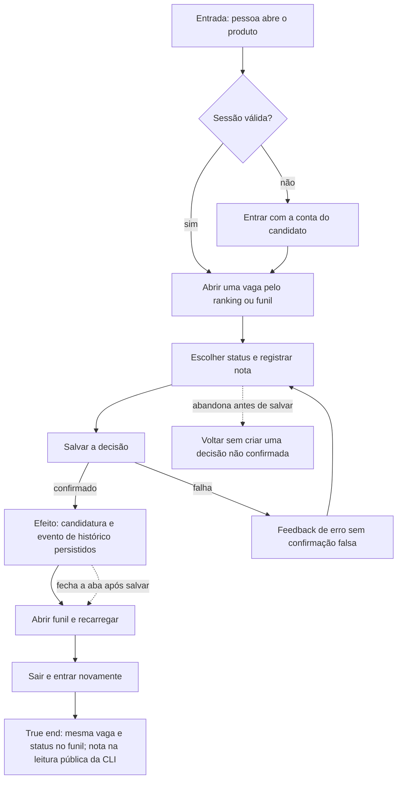

# Registrar e retomar uma decisão de candidatura



```yaml
journey:
  id: J-preserve-application-decision
  name: Registrar e retomar uma decisão de candidatura
  priority: P0
  value_statement: "A pessoa não perde suas decisões e consegue retomar uma candidatura com o status e a nota corretos."
  personas: [Andreus em triagem noturna, Andreus no celular]
  entry_points:
    - url: /jobs
      origin: in-app-nav
    - url: /pipeline
      origin: in-app-nav
  actions:
    - step: 1
      verb: Entrar e abrir uma vaga conhecida pelo ranking ou funil
      expected_observable: Empresa e título identificam a vaga escolhida
    - step: 2
      verb: Escolher o próximo status e salvar uma nota
      expected_observable: A interface confirma a gravação ou informa a falha
    - step: 3
      verb: Consultar o funil após refresh e um novo login
      expected_observable: A mesma vaga continua no status salvo
    - step: 4
      verb: Consultar o detalhe pela CLI pública com a mesma conta de candidato
      expected_observable: Status e nota correspondem à decisão tomada
  goal:
    observable: A decisão pode ser relida em sessão nova e por uma segunda superfície pública
    side_effects: [candidatura persistida, evento de histórico persistido]
  true_end_state: A pessoa retoma a candidatura sem perder status ou nota
  exit:
    natural: Funil com a próxima ação reconhecível
  abandonment:
    - at_step: 2
      how: Sair do detalhe sem enviar o formulário
      resume: O último status e a nota confirmados permanecem
  crosses: [autenticação, escopo do candidato, candidatura, histórico, CLI, PostgreSQL]
```

A CLI pública exibe status e nota, não uma lista de eventos. A preservação de
`application_event` é verificada no ensaio técnico de importação e nos testes
de persistência; esta jornada não atribui um veredito visual a esse dado interno.
