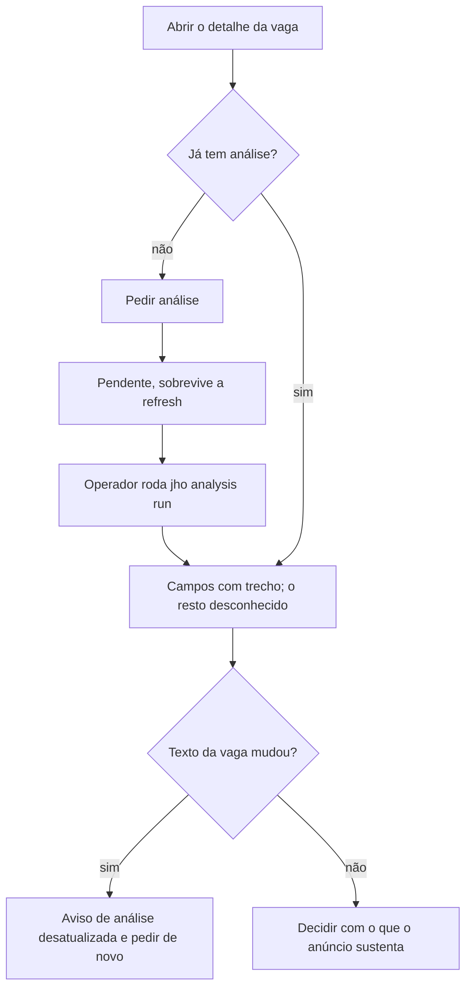

# Ler a análise estruturada de uma vaga



```yaml
journey:
  id: J-read-structured-job-analysis
  name: Ler a análise estruturada de uma vaga
  priority: P2
  value_statement: "Decidir sobre uma vaga lendo só o que o anúncio sustenta, com o trecho de cada fato, sem nova chamada paga para o que já foi analisado."
  personas: [Andreus em triagem]
  entry_points:
    - url: /jobs/<id>
      origin: direct
  actions:
    - step: 1
      verb: Pedir a análise estruturada da vaga
      expected_observable: A seção mostra análise pendente, também depois de recarregar
    - step: 2
      verb: Recarregar depois que o operador processou a fila
      expected_observable: Cada campo mostra valor e trecho do anúncio; o que o anúncio não diz aparece como desconhecido
    - step: 3
      verb: Abrir a mesma vaga como admin
      expected_observable: Modelo, tokens e custo aparecem só para o admin
  goal:
    observable: A pessoa lê os fatos da vaga com a prova de cada um
    side_effects: [job_analysis]
  true_end_state: A análise recarregada mostra os mesmos campos; pedir de novo o mesmo texto não cria outra
  exit:
    natural: Detalhe da vaga
  abandonment:
    - at_step: 1
      how: Fechar a aba com a análise pendente
      resume: A análise segue na fila e aparece ao reabrir a vaga
  crosses: [llm, autorização, i18n]
```
