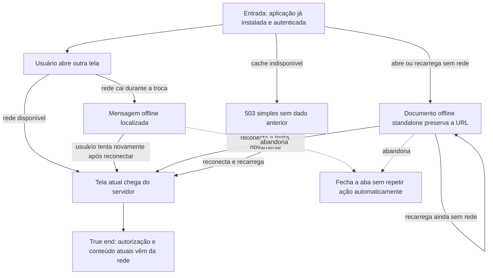

# Recuperar o acesso após perder a conexão



```yaml
journey:
  id: J-recover-offline-access
  name: Recuperar o acesso após perder a conexão
  value_statement: "O usuário entende a falta de rede, não vê dados persistidos de outra sessão e retoma o destino atual quando a conexão volta."
  personas: [Candidato após falha, Candidato em trânsito]
  entry_points:
    - url: /jobs
      origin: in-app-nav
    - url: /pipeline
      origin: direct
  actions:
    - step: 1
      verb: Abrir ou trocar de tela quando a conexão cai
      expected_observable: Uma única mensagem offline localizada aparece sem fingir que o destino carregou
    - step: 2
      verb: Recarregar sem rede ou reconectar e tentar novamente
      expected_observable: Sem rede o shell permanece honesto; reconectado, o destino atual vem novamente do servidor
  goal:
    observable: O destino pedido fica utilizável com autorização e dados atuais após a reconexão
    side_effects: []
  true_end_state: Recarregar o destino reconectado mantém o conteúdo atual e nenhum dado privado anterior aparece offline
  exit:
    natural: Tela originalmente solicitada
  abandonment:
    - at_step: 1
      how: Fechar a aba ao perceber que está sem conexão
      resume: Uma nova abertura offline continua sem dados privados e uma abertura online consulta o servidor
  crosses: [service worker, Cache Storage, Next App Router, auth policy, i18n]
```
