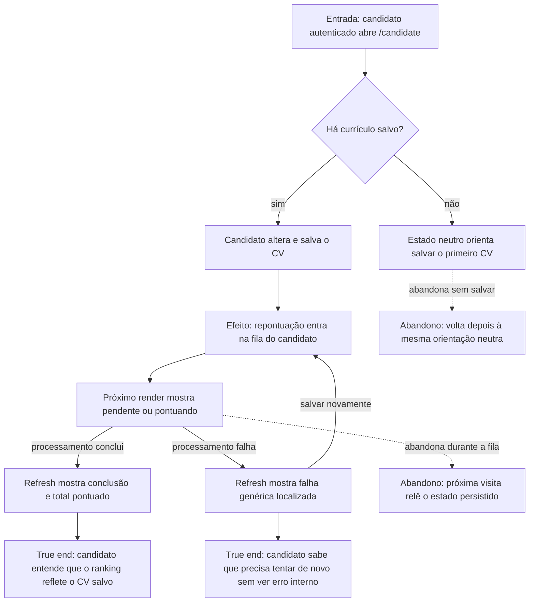

# Atualizar o ranking após salvar o currículo



```yaml
journey:
  id: J-refresh-candidate-ranking
  name: Atualizar o ranking após salvar o currículo
  priority: P1
  value_statement: "O candidato entende se o ranking já incorporou o currículo que acabou de salvar."
  personas: [Andreus em triagem noturna, Candidato após falha]
  entry_points:
    - url: /candidate
      origin: in-app-nav
  actions:
    - step: 1
      verb: Abrir a área do candidato e ler o estado atual
      expected_observable: O card mostra somente a fila da sessão em linguagem localizada
    - step: 2
      verb: Alterar e salvar o currículo
      expected_observable: O próximo render mostra a atualização pendente ou em andamento
    - step: 3
      verb: Recarregar depois do processamento
      expected_observable: A conclusão informa a contagem ou a falha orienta nova tentativa sem detalhe interno
  goal:
    observable: O estado do ranking continua verdadeiro depois de recarregar a página
    side_effects: [repontuação enfileirada para o candidato autenticado]
  true_end_state: O candidato sabe se o ranking está aguardando, processando, atualizado ou precisa ser tentado novamente
  exit:
    natural: Área do candidato com estado persistido e compreensível
  abandonment:
    - at_step: 2
      how: Fechar a página antes do worker concluir
      resume: A próxima visita relê o estado persistido sem depender de polling
  crosses: [auth candidate scope, score queue, Server Components, i18n, themes]
```
