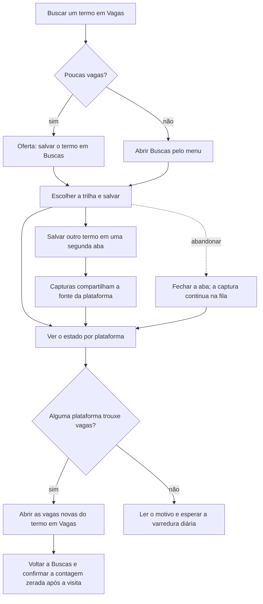

# Salvar uma busca por termo e acompanhar o que ela trouxe



```yaml
journey:
  id: J-save-term-search
  name: Salvar uma busca por termo e acompanhar o que ela trouxe
  priority: P1
  value_statement: "Buscar vagas de uma tecnologia nas plataformas cadastradas sem voltar a digitar o termo todo dia."
  personas: [Andreus em triagem, Andreus no celular, Recrutadora convidada]
  entry_points:
    - url: /jobs?q=<termo>
      origin: in-app-nav
    - url: /searches
      origin: direct
  actions:
    - step: 1
      verb: Buscar um termo em Vagas e aceitar a oferta de salvá-lo
      expected_observable: Buscas abre com o termo e a trilha preenchidos
    - step: 2
      verb: Salvar o termo numa trilha
      expected_observable: O termo aparece na trilha com um estado por plataforma
    - step: 3
      verb: Abrir as vagas novas que o termo trouxe
      expected_observable: Vagas filtra pelo termo e marca as novas
    - step: 4
      verb: Pausar, mover, rodar de novo ou excluir o termo
      expected_observable: O estado muda e sobrevive à recarga; rodar de novo no intervalo diz quando será possível
    - step: 5
      verb: Salvar outro termo em uma segunda aba e voltar depois das capturas
      expected_observable: Os dois termos mostram o resultado da plataforma, sem falha causada pela criação simultânea da fonte
  goal:
    observable: O termo salvo existe, repete sozinho todo dia e mostra quantas vagas novas trouxe
    side_effects: [captura por plataforma, vagas novas no acervo]
  true_end_state: Buscas e Vagas, lidas de novo, mostram o termo, seu estado e as vagas que ele trouxe
  exit:
    natural: Vagas filtrada pelas vagas que o termo trouxe
  abandonment:
    - at_step: 2
      how: Fechar a aba logo depois de salvar
      resume: A captura continua na fila e a varredura diária termina o que faltar
  crosses: [matching, sourcing, cota por plataforma, i18n, sessão emprestada]
```
