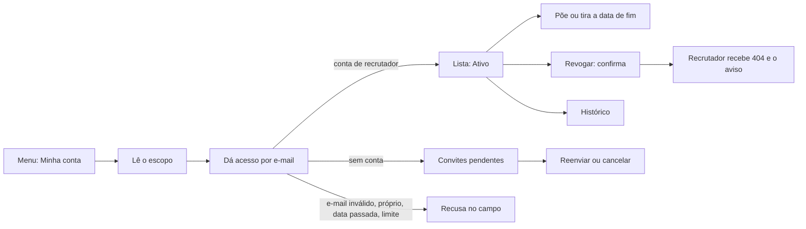

# Jornada: compartilhar a busca com um recrutador e tirar o acesso

```yaml
journey:
  id: J-share-search-with-recruiter
  name: Dar a um recrutador acesso de leitura, com prazo, e revogar quando quiser
  priority: P1
  value_statement: Escolher quem acompanha a busca, até quando, e saber a qualquer momento com quem o dado foi compartilhado (LGPD art. 18 VII)
  personas: [Andreus em triagem noturna, Andreus no celular, Andreus em triagem]
  entry_points:
    - url: /account
      origin: menu
  actions:
    - step: 1
      verb: Abrir Minha conta e ler a seção "Acesso de recrutadores"
      expected_observable: A declaração do que o recrutador vê e nunca vê aparece antes do formulário; sem ninguém, a lista diz "Ninguém tem acesso ao seu perfil"
    - step: 2
      verb: Dar acesso ao e-mail de um recrutador que já tem conta
      expected_observable: A lista mostra o nome e o e-mail como texto, "Ativo", a data de hoje, "Sem data de fim" e "Último acesso: nunca"; o recrutador vê o candidato em /recruiter sem sair da conta
    - step: 3
      verb: Dar acesso a um e-mail sem conta
      expected_observable: "Convites pendentes" mostra o e-mail e "Link válido até" daqui a 7 dias; o convite chega no idioma da conta
    - step: 4
      verb: Pôr uma data de fim no acesso e depois tirá-la
      expected_observable: A linha mostra "Até <data> (<fuso>)" e volta a "Sem data de fim"; o recrutador recebe um e-mail a cada mudança
    - step: 5
      verb: Revogar o acesso, primeiro voltando no diálogo e depois confirmando
      expected_observable: Voltar não muda nada; confirmar tira o recrutador da lista, a página do candidato passa a dar 404 para ele e chega o aviso de fim
    - step: 6
      verb: Ler o histórico
      expected_observable: Cada evento aparece com data, hora, e-mail e quem fez, do mais novo ao mais antigo, paginado de 20 em 20
  goal:
    observable: Só quem o candidato escolheu tem acesso, pelo prazo escolhido, e o histórico conta tudo
    side_effects: [recruiter_grant, recruiter_invite, recruiter_access_event, e-mails ao recrutador]
  true_end_state: Depois de recarregar, a lista e o histórico batem com o que foi feito; o recrutador revogado não abre nada do candidato
  exit:
    natural: Voltar ao trabalho na mesma sessão
  abandonment:
    - at_step: 2
      how: Digitou um e-mail errado ou o próprio
      resume: A recusa aparece embaixo do campo, com o texto digitado preservado
    - at_step: 3
      how: Dez concessões e convites nas últimas 24 h
      resume: A recusa diz a hora em que dá para tentar de novo
  crosses: [auth policy, advisory lock, recruiter access store, mailer, sweep, i18n, responsive shell]
```


