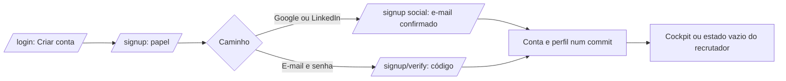

# Jornada: cadastrar-se sozinho como candidato ou recrutador

```yaml
journey:
  id: J-sign-up-alone
  name: Pessoa nova cria a própria conta em tela única
  priority: P1
  value_statement: Quem não tem conta entra sem depender do admin e sai do cadastro com o que precisa — o candidato com perfil e currículo, o recrutador sabendo de onde virá o acesso
  personas: [Pessoa nova que se cadastra sozinha]
  entry_points:
    - url: /signup
      origin: link "Criar conta" em /login
    - url: /login/oauth/google
      origin: botão "Continuar com Google" em /signup
  actions:
    - step: 1
      verb: Abrir /signup pelo link de /login e escolher Candidato ou Recrutador
      expected_observable: A tela mostra o formulário e o painel da marca; Recrutador esconde headline e currículo; só os dois papéis são oferecidos
    - step: 2
      verb: Continuar com Google (ou LinkedIn) e voltar do consentimento
      expected_observable: /signup no modo social, com o e-mail confirmado só para leitura e sem senha
    - step: 3
      verb: Preencher nome, headline e currículo (PDF ou texto), aceitar os termos e enviar
      expected_observable: Conta criada e sessão aberta; candidato cai no cockpit, recrutador no estado vazio de /recruiter; chega o e-mail de boas-vindas
    - step: 4
      verb: Pelo caminho manual, enviar e-mail e senha e digitar o código recebido
      expected_observable: '"Confira seu e-mail" com o aviso de 15 minutos; o código certo cria a conta e entra; o errado diz quantas tentativas restam'
    - step: 5
      verb: Recarregar a página de destino
      expected_observable: A sessão e o perfil continuam; /signup manda para a tela do papel
  goal:
    observable: A conta nova existe com o papel escolhido, e-mail verificado e, para candidato, o próprio perfil com o currículo como primeira versão
    side_effects: [auth_user com email_verified_at e versões dos termos, auth_identity no caminho social, candidate e candidate_document para candidato, auth_signup concluído, e-mail de boas-vindas]
  true_end_state: Depois do refresh, a pessoa está dentro da própria conta e não vê dado de ninguém
  exit:
    natural: Abrir Vagas (candidato com o ranking em formação) ou esperar um candidato conceder acesso (recrutador)
  abandonment:
    - at_step: 3
      how: Fecha a tela antes de enviar
      resume: Entrar de novo pelo provedor devolve ao /signup social; nada foi criado
    - at_step: 4
      how: Sai depois de receber o código
      resume: Voltar a /signup e usar "Já tenho um código" enquanto a pendência vale
  crosses: [auth policy, social sign-in, account emails, candidate identity, legal documents, i18n, responsive shell]
```



- **Entrada:** sem sessão, sem conta para o e-mail.
- **Estado final verdadeiro:** conta própria com e-mail verificado, papel escolhido (nunca admin) e, para candidato, perfil privado com o currículo enviado.
- **Saída:** usar o produto pelo papel escolhido.
- **Abandono:** nada é criado até o passo final; a pendência social vence em 15 minutos e a manual em 24 horas.
