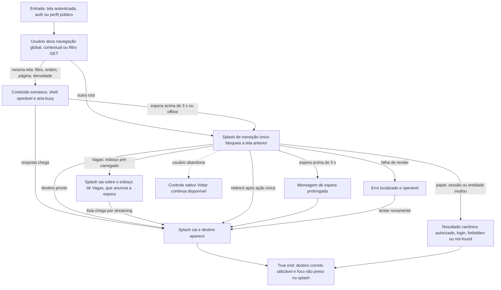

# Trocar de tela de trabalho



```yaml
journey:
  id: J-switch-workspace-screen
  name: Trocar de tela de trabalho
  priority: P0
  value_statement: "O usuário chega à próxima área com feedback verdadeiro sem operar conteúdo obsoleto."
  personas: [Andreus em triagem, Andreus no celular, Candidato em trânsito, Candidato por teclado, Candidato após falha]
  entry_points:
    - url: /jobs
      origin: in-app-nav
    - url: /login
      origin: direct
    - url: /p/[slug]
      origin: external-share
  actions:
    - step: 1
      verb: Ativar uma área interna pelo menu
      expected_observable: Um único splash cobre e bloqueia a tela anterior com status localizado
    - step: 2
      verb: Aguardar o destino ou acionar a recuperação oferecida
      expected_observable: O status permanece verdadeiro e o destino final substitui o splash
    - step: 3
      verb: Voltar, avançar ou concluir uma ação que redireciona
      expected_observable: Somente o destino aceito vence, sem repetir a mutação nem restaurar conteúdo obsoleto
  goal:
    observable: A área escolhida fica visível, operável e sem foco residual no overlay
    side_effects: []
  true_end_state: O destino correto continua utilizável depois de interação, retorno e recarga
  exit:
    natural: Tela interna escolhida
  abandonment:
    - at_step: 2
      how: Usar Voltar do navegador durante uma espera longa
      resume: O histórico escolhe a geração final e não deixa overlay órfão
  crosses: [Next App Router, transition store, auth policy, i18n, themes]
```
