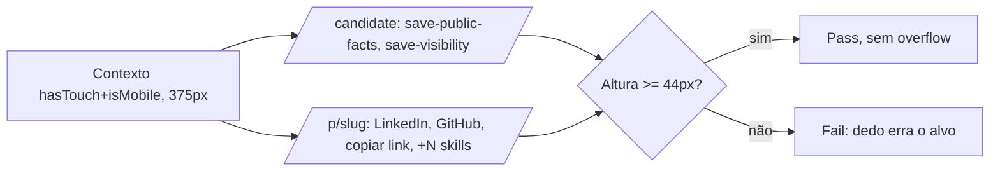

# Jornada: tocar os controles principais num aparelho de toque

```yaml
journey:
  id: J-tap-primary-controls-mobile
  name: Tocar botões e links principais com o dedo, não com o ponteiro
  priority: P1
  value_statement: Quem usa o dedo acerta o botão de primeira, sem precisar mirar num alvo menor do que o dedo
  personas: [Andreus no celular]
  entry_points:
    - url: /candidate
      origin: nav
    - url: /p/[slug]
      origin: external-share
  actions:
    - step: 1
      verb: Abrir a área do candidato num aparelho de toque e salvar um cartão (fatos públicos ou visibilidade)
      expected_observable: O botão de salvar mede pelo menos 44×44px, o piso do DESIGN.md, mesmo sem classe extra de altura
    - step: 2
      verb: Abrir o próprio perfil público e tocar os CTAs (LinkedIn, GitHub, copiar link) e o "+N" de skills
      expected_observable: Cada CTA mede pelo menos 44×44px, e a tela continua sem rolagem horizontal em 375px
  goal:
    observable: Todo controle principal mede pelo menos 44×44px num aparelho de toque real, sem estourar a largura de 375px
    side_effects: []
  true_end_state: A medição em `pointer: coarse` real (não só a ausência de `pointer: coarse`) confirma 44px, e o layout continua íntegro
  exit:
    natural: Concluir a ação (salvar, copiar link, abrir CTA externo)
  abandonment:
    - at_step: 1
      how: n/a — jornada de medição, sem decisão de negócio
      resume: n/a
  crosses: [pointer:coarse global CSS, responsive shell, public profile allowlist]
```



- **Entrada:** sessão autenticada (passo 1) e perfil público (passo 2), num contexto com toque real emulado.
- **Estado final verdadeiro:** todo controle medido tem pelo menos 44×44px, e a tela não ganha rolagem horizontal.
- **Saída:** ação concluída (salvar, copiar, abrir link externo).
- **Abandono:** não se aplica — é uma medição, não uma decisão do usuário.
