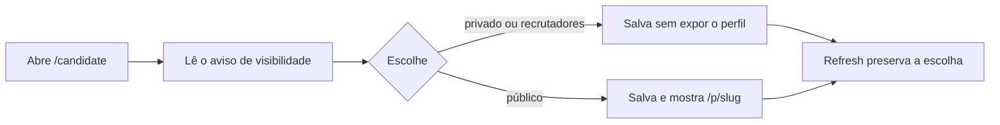

# Jornada: escolher quem vê o perfil

```yaml
journey:
  id: J-toggle-profile-visibility
  name: Escolher entre privado, recrutadores e público, e ler o que cada um significa
  priority: P1
  value_statement: O candidato decide com quem o currículo fica visível e lê, antes de confirmar, o que "público" expõe — inclusive nos temas que não são o padrão
  personas: [Andreus no celular]
  entry_points:
    - url: /candidate
      origin: nav
  actions:
    - step: 1
      verb: Abrir a área do candidato e ler o cartão de visibilidade
      expected_observable: As três opções (privado, recrutadores, público) aparecem, e o aviso "legível por qualquer um" fica sempre visível e legível — em qualquer tema e ambiente escolhido no seletor de aparência
    - step: 2
      verb: Escolher "público" e salvar
      expected_observable: O feedback de sucesso aparece, e o link /p/<slug> passa a ser mostrado
    - step: 3
      verb: Recarregar a página
      expected_observable: A escolha persiste e o aviso continua visível e legível
  goal:
    observable: A escolha de visibilidade e o aviso sobre o que ela expõe sobrevivem ao refresh, em qualquer tema
    side_effects: [candidate.visibility alterado]
  true_end_state: Depois do refresh, a opção escolhida está marcada e o aviso continua com contraste suficiente para leitura
  exit:
    natural: Compartilhar o link público, ciente do que ele expõe
  abandonment:
    - at_step: 1
      how: A pessoa decide manter privado depois de ler o aviso
      resume: Nada foi alterado; o estado anterior permanece
  crosses: [contraste de texto por tema, i18n, responsive shell]
```



- **Entrada:** área do candidato com perfil criado.
- **Estado final verdadeiro:** a escolha e o aviso persistem e continuam legíveis após refresh, em qualquer tema.
- **Saída:** compartilhar o link, ciente do aviso.
- **Abandono:** manter privado após ler o aviso; nada é gravado.
