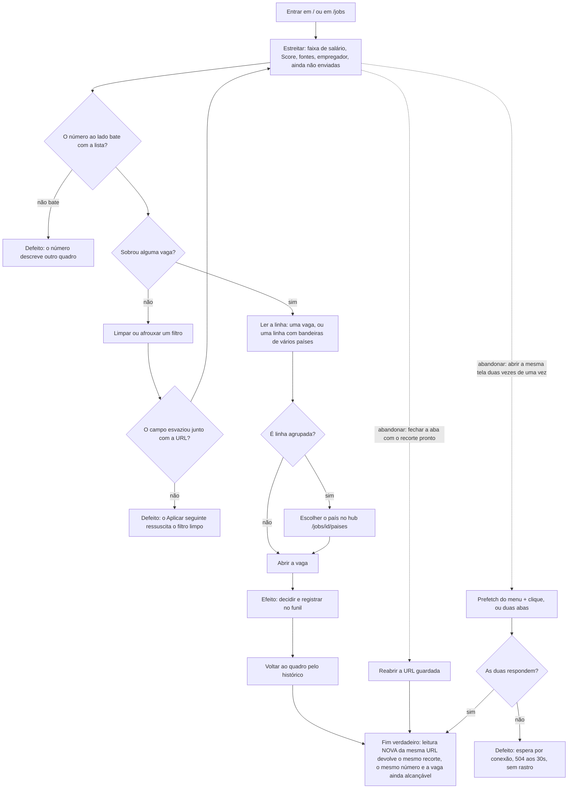

# Estreitar o quadro e confiar no que ele diz



```yaml
journey:
  id: J-trust-the-filtered-board
  name: Estreitar o quadro e confiar no que ele diz
  priority: P0
  value_statement: "Reduzir 6.000 vagas a um punhado decidível, e poder acreditar no recorte."
  personas: [Andreus em triagem, Andreus no celular, Recrutadora convidada]
  entry_points:
    - url: /
      origin: direct
    - url: /jobs
      origin: in-app-nav
    - url: /jobs?pay=8000&payMax=15000&cur=USD&per=month&fit=60&fitMax=90&source=lever&company=Shopify&notApplied=1
      origin: external-share
  actions:
    - step: 1
      verb: Estreitar por faixa de salário, Score, fontes, empregador e "ainda não enviadas"
      expected_observable: A lista encolhe e TODO número na tela descreve a lista ao lado dele
    - step: 2
      verb: Limpar um filtro, usar um atalho de corte, ou colar uma faixa invertida
      expected_observable: Campo, URL e quadro passam a dizer a mesma coisa, sem refresh
    - step: 3
      verb: Abrir uma vaga; se a linha tem bandeiras, escolher o país no hub
      expected_observable: O destino é a publicação do país escolhido, nunca um país sorteado
    - step: 4
      verb: Voltar pelo histórico e reabrir a mesma URL numa leitura nova
      expected_observable: Mesmo recorte, mesmo número, e a vaga continua alcançável
  goal:
    observable: Um recorte pequeno o bastante para decidir, cujos números não se contradizem
    side_effects: [registro no funil quando a pessoa decide]
  true_end_state: >
    Uma leitura NOVA da URL guardada devolve o mesmo recorte e o mesmo número, e a
    vaga escolhida continua alcançável — inclusive quando ela é a irmã de um grupo
    que outra publicação representava.
  exit:
    natural: Quadro estreitado, ou detalhe da vaga escolhida
  abandonment:
    - at_step: 1
      how: Fechar a aba com o recorte pronto e reabrir a URL no dia seguinte
      resume: Todo o recorte está na URL, e nada dele vive em React
    - at_step: 2
      how: Abrir a mesma tela pesada duas vezes ao mesmo tempo (prefetch do menu mais clique, ou duas abas)
      resume: As duas requisições respondem; nenhuma espera a outra até o limite da função
  crosses: [cockpit, matching, agrupamento por país, funil, i18n, pool de conexões, telemetria]
```

## Por que esta jornada existe separada da modalidade de trabalho

`J-find-jobs-by-work-mode` pergunta "consigo achar vaga compatível com presença
física?". Esta pergunta é outra: **posso acreditar no recorte?** Os defeitos que
ela encontra não são de busca, são de confiança —

- um número que conta um quadro diferente do que está listado ao lado dele;
- um campo que guarda o valor antigo e ressuscita o filtro no Aplicar seguinte;
- um grupo de países que desaparece porque a publicação usada para representá-lo
  foi cortada pelo filtro;
- duas vagas de empresas diferentes fundidas numa linha porque a fonte esconde o
  empregador;
- a mesma tela pedida duas vezes travando até a plataforma desistir.

Os cinco existiram em produção ao mesmo tempo, e nenhum deles aparece caminhando
o fluxo da modalidade. Por isso `priority: P0`: quando a confiança no recorte
quebra, a triagem inteira para — e é a triagem, não a descoberta, o gargalo deste
produto.

## Varredura das cinco dimensões, no planejamento de 2026-09-21

| Dimensão | Onde ela caiu nesta jornada |
|---|---|
| **Jornadas** | O fluxo inteiro, com o fim verdadeiro sendo uma leitura NOVA da URL guardada — não o clique que aplicou o filtro. |
| **Funcional** | Cada "expected_observable" das quatro ações; e a fronteira de papel, porque a recrutadora entra na mesma tela e não tem funil (o chip "ainda não enviadas" não pode aparecer para ela). |
| **Experiencial** | `CH-filtered-board-fields-follow-url` é experiencial por dentro: o campo que guarda valor antigo não falha nenhuma verificação funcional — a URL está certa, o quadro está certo — e ainda assim a pessoa perde a confiança no controle. |
| **Borda, erro e vazio** | Faixa invertida, `?pay=%20`, `?source=%`, campo de piso em 0, corte acima de tudo (quadro vazio legítimo), publicação sem localização, grupo que encolheu para uma. |
| **Transversal** | Duas requisições da mesma tela pesada (pool de conexões), o aviso pré-timeout nomeando a rota (telemetria), e o hub em `pt-BR` e `en`. |

Nenhuma dimensão foi pulada. A que mais rendeu no planejamento foi **borda, erro
e vazio**: sete dos treze Minor corrigidos nesta leva moravam ali, e nenhum deles
aparece caminhando só o caminho felizmente estreitado.
